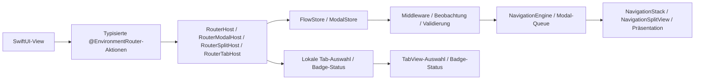
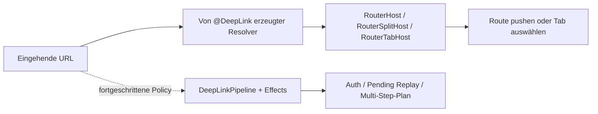

# InnoRouter

[English](README.md) | [한국어](README.ko.md) | [Español](README.es.md) | [Deutsch](README.de.md) | [简体中文](README.zh-Hans.md) | [日本語](README.ja.md) | [Русский](README.ru.md)

[](https://swiftpackageindex.com/InnoSquadCorp/InnoRouter)
[](https://swiftpackageindex.com/InnoSquadCorp/InnoRouter)
[](https://opensource.org/licenses/MIT)
[](https://codecov.io/gh/InnoSquadCorp/InnoRouter)

InnoRouter ist ein SwiftUI-natives Navigations-Framework, das auf typisiertem Zustand, expliziter Befehlsausführung und Deep-Link-Planung an der App-Grenze basiert.

Es behandelt Navigation als erstklassige State Machine statt als verstreute, view-lokale Seiteneffekte.

## Was InnoRouter besitzt

InnoRouter ist verantwortlich für:

- Macro-generierte Route- und Destination-Verdrahtung über `@Router`
- lokal besessene Stack-, Modal-, Split-Detail- und Tab-Autorität über
  `RouterHost`, `RouterModalHost`, `RouterSplitHost` und `RouterTabHost`
- Fail-closed URL-zu-Route-Zuordnung über `@DeepLink`
- Opt-in-Komposition räumlicher Scenes über `@SceneRouter` und `@Scene`
- fortgeschrittene Store-Autorität über `NavigationStore`, `ModalStore` und
  `FlowStore`
- Befehlsausführung über `NavigationCommand` und `NavigationEngine`
- fortgeschrittene Deep-Link-Planung und Pending Replay über
  `DeepLinkPipeline` und `InnoRouterEffects`

Es ist absichtlich keine allgemeine Anwendungs-State-Machine.

Halten Sie diese Anliegen außerhalb von InnoRouter:

- Geschäftsworkflow-Zustand
- Authentifizierungs-/Sitzungslebenszyklus
- Netzwerk-Retry- oder Transportzustand
- Alerts und Bestätigungsdialoge

## Anforderungen

- iOS 18+
- iPadOS 18+
- macOS 15+
- tvOS 18+
- watchOS 11+
- visionOS 2+
- Swift 6.3+

Die iOS-18-Untergrenze und die `swift-tools-version: 6.3` Paketbasis sind
bewusst gewählt: Sie ermöglichen es jedem öffentlichen Typ, strikte Concurrency
und `Sendable` ohne die `@preconcurrency` / `@unchecked Sendable` Auswege zu
übernehmen, was bedeutet, dass der Navigationszustand nie unbemerkt vom
Main-Actor zwischen View-Code und Store wegläuft. Der Preis ist ein kleineres
Adoptionsfenster als bei Bibliotheken, die iOS 13–16 ansprechen; der Vorteil
ist ein Router, dessen `Sendable`/`@MainActor`-Disziplin vom Compiler
überprüft statt in Prosa dokumentiert wird.

Das Macro-Target hängt von `swift-syntax` `603.0.2` mit einer
`.upToNextMinor`-Beschränkung ab. InnoRouter 5.0 hebt die Paketbasis auf
Swift 6.3 an und richtet sie damit an dieser Host-Abhängigkeit sowie dem in CI
gepinnten Xcode-26.6-Toolchain aus. Weitere Swift-Anhebungen bleiben
Major-Versionen vorbehalten.

| Concurrency-Haltung | InnoRouter | TCA / FlowStacks / andere auf iOS 13+ |
|---|---|---|
| Öffentliche Typen deklarieren `Sendable` bedingungslos | ✅ | ⚠ teilweise — viele nutzen `@preconcurrency` |
| Stores sind `@MainActor`-isoliert, keine Laufzeit-Hops | ✅ | ⚠ variiert |
| `@unchecked Sendable` / `nonisolated(unsafe)` im Quellcode | ❌ keine | ⚠ in einigen Adaptern verwendet |
| Strikter Concurrency-Modus | ✅ pro Modul erzwungen | ⚠ Opt-in oder teilweise |

## Plattformunterstützung

InnoRouter wird über SwiftUI auf jeder Apple-Plattform ausgeliefert. Es sind
keine UIKit- oder AppKit-Bridge-Module erforderlich.

| Fähigkeit | iOS | iPadOS | macOS | tvOS | watchOS | visionOS |
|---|---|---|---|---|---|---|
| `@Router` + `RouterHost` / `RouterModalHost` / `RouterTabHost` | ✅ | ✅ | ✅ | ✅ | ✅ | ✅ |
| `@Router` + `RouterSplitHost` | ✅ | ✅ | ✅ | ✅ | ❌ | ✅ |
| `NavigationStore` / `NavigationHost` / `FlowStore` / `FlowHost` | ✅ | ✅ | ✅ | ✅ | ✅ | ✅ |
| `NavigationSplitHost` / `CoordinatorSplitHost` | ✅ | ✅ | ✅ | ✅ | ❌ | ✅ |
| `ModalHost` `.sheet` | ✅ | ✅ | ✅ | ✅ | ✅ | ✅ |
| `ModalHost` `.fullScreenCover` nativ | ✅ | ✅ | ⚠ degradiert | ✅ | ⚠ degradiert | ⚠ degradiert |
| Tab-Badge-Status-API / native Darstellung | ✅ | ✅ | ✅ | ⚠ nur Status | ⚠ nur Status | ✅ |
| `DeepLinkPipeline` / `FlowDeepLinkPipeline` | ✅ | ✅ | ✅ | ✅ | ✅ | ✅ |
| `InnoRouterSpatial`: `@SceneRouter` / `@Scene` (Windows, volumetrisch, immersive) | — | — | — | — | — | ✅ |
| `InnoRouterSpatial`: `innoRouterOrnament(_:content:)` View-Modifier | no-op | no-op | no-op | no-op | no-op | ✅ |

`⚠ degradiert` bedeutet, dass die Store-API die Anfrage unverändert akzeptiert,
aber der SwiftUI-Host sie als `.sheet` rendert, weil `.fullScreenCover` nicht
verfügbar ist. `⚠ nur Status` bedeutet, dass der Router den Badge-Status
speichert und freigibt, aber `RouterTabHost` und `TabCoordinatorView` das native
visuelle Badge von SwiftUI auslassen, weil `.badge(_:)` nicht verfügbar ist.
`❌` bedeutet, dass die API auf dieser Plattform nicht verwendet werden kann,
weil sie fehlt oder ausdrücklich als unavailable markiert ist. Kompilieren Sie
den Aufruf hinter einem passenden Availability- oder Conditional-Compilation-Guard.

Für visionOS-Scenes fügen Sie das Produkt `InnoRouterSpatial` ausdrücklich zum
App-Target hinzu und importieren `InnoRouterSpatial` in den betroffenen Dateien.
Das Umbrella-Produkt `InnoRouter` re-exportiert das Spatial-Modul nicht.

## Installation

```swift skip package-manifest-fragment
dependencies: [
    .package(url: "https://github.com/InnoSquadCorp/InnoRouter.git", from: "5.0.0")
],
targets: [
    .target(
        name: "MyApp",
        dependencies: [
            .product(name: "InnoRouter", package: "InnoRouter")
        ]
    )
]
```

InnoRouter wird als reines Quellcode-SwiftPM-Paket ausgeliefert. Es liefert keine
Binärartefakte, und die Library Evolution ist absichtlich deaktiviert, damit
Quellcode-Builds plattformübergreifend einfach bleiben.

Beginnen Sie gewöhnliche App-Targets mit dem Produkt `InnoRouter`. Es stellt
Laufzeit-API und Macros bereit, sodass im Quellcode ein `import InnoRouter`
genügt. Targets mit visionOS-Scene-Routing oder App-Boundary-Ausführung fügen
`InnoRouterSpatial` beziehungsweise `InnoRouterEffects` ausdrücklich hinzu;
Test-Targets fügen bei Bedarf `InnoRouterTesting` hinzu. Diese Opt-in-Produkte
werden vom `InnoRouter`-Umbrella nicht re-exportiert.

## 30-Sekunden-Schnellstart

Fügen Sie einen InnoRouter-Import hinzu, versehen Sie ein Enum mit `@Router`
und verbinden Sie die Screens in dessen `destination`-Property. Das Macro
erzeugt die `Route`- und `DestinationRoute`-Conformances sowie die für SwiftUI
benötigten Actor- und Result-Builder-Annotationen.

```swift compile
import SwiftUI
import InnoRouter

@Router
enum HomeRoute {
    case detail(id: String)
    case settings

    var destination: some View {
        switch self {
        case .detail(let id):
            Text("Detail \(id)")
        case .settings:
            Text("Einstellungen")
        }
    }
}

struct AppRoot: View {
    var body: some View {
        RouterHost(HomeRoute.self) {
            HomeView()
        }
    }
}

struct HomeView: View {
    @EnvironmentRouter(HomeRoute.self) private var router

    var body: some View {
        List {
            Button("Detail") {
                router.go(.detail(id: "123"))
            }

            Button("Einstellungen") {
                router.go(.settings)
            }
        }
        .navigationTitle("Home")
    }
}
```

`@Router` meldet Compiler-Diagnosen, wenn es an der falschen Deklaration hängt,
`destination` fehlt oder fehlerhaft ist oder generierte Member mit manuellen
Deklarationen kollidieren würden. Ein fehlender oder typfremder Host ist ein
Problem der Laufzeithierarchie und folgt InnoRouters konfigurierter
Environment-Diagnoserichtlinie.

### Weitere Surface ohne zusätzlichen Store

Behalten Sie dasselbe Route-first-Modell bei und wählen Sie den Host passend
zur UI:

| Hinzufügen | Deklarieren | Host |
|---|---|---|
| Sheet / Cover | dieselben `@Router`-Cases | `RouterHost` oder das reine Modal-`RouterModalHost` |
| Split-Detail | dasselbe `@Router`-Enum | `RouterSplitHost` |
| Native Tabs | `@TabItem` an jedem `@Router`-Case | `RouterTabHost` |
| Deep Link zu einer Route | literale Allowlists an `@Router` plus `@DeepLink`-Cases | `RouterHost`, `RouterSplitHost` oder `RouterTabHost` |
| visionOS-Scenes | `@SceneRouter` plus ein `@Scene` pro Case | `<Route>.scenes` in `App.body` installieren |

Alle Route-Aktionen kommen weiterhin aus `@EnvironmentRouter`; räumliche
Scene-Aktionen kommen aus `@EnvironmentSceneRouter`. Ungültige oder
unvollständige Macro-Deklarationen erzeugen umsetzbare Compiler-Diagnosen.
Fehlende oder typfremde Host-Autorität zur Laufzeit folgt der konfigurierten
Environment-Diagnoserichtlinie.

## OSS-Release- und SemVer-Vertrag

`4.0.0` ist InnoRouters erstes OSS-Release und die erste Version, die vom
öffentlichen SemVer-Vertrag abgedeckt wird. Die aktuelle Kompatibilitätslinie
beginnt mit `5.0.0`. Frühere private/interne Paket-Snapshots sind nicht Teil der
OSS-Kompatibilitätslinie; Teams, die von einem 4.x-Release migrieren, sollten
den 5.0-Migrationshinweisen in [`CHANGELOG.md`](CHANGELOG.md) folgen.

### SemVer-Verpflichtung für die 5.x-Linie

Innerhalb der `5.x.y`-Releases folgt InnoRouter
[Semantic Versioning](https://semver.org/) strikt:

- **`5.x.y` → `5.x.(y+1)`** Patch-Releases: nur Bugfixes. Keine Änderungen
  der öffentlichen API-Signatur. Keine beobachtbaren Verhaltensänderungen
  außer der Behebung des dokumentierten Bugs.
- **`5.x.y` → `5.(x+1).0`** Minor-Releases: nur additiv. Neue Typen, neue
  Methoden, neue Cases, neue Konfigurationsoptionen. Bestehende Signaturen
  behalten ihre Form, und bestehende Aufrufstellen kompilieren unverändert.
- **`5.x.y` → `6.0.0`** Major-Releases: alles, was die Quellcode-Kompatibilität
  bricht, ein öffentliches Symbol entfernt, eine generische Beschränkung
  einengt oder das dokumentierte Laufzeitverhalten so ändert, dass bestehende
  Aufrufstellen überrascht werden können.

Pre-Release-Tags verwenden die Form `5.0.0-rc.1` / `5.1.0-beta.2`. Eine
einheitliche strict Versionsrichtlinie akzeptiert GA-, `rc`- und `beta`-Bezeichner
ohne führende Nullen. Ein Pre-Release-Tag-Push validiert, veröffentlicht aber
nichts; die Veröffentlichung erfolgt gemäß [`RELEASING.md`](RELEASING.md) durch
manuelles Ausführen von `release.yml` mit `prerelease=true`.

### Was als Breaking Change zählt

Für die Zwecke der 5.x-SemVer-Verpflichtung bedeutet ein *Breaking Change*
einen der folgenden:

- Entfernen oder Umbenennen eines öffentlichen Symbols (Typ, Methode,
  Eigenschaft, Associated Type, Case).
- Ändern einer öffentlichen Methodensignatur, sodass sie an einer bestehenden
  Aufrufstelle nicht mehr kompiliert (Hinzufügen eines nicht-defaulteten
  Parameters, Verschärfen einer generischen Beschränkung, Vertauschen des
  Rückgabetyps).
- Ändern des dokumentierten Verhaltens einer öffentlichen API, sodass ein
  bestehender korrekter Aufrufer ein anderes beobachtbares Ergebnis erzeugt
  (z. B. das Umkippen einer Standard-`NavigationPathMismatchPolicy`).
- Anheben des minimal unterstützten Swift-Toolchains oder der Plattformbasis.

Umgekehrt sind die folgenden *nicht* Breaking und können in jedem Minor-Release
landen:

- Hinzufügen neuer Cases zu einem nicht-`@frozen` öffentlichen Enum.
- Hinzufügen neuer defaulteter Parameter zu einer öffentlichen Methode.
- Verschärfen rein interner Typen.
- Performance-Verbesserungen, die die Semantik bewahren.
- Reine Dokumentationsänderungen.

### Historischer Hinweis zur 4.x-Linie

`4.1.0` ist die Adoptionsbasis nach dem Pre-User-Cleanup-Durchlauf. Es
entfernt ungenutzte Dispatcher-Object-APIs, behält `replaceStack` als das
einzige vollständige Stack-Replacement-Intent und verschiebt Effect-Beobachtung
zu expliziten Event-Streams. Das ist die einzige dokumentierte source-breaking
Ausnahme in der 4.x-Linie. Das `4.0.0`-Tag bleibt als erster OSS-Snapshot
verfügbar; die vollständige 4.x-Historie und die 5.0-Migration stehen in
[`CHANGELOG.md`](CHANGELOG.md).

### Imports

Das Umbrella-Target `InnoRouter` re-exportiert `InnoRouterCore`,
`InnoRouterSwiftUI`, `InnoRouterDeepLink` und die Router-Macros. Die
Standarderfahrung von 5.0 ist macro-first: App-Targets fügen ein Produkt hinzu
und Quelldateien verwenden einen Import. Spatial Scenes und
App-Boundary-Effects bleiben Opt-in-Produkte:

```swift skip doc-fragment
import InnoRouter            // Stores, Hosts, Deep Links und Macros
import InnoRouterSpatial     // visionOS-Scenes und Ornaments
import InnoRouterEffects     // App-Boundary-Ausführung und Pending Replay
```

Direkte Imports sind eine fortgeschrittene Modularisierungswahl.
`InnoRouterCore`, `InnoRouterSwiftUI` und `InnoRouterDeepLink` erlauben eine
kleinere Oberfläche ohne Macros. `InnoRouterMacros` stellt `@Router`,
`@TabItem`, `@DeepLink`, `@Routable` und `@CasePathable` direkt bereit und
re-exportiert die Core-, SwiftUI- und DeepLink-APIs, gegen die der generierte
Code kompiliert. App-Targets verwenden normalerweise das Umbrella-Produkt
`InnoRouter`.

Die SwiftSyntax-gestützte Macro-Implementation ist in diesem Paket enthalten.
Eine Aufteilung in Package-Traits oder ein separates Macro-Paket
sollte erst nach Messung von `swift package show-traits`,
`swift build --target InnoRouter` und `swift build --target InnoRouterMacros`
gegen die Migrationskosten evaluiert werden.

| Produkt | Wann importieren |
|---|---|
| `InnoRouter` | Standard für App-Code: `@Router`, `@TabItem`, `@DeepLink`, macro-first Hosts und die fortgeschrittenen Stores darunter. |
| `InnoRouterSpatial` | Targets, die visionOS-Windows, Volumes oder Immersive Spaces mit `@SceneRouter` / `@Scene` deklarieren oder manuelle Scene-Store- und Ornament-APIs nutzen. Dieses Produkt wird nicht von `InnoRouter` re-exportiert. |
| `InnoRouterMacros` | Direktes Macro-Modul, das die vom generierten Code verwendeten Core-, SwiftUI- und DeepLink-APIs re-exportiert; App-Targets verwenden normalerweise das `InnoRouter`-Umbrella. |
| `InnoRouterEffects` | App-Boundary-Code, der `NavigationCommand`-Werte ausführt, Pending Deep Links behandelt oder fortsetzt, oder beides. |
| `InnoRouterTesting` | Test-Targets, die host-loses `NavigationTestStore`, `ModalTestStore` oder `FlowTestStore` wollen. |

## Module

- `InnoRouter`: standardmäßiger macro-first Umbrella-Re-Export von `InnoRouterCore`, `InnoRouterSwiftUI`, `InnoRouterDeepLink` und `InnoRouterMacros`
- `InnoRouterCore`: Route-Stack, Validatoren, Befehle, Ergebnisse, Batch-/Transaction-Executoren, Middleware
- `InnoRouterSwiftUI`: `RouterHost`, `RouterModalHost`, `RouterSplitHost`, `RouterTabHost`, fortgeschrittene Stores/Hosts, Coordinators und typisierte `EnvironmentRouter`-Aktionen
- `InnoRouterSpatial`: Opt-in-`@SceneRouter` / `@Scene`, generierte Scene-Komposition, manuelle Scene-Registry/Store, Host-/Anchor-Modifier und Ornaments
- `InnoRouterDeepLink`: Pattern-Matching, Diagnostik, Pipeline-Planung, ausstehende Deep Links
- `InnoRouterEffects`: Navigation- und Deep-Link-Ausführungshelfer für App-Grenzen
- `InnoRouterMacros`: `@Router`, `@TabItem`, `@DeepLink`, `@Routable` und `@CasePathable`

## Die richtige Oberfläche wählen

Beginnen Sie mit einem Route-Enum und einem macro-first Host. Wechseln Sie nur
dann zu einem extern besessenen Store, wenn die App-Grenze Wiederherstellung,
veränderbare Middleware, direkte Beobachtung, authentifiziertes Pending Replay
oder einen atomaren Multi-Step-Plan benötigt.

| Bedarf | Verwenden |
|---|---|
| Stack plus Sheet / Cover in einem lokalen Feature | `@Router` + `RouterHost` |
| Lokales Feature nur mit Modal-Autorität | `@Router` + `RouterModalHost` |
| Split-Detail-Navigation auf unterstützten Plattformen | `@Router` + `RouterSplitHost` |
| Native Tabs mit generierten Labels und Bildern | `@Router` + `@TabItem` + `RouterTabHost` |
| Eine zugelassene URL wählt oder pusht genau eine Route | `@Router(deepLinkSchemes:deepLinkHosts:)` + `@DeepLink` + `RouterHost`, `RouterSplitHost` oder `RouterTabHost` |
| visionOS-Windows, Volumes und Immersive Spaces | `InnoRouterSpatial`: `@SceneRouter` + `@Scene` + `<Route>.scenes` |
| Extern besessener Stack, Wiederherstellung, Middleware oder direkte Beobachtung | `NavigationStore` + `NavigationHost` |
| Extern besessene Modal-Queue | `ModalStore` + `ModalHost` |
| Atomare Push-+-Modal-Pläne oder wiederhergestellte Flows | `FlowStore` + `FlowHost` + `FlowPlan` |
| Authentifizierung, Pending Replay oder Multi-Step-URL-Planung | `DeepLinkPipeline` / `FlowDeepLinkPipeline` + `InnoRouterEffects` |
| Manuelle visionOS-Scene-Autorität oder eigene Scene-Komposition | `SceneStore` + `innoRouterSceneHost` / `innoRouterSceneAnchor` |
| Reducer, Effekt oder App-Grenze-Ausführung | `InnoRouterEffects` |
| Router-Assertions ohne SwiftUI-Hosts | `InnoRouterTesting` |

Die macro-first Hosts besitzen ihre Stores lokal und veröffentlichen typisierte
Aktionen über `@EnvironmentRouter`. Store-, Effects-, Testing- und manuelle
Spatial-APIs bleiben ausdrückliche Eskalationspfade statt notwendige Einrichtung
für ein gewöhnliches Feature.

### Schneller Entscheidungsbaum

```text
Muss dieser Flow Routing-Zustand an der App-Grenze besitzen oder wiederherstellen?
├── Nein → @Router deklarieren und einen lokalen Host wählen
│           ├── Stack + Modal → RouterHost
│           ├── nur Modal     → RouterModalHost
│           ├── Split-Detail  → RouterSplitHost
│           └── Tabs          → @TabItem + RouterTabHost
└── Ja → NavigationStore, ModalStore oder FlowStore für diese Autorität
         (authentifizierte oder mehrstufige URLs: DeepLinkPipeline + Effects)
```

Für gewöhnliche Stack-Navigation aus einer View verwenden Sie
`@EnvironmentRouter` mit `go` / `back`; derselbe Wert stellt Modal- und
Tab-Aktionen bereit, wenn der installierte Host sie unterstützt. Wechseln Sie
nur für explizite Navigation-, Modal- oder Flow-Semantik zu den Low-Level-Intents in
[`Docs/IntentSelectionGuide.md`](Docs/IntentSelectionGuide.md).

## Dokumentation

- Aktuelles DocC-Portal: [InnoRouter latest docs](https://innosquadcorp.github.io/InnoRouter/latest/)
- Versionierte Docs-Wurzel: [InnoRouter docs](https://innosquadcorp.github.io/InnoRouter/)
- Release-Checkliste: [RELEASING.md](RELEASING.md)
- Maintainer-Schnellanleitung: [CLAUDE.md](CLAUDE.md)

`README.md` ist der Repository-Einstiegspunkt.
DocC ist die detaillierte Modul-Referenz.

### Tutorial-Artikel

Schritt-für-Schritt-Durchgänge für die häufigsten Adoptionspfade. Jeder Artikel
lebt im relevanten DocC-Katalog, sodass die gerenderte DocC-Site, die GitHub-
Quellcode-Ansicht und ein Offline-Build von `swift package generate-documentation`
denselben Inhalt zeigen.

| Artikel | Katalog | Behandelt |
| --- | --- | --- |
| [Tutorial-LoginOnboarding](Sources/InnoRouterSwiftUI/InnoRouterSwiftUI.docc/Articles/Tutorial-LoginOnboarding.md) | `InnoRouterSwiftUI` | Aufbau eines Login → Onboarding → Home-Flows mit `FlowStore` und `ChildCoordinator` |
| [Tutorial-DeepLinkReconciliation](Sources/InnoRouterSwiftUI/InnoRouterSwiftUI.docc/Articles/Tutorial-DeepLinkReconciliation.md) | `InnoRouterSwiftUI` | Cold-Start- vs. Warm-Deep-Links abgleichen, einschl. Pending-Replay |
| [Tutorial-MiddlewareComposition](Sources/InnoRouterSwiftUI/InnoRouterSwiftUI.docc/Articles/Tutorial-MiddlewareComposition.md) | `InnoRouterSwiftUI` | Typisiertes Middleware komponieren, Befehle abfangen, Churn beobachten |
| [Tutorial-MigratingFromNestedHosts](Sources/InnoRouterSwiftUI/InnoRouterSwiftUI.docc/Articles/Tutorial-MigratingFromNestedHosts.md) | `InnoRouterSwiftUI` | Verschachtelte `NavigationHost` + `ModalHost` Stacks durch `FlowHost` ersetzen |
| [Tutorial-Throttling](Sources/InnoRouterSwiftUI/InnoRouterSwiftUI.docc/Articles/Tutorial-Throttling.md) | `InnoRouterSwiftUI` | `ThrottleNavigationMiddleware` mit deterministischen Test-Clocks verwenden |
| [Tutorial-VisionOSScenes](Sources/InnoRouterSpatial/InnoRouterSpatial.docc/Articles/Tutorial-VisionOSScenes.md) | `InnoRouterSpatial` | visionOS-Windows, volumetrische Scenes und Immersive Spaces mit `@SceneRouter` und `@Scene` deklarieren |
| [Tutorial-FlowDeepLinkPipeline](Sources/InnoRouterDeepLink/InnoRouterDeepLink.docc/Articles/Tutorial-FlowDeepLinkPipeline.md) | `InnoRouterDeepLink` | Zusammengesetzte Push-+-Modal-Deep-Links über `FlowDeepLinkPipeline` aufbauen |
| [Tutorial-StatePersistence](Sources/InnoRouterCore/InnoRouterCore.docc/Tutorial-StatePersistence.md) | `InnoRouterCore` | `FlowPlan` / `RouteStack` über Launches mit `StatePersistence` persistieren |
| [Tutorial-TestingFlows](Sources/InnoRouterTesting/InnoRouterTesting.docc/Articles/Tutorial-TestingFlows.md) | `InnoRouterTesting` | Host-lose Swift-Testing-Assertions über `FlowTestStore` |

## Wie es funktioniert

### Laufzeit-Flow



- Views rufen route-typisierte Aktionen über `@EnvironmentRouter` auf.
- `RouterHost`, `RouterModalHost` und `RouterSplitHost` besitzen einen lokalen
  `FlowStore` oder `ModalStore`; `RouterTabHost` besitzt Auswahl und Badge-Status
  direkt. Jeder Host übersetzt seine Autorität in native SwiftUI-APIs.
- Fortgeschrittene Apps können die entsprechende explizite Store- oder
  Coordinator-Autorität für externen Besitz und Injection wählen.

### Deep-Link-Flow



- Literale Origin-Allowlists und `@DeepLink`-Cases bieten den Pfad ohne Plumbing.
- Hosts lösen eingehende URLs automatisch auf und koordinieren verschachtelte
  macro-first Hosts.
- Wechseln Sie nur dann zu Pipeline- und Effects-APIs, wenn App-Policy den
  Übergang autorisieren, verschieben, wiederholen oder aus mehreren Schritten
  zusammensetzen muss.

## Zustands- und Ausführungsmodell

InnoRouter macht drei verschiedene Ausführungssemantiken verfügbar.

### Einzelner Befehl

`execute(_:)` wendet einen `NavigationCommand` an und gibt ein typisiertes `NavigationResult` zurück.

### Batch

`executeBatch(_:stopOnFailure:)` bewahrt die Pro-Schritt-Befehlsausführung, fasst aber die Beobachtung zusammen.

Verwenden Sie Batch-Ausführung, wenn:

- mehrere Befehle dennoch einer nach dem anderen laufen sollen
- Middleware jeden Schritt sehen soll
- Beobachter ein aggregiertes Übergangsereignis erhalten sollen

### Transaction

`executeTransaction(_:)` zeigt Befehle in einem Schatten-Stack vor und committet nur, wenn jeder Schritt gelingt.

Verwenden Sie Transaction-Ausführung, wenn:

- partieller Erfolg nicht akzeptabel ist
- Sie Rollback bei Fehlschlag oder Abbruch wollen
- ein All-or-Nothing-Commit-Ereignis wichtiger ist als Schritt-für-Schritt-Beobachtung

### `.sequence`

`.sequence` ist Befehlsalgebra, keine Transaktion.

Sie ist absichtlich:

- links nach rechts
- nicht-atomar
- typisiert über `NavigationResult.multiple`

Frühere erfolgreiche Schritte bleiben angewendet, auch wenn ein späterer Schritt fehlschlägt.

### `send(_:)` vs `execute(_:)` — den richtigen Einstiegspunkt wählen

InnoRouter schichtet View-Aktionen und Store-/Engine-APIs nach Zweck.
Wählen Sie den Einstiegspunkt, der zur Aufrufstelle passt, nicht den, der zur Datenform passt.

| Schicht                 | Einstieg                              | Verwenden, wenn |
| ----------------------- | ------------------------------------- | --------------- |
| View-Aktion (Standard)  | `router.go(_:)`, `router.back()`, …   | Aus einer gewöhnlichen SwiftUI-View über `@EnvironmentRouter` routen. |
| View-Intent (erweitert) | `router.send(_:)`                     | Ein `NavigationIntent` senden, für das es keine benannte Convenience-Methode gibt. |
| Externe Store-Grenze    | `store.send(_:)`                      | Die App einen `NavigationStore` bewusst extern besitzt und injiziert. |
| Befehl                  | `store.execute(_:)`                   | Einen einzelnen `NavigationCommand` an die Engine weiterleiten und das typisierte `NavigationResult` inspizieren. |
| Batch                   | `store.executeBatch(_:)`              | Mehrere Befehle einer nach dem anderen ausführen, dabei Middleware-Sichtbarkeit und ein einzelnes Beobachter-Ereignis behalten. |
| Transaction             | `store.executeTransaction(_:)`        | All-or-Nothing committen — gegen einen Schatten-Stack vorzeigen, dann nur committen, wenn jeder Schritt gelingt. |

Faustregel:

- Gewöhnliche Views verwenden `@EnvironmentRouter`; nur eine explizite externe
  Store-Grenze ruft `store.send` auf. Coordinators und Effect-Grenzen führen aus.
- `send` ist intent-förmig (kein Rückgabewert zum Inspizieren); `execute*` ist
  befehlsförmig (gibt ein typisiertes Ergebnis für Branching, Telemetrie,
  Retries zurück).
- Für atomare Multi-Schritt-Flows, die bei partiellem Fehlschlag rollbacken
  müssen, bevorzugen Sie `executeTransaction` gegenüber handgemachten Batches.

Die gleiche Schichtung gilt für `ModalStore` und `FlowStore`:
`send(_: ModalIntent)` / `send(_: FlowIntent)` aus Views, und
`execute(_:)` / `executeBatch(_:)` / `executeTransaction(_:)` an der Engine-Grenze.

### Wahl zwischen `.sequence`, `executeBatch` und `executeTransaction`

| Sie wollen… | Verwenden | Warum |
|---|---|---|
| Eine beobachtbare Änderung für viele Befehle, Best-Effort | `executeBatch(_:stopOnFailure:)` | Zusammengefasste `.changed` und `.batchExecuted` über `onEvent` / `events`, optionales Fail-Fast |
| All-or-Nothing-Anwendung mit Rollback | `executeTransaction(_:)` | Schattenzustand-Vorschau, journalbasiertes Verwerfen |
| Einen zusammengesetzten *Wert*, den die Engine plant / validiert | `NavigationCommand.sequence([...])` | Reiner Befehl, fließt durch jedes Middleware als eine Einheit |
| Nur den letzten Befehl nach einem stillen Fenster auslösen | `DebouncingNavigator` | Async-Wrapping-Navigator, `Clock`-injizierbar |
| Pro Schlüssel rate-limitieren | `ThrottleNavigationMiddleware` | Synchron, letzter Akzept-Zeitstempel |

Die vollständige Entscheidungsmatrix mit ausgearbeiteten Beispielen und
Antipatterns lebt im DocC-Tutorial
[`Guide-SequenceVsBatchVsTransaction`](Sources/InnoRouterSwiftUI/InnoRouterSwiftUI.docc/Articles/Guide-SequenceVsBatchVsTransaction.md).

## Stack-Routing-Oberfläche

`NavigationIntent` ist die vollständige SwiftUI-Stack-Intent-Oberfläche:

- `.go(Route)`
- `.goMany([Route])`
- `.back`
- `.backBy(Int)`
- `.backTo(Route)`
- `.backToRoot`
- `.replaceStack([Route])`

Macro-first Views müssen den Store normalerweise nicht kennen. Lesen Sie die
Aktionen mit `@EnvironmentRouter`, verwenden Sie `router.go(_:)` /
`router.back()` für häufige Übergänge und `router.send(_:)` für erweiterte
Intents. Rufen Sie `NavigationStore.send(_:)` nur an einer Grenze auf, an der
die App den Store bewusst extern besitzt und injiziert.

## Modal-Routing-Oberfläche

InnoRouter unterstützt modales Routing für:

- `sheet`
- `fullScreenCover`

Verwenden Sie:

- `@Router`
- `RouterModalHost` für ein reines Modal-Feature oder `RouterHost` für Stack + Modal
- `@EnvironmentRouter`

Beispiel:

```swift skip doc-fragment
@Router
enum AppModalRoute {
    case profile
    case onboarding

    var destination: some View {
        switch self {
        case .profile: ProfileView()
        case .onboarding: OnboardingView()
        }
    }
}

struct ShellView: View {
    var body: some View {
        RouterModalHost(AppModalRoute.self) {
            ModalLauncher()
        }
    }
}

struct ModalLauncher: View {
    @EnvironmentRouter(AppModalRoute.self) private var router

    var body: some View {
        Button("Profil") {
            router.sheet(.profile)
        }
    }
}
```

Descendants präsentieren mit `router.sheet(.profile)` oder
`router.cover(.onboarding)` und schließen mit `router.dismiss()`. Verwenden Sie
`ModalStore` + `ModalHost` nur, wenn die App die Modal-Queue besitzen oder
wiederherstellen, Middleware verändern oder sie direkt beobachten muss.

### Modale Scope-Grenze

Auf iOS und tvOS mappen die macro-first Hosts und `ModalHost` Stile direkt auf
`sheet` und `fullScreenCover`. Auf anderen unterstützten Plattformen degradiert
`fullScreenCover` sicher zu `sheet`.

InnoRouter besitzt absichtlich **nicht**:

- `alert`
- `confirmationDialog`

Halten Sie diese als feature-lokalen oder coordinator-lokalen Präsentationszustand.

### Modale Beobachtbarkeit

`ModalStoreConfiguration` bietet einen typisierten Beobachtungs-Callback und
den asynchronen Stream:

- `logger`
- `onEvent: (ModalEvent<M>) -> Void`
- `ModalStore.events: AsyncStream<ModalEvent<M>>`

Behandeln Sie Präsentation, Dismiss, Ersetzung, Queue-Änderungen,
Befehlsabfangung und Middleware-Mutationen per `switch` über `ModalEvent`.

`ModalDismissalReason` unterscheidet:

- `.dismiss`
- `.dismissAll`
- `.systemDismiss`

### Modale Middleware

`ModalStore` macht dieselbe Middleware-Oberfläche wie `NavigationStore` verfügbar:

- `ModalMiddleware` / `AnyModalMiddleware<M>` mit `willExecute` / `didExecute`.
- `ModalInterception` lässt Middleware `.proceed(command)` (einschl. umgeschriebener Befehle)
  oder `.cancel(reason:)` mit einem `ModalCancellationReason` ausführen.
- `ModalStore.addMiddleware` / `insertMiddleware` / `removeMiddleware` /
  `replaceMiddleware` / `moveMiddleware` — handle-basiertes CRUD passend zu Navigation.
- `execute(_:) -> ModalExecutionResult<M>` routet alle `.present`,
  `.dismissCurrent` und `.dismissAll` durch das Registry.
- `ModalMiddlewareMutationEvent` macht Registry-Churn für Analytics sichtbar.

## Split-Navigation

Für eine lokale Split-Detail-Surface auf unterstützten Plattformen verwenden
Sie `@Router` + `RouterSplitHost`:

```swift skip doc-fragment
RouterSplitHost(AppRoute.self) {
    SidebarView()
} root: {
    ContentUnavailableView("Element auswählen", systemImage: "sidebar.left")
}
```

Der Host besitzt den Detail-Stack und die Modal-Autorität. Descendants nutzen
weiter dieselben `@EnvironmentRouter`-Aktionen. Verwenden Sie
`NavigationSplitHost` oder `CoordinatorSplitHost`, wenn die App den Stack
besitzen oder Intents über einen Coordinator routen muss. `RouterSplitHost` ist
auf watchOS nicht verfügbar.

Diese bleiben app-eigentum:

- Sidebar-Auswahl
- Spaltensichtbarkeit
- Compact-Anpassung

## Tab-Routing-Oberfläche

Versehen Sie jeden parameterlosen `@Router`-Case mit `@TabItem`; die Macros
erzeugen `RouterTab`, `CaseIterable`, Titel und Systembilder:

```swift skip doc-fragment
@Router
enum AppTab {
    @TabItem("Home", systemImage: "house")
    case home

    @TabItem("Einstellungen", systemImage: "gear")
    case settings

    var destination: some View {
        switch self {
        case .home: HomeView()
        case .settings: SettingsView()
        }
    }
}

RouterTabHost(AppTab.self, initial: .home)
```

Descendants verwenden `router.select(_:)`, `router.setBadge(_:for:)` und die
Aktionen zum Löschen von Badges. Verwenden Sie `TabCoordinatorView`, wenn die
App die Auswahl selbst besitzen, eine eigene Shell bereitstellen oder
unabhängige Stores pro Tab zusammensetzen muss.

## Coordinator-Oberfläche

Coordinators sind Policy-Objekte, die zwischen SwiftUI-Intent und Befehlsausführung sitzen.

Verwenden Sie `CoordinatorHost` oder `CoordinatorSplitHost`, wenn:

- View-Intent zuerst Policy-Routing benötigt
- App-Shells Koordinationslogik benötigen
- mehrere Navigationsautoritäten hinter einem Coordinator komponiert werden sollen

`StepCoordinator` und `TabCoordinator` sind Helfer, kein Ersatz für `NavigationStore`.

Empfohlene Aufteilung:

- `NavigationStore`: Route-Stack-Autorität
- `TabCoordinator`: Shell-/Tab-Auswahl-Zustand
- `StepCoordinator`: lokale Schritt-Progression in einem Ziel

### Ergebnisübergabe eines Child-Coordinators

`ChildCoordinator` bietet den strukturierten Aufruf
`child.waitForResult() async -> Child.Result?`. Jeder app-definierte Flow-Owner
kann ihn verwenden und hält das Child im Präsentationszustand, solange Route,
Sheet oder Cover sichtbar ist:

```swift skip doc-fragment
let signUp = SignUpCoordinator()
activeSignUp = signUp
defer { activeSignUp = nil }

if let user = await signUp.waitForResult() {
    flowStore.send(.push(.home(user)))
}
```

`activeSignUp` ist hier app-eigener Zustand für die Platzierung der View;
`waitForResult()` wartet nur auf das Ergebnis und präsentiert das Child nicht.
Callbacks (`onFinish`, `onCancel`) werden installiert, bevor `waitForResult()`
erstmals suspendiert. Nach Beginn des asynchronen Aufrufs kann das Child sie
jederzeit auslösen. Die Designbegründung finden Sie in
[`Docs/design-child-coordinator-handoff.md`](Docs/design-child-coordinator-handoff.md).

Wird der Caller-Task abgebrochen, der `waitForResult()` abwartet, liefert der
Aufruf `nil`; die Stornierung propagiert über
`ChildCoordinator.parentDidCancel()` (Standard-leere No-Op) zum Child. Überschreiben
Sie es, um vorübergehenden Zustand abzubauen — Sheets schließen, laufende
Anfragen stornieren, temporäre Stores freigeben — wenn die Parent-View entlassen wird:

```swift skip doc-fragment
final class SignUpCoordinator: ChildCoordinator {
    typealias Result = UserID
    var onFinish: (@MainActor @Sendable (UserID) -> Void)?
    var onCancel: (@MainActor @Sendable () -> Void)?

    func parentDidCancel() {
        signUpAPIClient.cancelActiveRequests()
    }
}
```

`parentDidCancel` ist gerichtet (Parent → Child). Es ruft `onCancel` nicht auf
(das bleibt Child → Parent); die zwei Hooks sind orthogonal.

## Benannte Navigations-Intents

Häufige Intents werden aus bestehenden `NavigationCommand`-Primitiven komponiert:

- `NavigationIntent.replaceStack([R])` — setzt den Stack in einem beobachtbaren Schritt auf die gegebenen Routen zurück.
- `NavigationIntent.backOrPush(R)` — pop zu `route`, wenn sie bereits im Stack existiert, sonst push.
- `NavigationIntent.pushUniqueRoot(R)` — push nur, wenn der Stack noch keine gleiche Route enthält.

Diese routen durch die normale `send` → `execute`-Pipeline, sodass Middleware
und Telemetrie sie identisch zu direkten `NavigationCommand`-Aufrufen beobachten.

## Case-typisierte Ziel-Bindings

`NavigationStore` und `ModalStore` machen `binding(case:)`-Helfer verfügbar,
die durch den von `@Routable` / `@CasePathable` emittierten `CasePath` indiziert sind:

```swift skip doc-fragment
struct DetailSheet: View {
    let store: NavigationStore<AppRoute>

    var body: some View {
        SomeDetailView()
            .sheet(item: store.binding(case: AppRoute.Cases.detail)) { detail in
                DetailView(detail: detail)
            }
    }
}
```

Bindings routen jedes Set durch die bestehende Befehlspipeline, sodass
Middleware und Telemetrie sie genauso beobachten wie direkte
`execute(...)`-Aufrufe. `ModalStore.binding(case:style:)` ist pro
Präsentationsstil (`.sheet` / `.fullScreenCover`) gescoped.

## Deep-Link-Modell

Der Standardpfad ist eine Annotation pro Route. Literale Scheme- und
Host-Allowlists lassen den generierten Resolver fail-closed arbeiten; ein
passender macro-first Host verarbeitet eingehende URLs automatisch:

```swift skip doc-fragment
@Router(
    deepLinkSchemes: ["myapp", "https"],
    deepLinkHosts: ["app.example.com"]
)
enum AppRoute {
    @DeepLink("/products/:id")
    case product(id: String)

    var destination: some View {
        switch self {
        case .product(let id): ProductView(id: id)
        }
    }
}

RouterHost(AppRoute.self) { HomeView() }
```

`RouterHost` und `RouterSplitHost` pushen die aufgelöste Route;
`RouterTabHost` wählt sie aus. Die Macros diagnostizieren fehlerhafte Patterns,
fehlende Origin-Allowlists, nicht unterstützte Payloads, Konflikte mit
generierten Membern sowie unerreichbare oder reihenfolgeabhängige Mappings beim
Kompilieren.

Deep-Link-Pläne bleiben der fortgeschrittene Pfad, wenn die App Policy besitzt.

Kernteile:

- `DeepLinkMatcher`
- `DeepLinkPipeline`
- `DeepLinkDecision`
- `PendingDeepLink`
- `NavigationPlan`

Typischer Ablauf:

1. eine URL einer Route zuordnen
2. nach Scheme/Host ablehnen oder akzeptieren
3. Authentifizierungsrichtlinie anwenden
4. `.plan`, `.pending`, `.rejected` oder `.unhandled` emittieren
5. den resultierenden Navigationsplan explizit ausführen

### Matcher-Diagnostik

`DeepLinkMatcher` meldet dieselbe Diagnostik für Route- und `FlowPlan`-Ausgaben:

- doppelte Patterns
- Wildcard-Shadowing
- Parameter-Shadowing
- nicht-terminale Wildcards

Diagnostik ändert die Deklarationsreihenfolge-Präzedenz nicht. Sie hilft beim
Erkennen von Authoring-Fehlern, ohne das Laufzeitverhalten still zu ändern.
Verwenden Sie `try DeepLinkMatcher(strict:)` in Release-Readiness-Gates,
wenn Diagnostik den Build fehlschlagen lassen soll.

### Zusammengesetzte Deep Links (Push + Modal-Tail)

`FlowDeepLinkPipeline` erweitert die Push-only-Pipeline, sodass eine einzelne
URL ein Push-Prefix **plus** einen modalen Endschritt in einem atomaren
`FlowStore.apply(_:)` rehydrieren kann:

```swift skip doc-fragment
let matcher = DeepLinkMatcher<FlowPlan<AppRoute>> {
    DeepLinkMapping("/home/detail/:id") { params in
        guard let id = params.firstValue(forName: "id") else { return nil }
        return FlowPlan(steps: [.push(.home), .push(.detail(id: id))])
    }
    DeepLinkMapping("/onboarding/privacy") { _ in
        FlowPlan(steps: [.sheet(.privacyPolicy)])
    }
}

let pipeline = FlowDeepLinkPipeline(
    allowedSchemes: ["myapp"],
    allowedHosts: ["app"],
    matcher: matcher,
    authenticationPolicy: .required(
        shouldRequireAuthentication: { _ in true },
        isAuthenticated: { SessionStore.shared.isAuthenticated }
    )
)

let handler = FlowDeepLinkEffectHandler(pipeline: pipeline, applier: flowStore)

FlowHost(store: flowStore, destination: destination) { RootView() }
    .onOpenURL { _ = handler.handle($0) }
```

Jeder `DeepLinkMapping<FlowPlan<R>>`-Handler gibt einen **vollständigen** `FlowPlan`
zurück, sodass Multi-Segment-URLs an der Deklarationsstelle explizit sind.
Die Pipeline verwendet die `DeepLinkAuthenticationPolicy` + `PendingDeepLink`-Semantik
der Push-only-Pipeline wortwörtlich für symmetrische Authentifizierungsverschiebung
und Replay. Den vollständigen Walk-through finden Sie in
[`Sources/InnoRouterDeepLink/InnoRouterDeepLink.docc/Articles/Tutorial-FlowDeepLinkPipeline.md`](Sources/InnoRouterDeepLink/InnoRouterDeepLink.docc/Articles/Tutorial-FlowDeepLinkPipeline.md).

## Spatial-Scene-Oberfläche

Spatial Routing ist im Opt-in-Produkt `InnoRouterSpatial` ebenfalls
macro-first. Versehen Sie ein Enum mit `@SceneRouter`, annotieren Sie jeden Case
mit `@Scene` und installieren Sie den generierten Scene-Baum in `App.body`:

```swift skip doc-fragment
import InnoRouterSpatial

@SceneRouter
enum AppScene {
    @Scene(.window)
    case main

    @Scene(.immersive(style: .mixed))
    case theatre

    var destination: some View {
        switch self {
        case .main: MainView()
        case .theatre: TheatreView()
        }
    }
}

@main
struct ExampleApp: App {
    var body: some Scene { AppScene.scenes }
}
```

Descendants verwenden `@EnvironmentSceneRouter(AppScene.self)` sowie die
route-bewussten Aktionen `open(_:)`, `dismissWindow(_:)` und
`dismissImmersive()`. Verwenden Sie `SceneStore`, `innoRouterSceneHost` und
`innoRouterSceneAnchor` nur für eigene Scene-Komposition oder extern besessene
Scene-Autorität.

## Middleware

Middleware bietet eine Querschnitts-Policy-Schicht um die Befehlsausführung.

Pre-Ausführung:

- `willExecute(_:state:) -> NavigationInterception`
- `.proceed(updatedCommand)`
- `.cancel(reason)`

Post-Ausführung:

- `didExecute(_:result:state:) -> NavigationResult`

Middleware kann:

- Befehle umschreiben
- die Ausführung mit typisierten Stornierungsgründen blockieren
- Ergebnisse nach der Ausführung falten

Middleware kann den Store-Zustand nicht direkt mutieren.

### Typisierte Stornierung

Stornierungsgründe verwenden `NavigationCancellationReason`:

- `.middleware(debugName:command:)`
- `.conditionFailed`
- `.custom(String)`

### Middleware-Verwaltung

`NavigationStore` macht handle-basierte Verwaltung verfügbar:

- `addMiddleware`
- `insertMiddleware`
- `removeMiddleware`
- `replaceMiddleware`
- `moveMiddleware`
- `middlewareMetadata`

## Path-Reconciliation

SwiftUI-`NavigationStack(path:)`-Updates werden zurück auf semantische Befehle gemappt.

Regeln:

- Prefix-Shrink → `.popCount` oder `.popToRoot`
- Prefix-Expand → batched `.push`
- Nicht-Prefix-Mismatch → `NavigationPathMismatchPolicy`

Verfügbare Mismatch-Policies:

- `.replace` — Standard-Produktions-Stance; akzeptiert SwiftUIs nicht-prefix-Path-Rewrite
  und emittiert ein Mismatch-Ereignis.
- `.assertAndReplace` — Debug-/Pre-Release-Stance; assertet, dann mit derselben
  Replacement-Semantik wiederherstellen.
- `.ignore` — Store-autoritative Stance; beobachtet das Rewrite, behält aber
  den aktuellen Stack unverändert.
- `.custom` — Domain-Reparatur-Stance; mappt die alten/neuen Paths auf einen
  Befehl, einen Batch oder ein No-Op.

Wenn `NavigationStoreConfiguration.logger` gesetzt ist, emittiert die
Mismatch-Behandlung strukturierte Telemetrie.

## Effect-Module

### `InnoRouterEffects`

Verwenden Sie dies, wenn App-Shell-Code eine kleine Ausführungsfassade über einer
Navigator-Grenze möchte.

Schlüssel-API:

- `execute(_:)`
- `execute(_ commands:)`
- `executeTransaction(_:)`
- `executeGuarded(_:, prepare:)`

Diese APIs sind synchrone `@MainActor`-APIs, mit Ausnahme des expliziten
async-Guard-Helfers.

Verwenden Sie dies, wenn Deep-Link-Pläne an einer App-Grenze mit typisierten
Ergebnissen ausgeführt werden sollen.

Schlüssel-API:

- `handle(_ url:)`
- `resumePendingDeepLink()`
- `resumePendingDeepLinkIfAllowed(_:)`
- `restore(pending:)`

### Coordinator-Integration

Coordinator-basierte Apps besitzen einen `DeepLinkEffectHandler` neben ihrem
Store und injizieren mit `init(pipeline:navigator:)` eine konfigurierte
Pipeline. URLs gehen an `handle(_:)`, Replays an `resumePendingDeepLink()` oder
`resumePendingDeepLinkIfAllowed(_:)`; ausgewertet wird
`DeepLinkEffectHandler.Result`. Der Handler besitzt die Pending-Identität;
app-eigene In-Memory-Übergaben kommen über `restore(pending:)` zurück. Für
UI-Beobachtung kann der Coordinator das zurückgegebene Ergebnis spiegeln. Für
launch-übergreifende Persistenz dient `FlowPendingDeepLinkPersistence`.

## `Examples` vs `ExamplesSmoke`

Das Repository trennt Dokumentationsbeispiele und CI-Beispiele absichtlich.

- `Examples/`: menschengerichtete Beispiele für macro-first Einstiegspunkte
  und die explizite Store- / Coordinator-Eskalation
- `ExamplesSmoke/`: compiler-stabile Smoke-Fixtures für CI

`InnoRouterMacroFirstSmoke` kompiliert den downstream-Vertrag für `@Router`,
`@TabItem` und `@DeepLink` zusammen mit `RouterHost`, `RouterModalHost`,
`RouterSplitHost` und `RouterTabHost` auf der unterstützten Plattformmatrix.
Der separate Spatial-Consumer-Smoke kompiliert `@SceneRouter` unter visionOS.

Menschengerichtete Beispiele decken ab:

- [`Examples/MacrosExample.swift`](Examples/MacrosExample.swift): macro-first
  Stack, reines Modal, Split-Detail, native Tabs und One-Route-Deep-Links
- eigenständiges Stack-Routing
- Coordinator-Routing
- Deep Links
- Split-Navigation
- App-Shell-Komposition
- Modal-Routing
- macro-first visionOS-Scene-Routing

## Docs- und Release-Flow

### DocC

DocC wird pro Modul gebaut und auf GitHub Pages veröffentlicht.

Veröffentlichte Struktur:

- `/InnoRouter/latest/`
- `/InnoRouter/4.3.0/`
- `/InnoRouter/` Root-Portal

### CI

CI validiert:

- `swift test`
- `principle-gates`
- `platforms`-Workflow, der alle Apple-Targets kompiliert und Laufzeittests für tvOS, watchOS und visionOS ausführt
- Beispiel-Smoke-Builds
- DocC-Vorschau-Build

### CD

GA-Veröffentlichungen laufen auf strict reinen Semver-Tags:

- `5.0.0`

Ungültige Tag-Beispiele:

- jedes Tag mit führendem `v`
- `release-5.0.0`

Verantwortungen des Release-Workflows:

- exact Tag, `main`-Ancestry und `CHANGELOG.md` des Tags prüfen
- Code-/Dokumentations-Gates erneut ausführen
- das wiederverwendbare `platforms`-Gate aufrufen und die Veröffentlichung bis zum erfolgreichen Abschluss blockieren; `./scripts/principle-gates.sh --platforms=all` prüft lokal nur die Kompilierung und ersetzt diese Laufzeittests nicht
- versioniertes DocC bauen
- `/latest/` nur aktualisieren, wenn das GA mindestens dem höchsten veröffentlichten GA entspricht
- ältere versionierte Docs erhalten
- GitHub Release veröffentlichen

### SwiftUI-Philosophie-Ausrichtung

InnoRouter folgt der deklarativen Richtung von SwiftUI und macht dabei
bewusste Trade-offs für gemeinsame Navigationsautorität.

- Views emittieren Intent statt direkt den Router-Zustand zu mutieren.
- Stack-, Split-Detail- und Modal-Autoritäten bleiben getrennt.
- Fehlende Environment-Verkabelung schlägt schnell fehl.
- `NavigationStore` bleibt ein Referenztyp, weil es geteilte Autorität ist,
  kein flüchtiger lokaler Zustand.
- `Coordinator` bleibt aus demselben Grund `AnyObject`.

Das ist ein bewusster pragmatischer Trade-off, kein versehentliches Abdriften von SwiftUI.

## Examples

Menschengerichtete Beispiele leben hier:

- Macro-first Modal-, Split- und Tab-Surfaces: [Examples/MacrosExample.swift](https://github.com/InnoSquadCorp/InnoRouter/blob/main/Examples/MacrosExample.swift)
- Macro-first Stack: [Examples/StandaloneExample.swift](https://github.com/InnoSquadCorp/InnoRouter/blob/main/Examples/StandaloneExample.swift)
- Macro-first Deep Links: [Examples/DeepLinkExample.swift](https://github.com/InnoSquadCorp/InnoRouter/blob/main/Examples/DeepLinkExample.swift)
- Macro-first visionOS-Scenes: [Examples/VisionOSImmersiveExample.swift](https://github.com/InnoSquadCorp/InnoRouter/blob/main/Examples/VisionOSImmersiveExample.swift)
- Fortgeschrittener Coordinator: [Examples/CoordinatorExample.swift](https://github.com/InnoSquadCorp/InnoRouter/blob/main/Examples/CoordinatorExample.swift)
- Fortgeschrittener Split-Coordinator: [Examples/SplitCoordinatorExample.swift](https://github.com/InnoSquadCorp/InnoRouter/blob/main/Examples/SplitCoordinatorExample.swift)
- Fortgeschrittene App-Shell: [Examples/AppShellExample.swift](https://github.com/InnoSquadCorp/InnoRouter/blob/main/Examples/AppShellExample.swift)

## Quality-Gates

Führen Sie diese lokal aus, bevor Sie ein Release schneiden:

```bash
swift test
./scripts/principle-gates.sh
./scripts/build-docc-site.sh --version preview --skip-latest
```

## Flow-Stack

`FlowStore<R>` repräsentiert einen vereinheitlichten Push-+-Sheet-+-Cover-Flow
als ein einzelnes Array von `RouteStep<R>`-Werten. Er besitzt einen inneren
`NavigationStore<R>` und `ModalStore<R>`, delegiert an jeden, während er
Invarianten erzwingt (höchstens eine abschließende Modal, Modal immer am Tail,
Middleware-Rollbacks reconcilieren den Path).

Diese inneren Stores sind Implementierungsdetails. App-Code sollte
`FlowStore.path`, `send(_:)`, `apply(_:)` und `events` als die öffentliche
Autoritätsoberfläche behandeln; direkte innere Store-Mutation ist Hosts und
fokussierten Invariant-Tests vorbehalten.

Typische Verwendung:

```swift skip doc-fragment
let flow = FlowStore<AppRoute>()
let restoredFlow = try FlowStore<AppRoute>(
    validating: persistedSteps
)

flow.send(.push(.home))
flow.send(.push(.detail(id)))
flow.send(.presentSheet(.share))   // tail modal
flow.apply(FlowPlan(steps: [.push(.home), .cover(.paywall)]))
```

- `FlowHost` rendert Environment-freie Navigations- und Modal-Surfaces auf
  Basis von `FlowStore` und veröffentlicht eine gemeinsame Authority für
  `@EnvironmentRouter(Route.self)`. Flow-spezifische Intents werden mit
  `router.send(flow:)` gesendet.
- `FlowStoreConfiguration` komponiert `NavigationStoreConfiguration` und
  `ModalStoreConfiguration` und fügt einen einzigen `onEvent`-Callback für
  `FlowEvent` hinzu. Er empfängt Flow-Level-Path/Rejection sowie in
  `.navigation(...)` / `.modal(...)` verpackte innere Ereignisse.
- `FlowStore(validating:configuration:)` ist der throwende Initializer für
  wiederhergestellte oder extern bereitgestellte `[RouteStep]`-Werte; der
  Kompatibilitäts-Initializer `initial:` zwingt ungültige Eingaben weiterhin auf
  einen leeren Path.
- `FlowRejectionReason` macht Laufzeit-Ablehnungsgründe sichtbar
  (`pushBlockedByModalTail`, `invalidResetPath`, `middlewareRejected(debugName:)`,
  `reentrantApply`).

## Host-loses Testing (`InnoRouterTesting`)

`InnoRouterTesting` ist ein auslieferbares Swift-Testing-natives Assertion-Harness,
das `NavigationStore`, `ModalStore` und `FlowStore` umhüllt. Tests benötigen
keinen `@testable import InnoRouterSwiftUI` mehr und keine
handgefertigten `Mutex<[Event]>`-Sammler — jedes öffentliche Beobachtungsereignis
wird in eine FIFO-Queue gepuffert, und Tests entleeren sie mit TCA-artigen
`receive(...)`-Aufrufen.

Fügen Sie das Produkt nur zum Test-Target hinzu:

```swift skip doc-fragment
// Package.swift
.testTarget(
    name: "AppTests",
    dependencies: [
        .product(name: "InnoRouter", package: "InnoRouter"),
        .product(name: "InnoRouterTesting", package: "InnoRouter"),
    ]
)
```

Dann schreiben Sie Tests gegen die Produktions-Intents:

```swift skip doc-fragment
import Testing
import InnoRouter
import InnoRouterTesting

@Test
@MainActor
func pushHomeThenDetail() {
    let store = NavigationTestStore<AppRoute>()

    store.send(.go(.home))
    store.receiveChange { _, new in new.path == [.home] }

    store.executeBatch([.push(.detail("42"))])
    store.receiveChange { _, new in new.path == [.home, .detail("42")] }
    store.receiveBatch { $0.isSuccess }

    store.finish()
}
```

Was das Harness abdeckt:

- **`NavigationTestStore<R>`** — alle `NavigationEvent`-Fälle:
  `.changed`, `.batchExecuted`, `.transactionExecuted`, `.middlewareMutation`
  und `.pathMismatch`. Leitet
  `send`, `execute`, `executeBatch`, `executeTransaction` unverändert an den
  zugrunde liegenden Store weiter.
- **`ModalTestStore<M>`** — alle `ModalEvent`-Fälle, einschließlich
  `.presented`, `.dismissed`, `.replaced`, `.queueChanged`,
  `.commandIntercepted` und `.middlewareMutation`.
- **`FlowTestStore<R>`** — FlowStore-Level-`.pathChanged` + `.intentRejected`,
  plus `.navigation(...)`- und `.modal(...)`-Wrapper um die inneren Store-Emissionen
  in einer einzelnen Queue. Ein Test kann die vollständige durch ein einzelnes
  `FlowIntent` ausgelöste Kette einschließlich Middleware-Cancellation-Pfaden behaupten.

Erschöpfung ist standardmäßig `.strict`: jedes nicht behauptete Ereignis beim
Store-Deinit feuert ein Swift-Testing-Issue. Verwenden Sie `.off` für
inkrementelle Migrationen von Legacy-Test-Fixtures.

## Zustandswiederherstellung

Routen, die `Codable` opt-in einschalten, erhalten round-trip-fähige
`RouteStack`-, `RouteStep`- und `FlowPlan`-Werte gratis:

```swift skip doc-fragment
enum AppRoute: Route, Codable {
    case home
    case detail(String)
    case settings
}

let persistence = StatePersistence<AppRoute>()

// Bei Scene-Background / Checkpoint:
let data = try persistence.encode(FlowPlan(steps: flowStore.path))
try data.write(to: restorationURL, options: .atomic)

// Beim Launch:
if let data = try? Data(contentsOf: restorationURL) {
    flowStore.apply(try persistence.decode(data))
}
```

`StatePersistence<R: Route & Codable>` umhüllt einen `JSONEncoder` und
`JSONDecoder` (beide konfigurierbar) und stoppt an der `Data`-Grenze —
File-URLs, `UserDefaults`, iCloud und Scene-Phase-Hooks sind App-Anliegen.
Fehler propagieren als die zugrunde liegenden `EncodingError` /
`DecodingError`, sodass Aufrufer Schema-Drift von I/O-Fehlern unterscheiden können.

`FlowPlan(steps: flowStore.path)` ist ein Snapshot des aktuell sichtbaren Flows:
er speichert den Navigations-Push-Stack plus den aktiven modalen Tail, falls
einer sichtbar ist. Er serialisiert nicht den modalen Backlog. Eingereihte
Präsentationen leben in `ModalStore.queuedPresentations` als interner
Ausführungszustand und sind außerhalb des aktuellen `FlowPlan`-Persistenz-Vertrags.
Apps, die eingereihte Modal-Arbeit wiederherstellen müssen, sollten einen
app-eigenen Queue-Snapshot zusammen mit dem `FlowPlan` persistieren und ihn
nach dem Launch durch ihre eigene Routing-Policy replayen.

## Vereinheitlichter Beobachtungsstream

Jeder Store veröffentlicht einen einzelnen `events: AsyncStream`, der die
gesamte Beobachtungsoberfläche abdeckt — Stack-Änderungen, Batch-/
Transaction-Abschlüsse, Path-Mismatch-Auflösungen, Middleware-Registry-Mutationen,
Modal-Present-/Dismiss-/Queue-Updates, Befehlsabfangungen und Flow-Level-Path-
oder Intent-Rejection-Signale.

Erfassen Sie einen frischen Stream, bevor Sie den lebenszyklusgebundenen Task
starten. So wird der Subscriber synchron registriert und verpasst kein Ereignis
direkt nach der Task-Erstellung. Beenden Sie dann `observationTask` mit seinem Besitzer.

```swift skip doc-fragment
let events = flowStore.events
let observationTask = Task { @MainActor in
    for await event in events {
        switch event {
        case .navigation(.changed(_, let to)):
            analytics.track("nav_path", to.path)
        case .modal(.commandIntercepted(_, .cancelled(let reason))):
            Log.warning("modal cancelled: \(reason)")
        case .intentRejected(let intent, let reason):
            Log.info("flow rejected \(intent) because \(reason)")
        default:
            continue
        }
    }
}
```

In 5.0 besitzt jede `*Configuration` genau einen typisierten `onEvent`-Callback.
Für synchrone Zustellung wechseln Sie über `NavigationEvent`, `ModalEvent` oder
`FlowEvent`; für asynchrone Iteration verwenden Sie `events`. Die früheren
ereignisspezifischen Callbacks wurden ohne Kompatibilitäts-Shims entfernt. Der
Flow-Callback empfängt `.navigation(...)` / `.modal(...)` zusätzlich zu
`.pathChanged` und `.intentRejected`.

### Backpressure (Gegendruck)

Jeder Store fächert jedes Ereignis über eine `AsyncStream.Continuation` pro
Subscriber an jeden Subscriber aus. Um die Warteschlange pro Subscriber unter
Last zu begrenzen, akzeptiert jeder Store ein `eventBufferingPolicy` in seiner
Konfiguration:

- `.bufferingNewest(1024)` (Standard) — behält die jüngsten 1024 Ereignisse
  pro Subscriber, verwirft ältere Ereignisse wenn der Puffer voll ist.
  Dimensioniert für realistische Navigations-Bursts und hält das gehaltene
  Working Set begrenzt.
- `.bufferingOldest(N)` — behält die ältesten N Ereignisse pro Subscriber,
  verwirft neuere Ereignisse wenn der Puffer voll ist.
- `.unbounded` — puffert jedes Ereignis, bis der Subscriber es entleert.
  Verwenden Sie dies für Test-Harnesses oder kurzlebige Subscriber, deren
  Lebensdauer Sie kontrollieren und die deterministische, verlustfreie
  Reihenfolge erfordern.

```swift skip doc-fragment
let store = try NavigationStore<HomeRoute>(
    initialPath: [.list],
    configuration: NavigationStoreConfiguration(
        eventBufferingPolicy: .bufferingNewest(2048)
    )
)
```

`ModalStoreConfiguration.eventBufferingPolicy` steuert `ModalStore.events`.
`FlowStoreConfiguration.eventBufferingPolicy` steuert das flow-level
`FlowStore.events` fan-out, während
`FlowStoreConfiguration.navigation.eventBufferingPolicy` und
`FlowStoreConfiguration.modal.eventBufferingPolicy` die umhüllten inneren
Store-Streams steuern. Verluste sind still — wenn Ihre Analytics-Pipeline
"kein Ereignis aufgetreten" von "ein Ereignis wurde aus dem Puffer verworfen"
unterscheiden muss, abonnieren Sie mit `.unbounded` und tunen Sie selbst das Tempo.

Der vollständige Vertrag ist in
[`Event-Stream-Backpressure`](Sources/InnoRouterCore/InnoRouterCore.docc/Articles/Event-Stream-Backpressure.md)
dokumentiert.

## Roadmap

Verfolgt in
[`Docs/competitive-analysis-and-roadmap.md`](Docs/competitive-analysis-and-roadmap.md).
Mit dem ausgelieferten P3-Polish-Cluster ist das P0-/P1-/P3-Backlog leer.
Die öffentliche OSS-Linie beginnt bei der 4.0-Basis; siehe
[`CHANGELOG.md`](CHANGELOG.md) für ausgelieferte Oberflächenänderungen.

- [x] **P2-3 UIKit-Escape** — abgelehnt für das 4.0.0-OSS-Release. InnoRouter
      behält eine SwiftUI-only-Positionierungshaltung; Teams, die UIKit-/AppKit-
      Adapter benötigen, können diese Oberflächen außerhalb von InnoRouter komponieren.
- [x] **Debounce-Semantik** — ausgeliefert in 4.0.0 als `DebouncingNavigator`,
      ein `Clock`-injizierbarer Wrapper um einen `NavigationCommandExecutor`.
      Die synchrone `NavigationCommand`-Algebra bleibt timer-frei.

## Anwender

InnoRouter steht am Anfang seiner öffentlichen Adoptionskurve. Wenn Sie InnoRouter
in Produktion ausliefern, öffnen Sie bitte eine PR, die Ihr Projekt zur Liste unten
hinzufügt — ein generischer Deskriptor (`a finance app at $company`) ist okay,
falls ein öffentlicher Name noch nicht möglich ist. Anwender-Signal hilft
prospektiven Nutzern, die Reife einzuschätzen.

- _Ihr Projekt hier._

Die Datei
[`Examples/SampleAppExample.swift`](Examples/SampleAppExample.swift)
zeigt die vollständige Headline-Feature-Oberfläche — Deep-Link-Pipeline mit
Auth-Gating, FlowStore-Push-+-Modal-Projektion und DebouncingNavigator-Such-Debouncing
— in einer einzelnen, in sich geschlossenen Autoritätsklasse komponiert.

## Mitwirken

Siehe [`CONTRIBUTING.md`](CONTRIBUTING.md) für Branching, Commit-Konventionen,
öffentliche-API-Änderungsregeln und Macro-Test-Anforderungen.
Sicherheitsfunde folgen dem privaten Prozess in [`SECURITY.md`](SECURITY.md).
Teilnahme wird erwartet, [`CODE_OF_CONDUCT.md`](CODE_OF_CONDUCT.md) zu folgen.

## Lizenz

MIT
