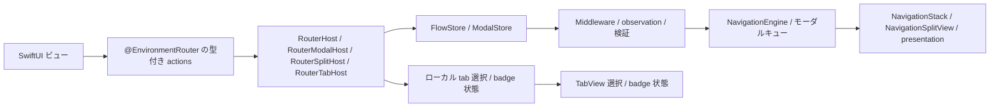
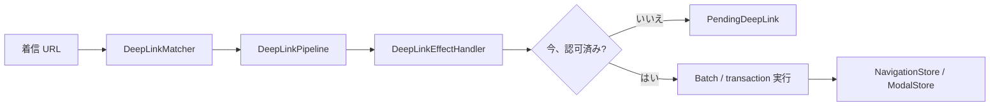

# InnoRouter

[English](README.md) | [한국어](README.ko.md) | [Español](README.es.md) | [Deutsch](README.de.md) | [简体中文](README.zh-Hans.md) | [日本語](README.ja.md) | [Русский](README.ru.md)

[](https://swiftpackageindex.com/InnoSquadCorp/InnoRouter)
[](https://swiftpackageindex.com/InnoSquadCorp/InnoRouter)
[](https://opensource.org/licenses/MIT)
[](https://codecov.io/gh/InnoSquadCorp/InnoRouter)

InnoRouter は、型付き状態、明示的なコマンド実行、アプリ境界でのディープリンクプランニングを中心に構築された SwiftUI ネイティブのナビゲーションフレームワークです。

ナビゲーションを、ビューにローカルな副作用の散乱ではなく、第一級のステートマシンとして扱います。

## InnoRouter が所有するもの

InnoRouter は以下を担当します:

- `@Router` による route と destination の自動生成
- `RouterHost`、`RouterModalHost`、`RouterSplitHost`、`RouterTabHost`
  がローカルに所有する stack、modal、split-detail、tab authority
- `@DeepLink` による fail-closed な URL-to-route マッピング
- `@SceneRouter` と `@Scene` による opt-in の spatial scene 構成
- `NavigationStore`、`ModalStore`、`FlowStore` による高度な外部所有ルーティング
- `NavigationCommand` と `NavigationEngine` によるコマンド実行
- `DeepLinkPipeline` と `InnoRouterEffects` による高度なディープリンク計画と pending replay

意図的に汎用アプリケーションステートマシンではありません。

これらの関心事は InnoRouter の外に保ってください:

- ビジネスワークフロー状態
- 認証/セッションのライフサイクル
- ネットワークリトライまたはトランスポート状態
- アラートと確認ダイアログ

## 要件

- iOS 18+
- iPadOS 18+
- macOS 15+
- tvOS 18+
- watchOS 11+
- visionOS 2+
- Swift 6.3+

iOS 18 フロアと `swift-tools-version: 6.3` パッケージベースラインは
意図的なものです:すべてのパブリック型が `@preconcurrency` /
`@unchecked Sendable` のエスケープハッチなしで strict concurrency と
`Sendable` を採用できるようにし、これによりナビゲーション状態がビュー
コードとストア間の境界で main actor の外に静かに漏れることがなくなります。
代償は iOS 13–16 をターゲットとするライブラリよりも採用ウィンドウが小さい
ことであり、利点はルーターの `Sendable`/`@MainActor` 規律が散文ではなく
コンパイラによってチェックされることです。

マクロターゲットは `swift-syntax` `603.0.2` に `.upToNextMinor` 制約で
依存しています。InnoRouter 5.0 は、このホスト依存と CI で固定した Xcode 26.6
toolchain に合わせてパッケージフロアを Swift 6.3 に引き上げます。今後の
Swift フロア引き上げもメジャーバージョンでのみ行います。

| 並行性スタンス | InnoRouter | iOS 13+ の TCA / FlowStacks / その他 |
|---|---|---|
| パブリック型は `Sendable` を無条件に宣言 | ✅ | ⚠ 部分的 — 多くは `@preconcurrency` を使用 |
| ストアは `@MainActor` 隔離、ランタイム hop なし | ✅ | ⚠ 状況による |
| ソース内の `@unchecked Sendable` / `nonisolated(unsafe)` | ❌ なし | ⚠ 一部のアダプターで使用 |
| Strict concurrency モード | ✅ モジュール単位で強制 | ⚠ オプトインまたは部分的 |

## プラットフォームサポート

InnoRouter はすべての Apple プラットフォーム上で SwiftUI を介して出荷されます。
UIKit や AppKit のブリッジモジュールは不要です。

| 機能 | iOS | iPadOS | macOS | tvOS | watchOS | visionOS |
|---|---|---|---|---|---|---|
| `@Router` + `RouterHost` / `RouterModalHost` / `RouterTabHost` | ✅ | ✅ | ✅ | ✅ | ✅ | ✅ |
| `@Router` + `RouterSplitHost` | ✅ | ✅ | ✅ | ✅ | ❌ | ✅ |
| `NavigationStore` / `NavigationHost` / `FlowStore` / `FlowHost` | ✅ | ✅ | ✅ | ✅ | ✅ | ✅ |
| `NavigationSplitHost` / `CoordinatorSplitHost` | ✅ | ✅ | ✅ | ✅ | ❌ | ✅ |
| `ModalHost` `.sheet` | ✅ | ✅ | ✅ | ✅ | ✅ | ✅ |
| `ModalHost` `.fullScreenCover` ネイティブ | ✅ | ✅ | ⚠ ダウングレード | ✅ | ⚠ ダウングレード | ⚠ ダウングレード |
| Tab badge 状態 API / ネイティブビジュアル | ✅ | ✅ | ✅ | ⚠ 状態のみ | ⚠ 状態のみ | ✅ |
| `DeepLinkPipeline` / `FlowDeepLinkPipeline` | ✅ | ✅ | ✅ | ✅ | ✅ | ✅ |
| `InnoRouterSpatial`: `@SceneRouter` / `@Scene` (windows、volumetric、immersive) | — | — | — | — | — | ✅ |
| `InnoRouterSpatial`: `innoRouterOrnament(_:content:)` ビュー modifier | no-op | no-op | no-op | no-op | no-op | ✅ |

`⚠ ダウングレード` は、ストア API がリクエストをそのまま受け入れますが、
SwiftUI ホストが `.fullScreenCover` を利用できないため `.sheet` として
レンダリングすることを意味します。`⚠ 状態のみ` は、router が
バッジ状態を保存・公開しますが、`RouterTabHost` と `TabCoordinatorView` が `.badge(_:)` を
利用できないため SwiftUI のネイティブなビジュアルバッジを省略することを
意味します。`❌` は、API が存在しないか明示的に unavailable と指定されているため、
そのプラットフォームでは使用できないことを意味します。適切な availability または
条件付きコンパイル guard の内側で呼び出しをビルドしてください。

## インストール

```swift skip package-manifest-fragment
dependencies: [
    .package(url: "https://github.com/InnoSquadCorp/InnoRouter.git", from: "5.0.0")
],
targets: [
    .target(
        name: "MyApp",
        dependencies: [
            .product(name: "InnoRouter", package: "InnoRouter")
        ]
    )
]
```

InnoRouter はソースのみの SwiftPM パッケージとして配布されます。バイナリ
アーティファクトは出荷せず、library evolution は意図的にオフになっており、
Apple プラットフォーム全体でソースビルドがシンプルに保たれます。
通常のアプリターゲットは `InnoRouter` product から始めます。ランタイム API と
macros の両方を提供するため、ソースでは `import InnoRouter` だけで使用できます。
visionOS scene routing または app-boundary 実行を使う target は
`InnoRouterSpatial` または `InnoRouterEffects` を明示的に追加し、test target は
必要に応じて `InnoRouterTesting` を追加します。これらの opt-in product は
`InnoRouter` umbrella から re-export されません。

## 30 秒クイックスタート

`InnoRouter` を 1 回 import し、enum に `@Router` を付け、`destination` に各画面を
記述します。Macro が `Route` / `DestinationRoute` conformance と SwiftUI に必要な
actor / result-builder annotation を生成します。

```swift compile
import SwiftUI
import InnoRouter

@Router
enum HomeRoute {
    case detail(id: String)
    case settings

    var destination: some View {
        switch self {
        case .detail(let id):
            Text("Detail \(id)")
        case .settings:
            Text("Settings")
        }
    }
}

struct AppRoot: View {
    var body: some View {
        RouterHost(HomeRoute.self) {
            HomeView()
        }
    }
}

struct HomeView: View {
    @EnvironmentRouter(HomeRoute.self) private var router

    var body: some View {
        List {
            Button("Detail") {
                router.go(.detail(id: "123"))
            }

            Button("Settings") {
                router.go(.settings)
            }
        }
        .navigationTitle("Home")
    }
}
```

`@Router` は誤った宣言、欠落または不正な `destination`、手書き member と
生成 member の衝突をコンパイル時に報告します。Host がない、または route 型が
合わない場合は runtime hierarchy の問題として、設定済みの environment diagnostic policy に従います。

### Store を追加せずに surface を増やす

| 追加したいもの | 宣言 | Host |
|---|---|---|
| sheet / cover | 同じ `@Router` cases | `RouterHost` または modal-only の `RouterModalHost` |
| split detail | 同じ `@Router` enum | `RouterSplitHost` |
| native tabs | すべての `@Router` case に `@TabItem` | `RouterTabHost` |
| 1 route の deep link | `@Router` の literal allowlists + case の `@DeepLink` | `RouterHost`、`RouterSplitHost`、または `RouterTabHost` |
| visionOS scenes | `@SceneRouter` + case ごとの `@Scene` | `App.body` に `<Route>.scenes` を設置 |

通常の route action は引き続き `@EnvironmentRouter` から、spatial scene action は
`@EnvironmentSceneRouter` から取得します。不正または不完全な macro 宣言には、
対処方法を示す compiler diagnostic が出ます。

## OSS リリースと SemVer 契約

`4.0.0` は InnoRouter の最初の OSS リリースであり、パブリック SemVer
契約でカバーされる最初のバージョンです。現在の互換性ラインは `5.0.0` から
始まります。以前のプライベート/内部パッケージスナップショットは OSS 互換性
ラインの一部ではありません。4.x リリースから移行するチームは
[`CHANGELOG.md`](CHANGELOG.md) の 5.0 移行ノートに従ってください。

### 5.x ラインの SemVer コミットメント

`5.x.y` リリース内で、InnoRouter は [Semantic Versioning](https://semver.org/)
に厳密に従います:

- **`5.x.y` → `5.x.(y+1)`** パッチリリース:バグ修正のみ。パブリック API
  シグネチャの変更なし。文書化されたバグの修正以外、観察可能な動作変更なし。
- **`5.x.y` → `5.(x+1).0`** マイナーリリース:追加のみ。新しい型、新しい
  メソッド、新しい case、新しい設定オプション。既存のシグネチャは形を保ち、
  既存の呼び出し箇所は変更なしでコンパイルします。
- **`5.x.y` → `6.0.0`** メジャーリリース:ソース互換性を破壊するもの、
  パブリックシンボルを削除するもの、ジェネリック制約を狭めるもの、または
  既存の呼び出し箇所を驚かせる方法で文書化されたランタイム動作を変更
  するもの全て。

プレリリースタグは `5.0.0-rc.1` / `5.1.0-beta.2` 形式を使用します。単一の
strict バージョンポリシーが、先行ゼロのない GA、`rc`、`beta` のみを受け入れます。
プレリリースタグの push は公開しない検証 run として完了し、実際の公開は
[`RELEASING.md`](RELEASING.md) に従って `release.yml` を `prerelease=true` で
手動実行します。

### 何が破壊的変更とみなされるか

5.x SemVer コミットメントの目的において、*破壊的変更*とは以下の
いずれかを意味します:

- パブリックシンボル(型、メソッド、プロパティ、associated type、case)の
  削除または名前変更。
- 既存の呼び出し箇所でコンパイルに失敗するようなパブリックメソッド
  シグネチャの変更(デフォルト値なしのパラメータの追加、ジェネリック制約の
  厳格化、戻り値型の交換)。
- 既存の正しい呼び出し元が異なる観察可能な結果を生成するようにパブリック
  API の文書化された動作を変更すること(例:デフォルトの
  `NavigationPathMismatchPolicy` を反転する)。
- サポートされる最小 Swift toolchain またはプラットフォームフロアを上げる。

逆に、以下は破壊的*ではない*ため、任意のマイナーリリースでランディング
できます:

- 非 `@frozen` パブリック enum に新しい case を追加する。
- パブリックメソッドにデフォルト値ありのパラメータを追加する。
- 内部のみの型を厳格化する。
- セマンティクスを保持するパフォーマンス改善。
- ドキュメントのみの変更。

### 4.x の歴史的記録

`4.1.0` は事前ユーザクリーンアップパス後の採用ベースラインです。未使用の
ディスパッチャオブジェクト API を削除し、`replaceStack` を唯一のフルスタック
置換 intent として保持し、effect 観察を明示的なイベントストリームに
移動します。これは 4.x ラインで文書化された唯一の source-breaking 例外です。
`4.0.0` タグは最初の OSS スナップショットとして残り、完全な 4.x 履歴と
5.0 移行は [`CHANGELOG.md`](CHANGELOG.md) に記録されています。

### Imports

アンブレラターゲット `InnoRouter` は `InnoRouterCore`、
`InnoRouterSwiftUI`、`InnoRouterDeepLink` と macro 宣言を re-export します。
デフォルトの 5.0 体験は macro-first です。アプリは 1 つの product と
1 つの import で `@Router`、`@TabItem`、`@DeepLink` を使えます。
Spatial scene と app-boundary effects は opt-in です:

```swift skip doc-fragment
import InnoRouter            // stores、hosts、deep links、macros
import InnoRouterSpatial     // visionOS scenes と ornaments
import InnoRouterEffects     // app-boundary 実行と pending replay
```

直接 import は高度なモジュール分割の選択です。`InnoRouterMacros` は
macro 宣言を直接公開し、生成コードが使う Core、SwiftUI、DeepLink API も
re-export します。通常のアプリターゲットは `InnoRouter` アンブレラを使います。

SwiftSyntax がバックエンドのマクロ実装はこのパッケージに含まれます。
package-traits または別のマクロパッケージへの分割は、
`swift package show-traits`、`swift build --target InnoRouter`、
`swift build --target InnoRouterMacros` を移行コストに対して測定した後でのみ
評価するべきです。

| Product | いつ import するか |
|---|---|
| `InnoRouter` | アプリコードのデフォルト: `@Router`、`@TabItem`、`@DeepLink`、macro-first hosts、およびその下の高度な stores。 |
| `InnoRouterSpatial` | `@SceneRouter` / `@Scene` で visionOS の window、volume、immersive space を宣言するターゲット。manual scene store と ornament API も含み、`InnoRouter` からは re-export されません。 |
| `InnoRouterMacros` | macro 宣言と、生成コードが使う Core、SwiftUI、DeepLink API を re-export する直接 macro module。通常は `InnoRouter` を使います。 |
| `InnoRouterEffects` | `NavigationCommand` 値を実行し、保留中のディープリンクを処理または再開するアプリ境界コード。 |
| `InnoRouterTesting` | ホストレスの `NavigationTestStore`、`ModalTestStore`、`FlowTestStore` を望むテストターゲット。 |

## モジュール

- `InnoRouter`:`InnoRouterCore`、`InnoRouterSwiftUI`、`InnoRouterDeepLink`、`InnoRouterMacros` の macro-first アンブレラ
- `InnoRouterCore`:route stack、validators、commands、results、batch/transaction executors、middleware
- `InnoRouterSwiftUI`:`RouterHost`、`RouterModalHost`、`RouterSplitHost`、`RouterTabHost`、高度な stores/hosts、coordinators、型付き `EnvironmentRouter` actions
- `InnoRouterSpatial`:opt-in の `@SceneRouter` / `@Scene`、生成 scene 構成、manual scene registry/store、host/anchor modifiers、ornaments
- `InnoRouterDeepLink`:パターンマッチング、診断、pipeline プランニング、保留中ディープリンク
- `InnoRouterEffects`:アプリ境界用のナビゲーションとディープリンク実行ヘルパー
- `InnoRouterMacros`:`@Router`、`@TabItem`、`@DeepLink`、`@Routable`、`@CasePathable`

## 適切な surface を選ぶ

まず route enum と macro-first host から始めます。状態復元、可変
middleware、直接監視、認証後の pending replay、またはアトミックな
複数ステップ計画をアプリ境界が所有する場合だけ、外部所有の store に移行します:

| 必要 | 使用 |
|---|---|
| 1 つのローカル feature で stack + sheet / cover | `@Router` + `RouterHost` |
| modal のみのローカル feature | `@Router` + `RouterModalHost` |
| 対応 platform の split-detail navigation | `@Router` + `RouterSplitHost` |
| 生成された label と image を持つ native tabs | `@Router` + `@TabItem` + `RouterTabHost` |
| 許可された URL が 1 route を select または push | `@Router(deepLinkSchemes:deepLinkHosts:)` + `@DeepLink` + `RouterHost`、`RouterSplitHost`、または `RouterTabHost` |
| visionOS windows、volumes、immersive spaces | `InnoRouterSpatial`: `@SceneRouter` + `@Scene` + `<Route>.scenes` |
| 外部所有の stack、復元、middleware、直接監視 | `NavigationStore` + `NavigationHost` |
| 外部所有の modal queue | `ModalStore` + `ModalHost` |
| アトミックな push + modal 計画または復元された flow | `FlowStore` + `FlowHost` + `FlowPlan` |
| 認証、pending replay、複数ステップの URL 計画 | `DeepLinkPipeline` / `FlowDeepLinkPipeline` + `InnoRouterEffects` |
| manual visionOS scene authority または custom scene 構成 | `SceneStore` + `innoRouterSceneHost` / `innoRouterSceneAnchor` |
| Reducer、effect、またはアプリ境界の実行 | `InnoRouterEffects` |
| SwiftUI ホストなしの router アサーション | `InnoRouterTesting` |

Macro-first host は store をローカルに所有し、`@EnvironmentRouter` で型付き
action を公開します。Store、Effects、Testing、manual spatial API は通常の
feature に必要な初期設定ではなく、明示的な高度化パスです。

### 簡易意思決定フローチャート

```text
アプリ境界が routing state を所有または復元する flow ですか?
├── いいえ → @Router を宣言し、ローカル host を選択
│        ├── stack + modal → RouterHost
│        ├── modal only   → RouterModalHost
│        ├── split detail → RouterSplitHost
│        └── tabs         → @TabItem + RouterTabHost
└── はい → authority に合わせて NavigationStore、ModalStore、FlowStore を選択
         (認証付きまたは複数ステップ URL: DeepLinkPipeline + Effects)
```

View からの通常の stack navigation には `@EnvironmentRouter` の
`go` / `back` を使用します。明示的な navigation、modal、flow semantics が
必要な場合のみ [`Docs/IntentSelectionGuide.md`](Docs/IntentSelectionGuide.md)
の低レベル intent を使用します。

## ドキュメント

- 最新 DocC ポータル: [InnoRouter latest docs](https://innosquadcorp.github.io/InnoRouter/latest/)
- バージョン管理された docs ルート: [InnoRouter docs](https://innosquadcorp.github.io/InnoRouter/)
- リリースチェックリスト: [RELEASING.md](RELEASING.md)
- メンテナークイックガイド: [CLAUDE.md](CLAUDE.md)

`README.md` はリポジトリのエントリポイントです。
DocC は詳細なモジュールレベルリファレンスセットです。

### チュートリアル記事

最も一般的な採用パスのステップバイステップウォークスルー。各記事は関連する
DocC カタログ内に存在し、レンダリングされた DocC サイト、GitHub ソース
ビュー、オフライン `swift package generate-documentation` ビルドのすべてが
同じコンテンツを表示します。

| 記事 | カタログ | カバー内容 |
| --- | --- | --- |
| [Tutorial-LoginOnboarding](Sources/InnoRouterSwiftUI/InnoRouterSwiftUI.docc/Articles/Tutorial-LoginOnboarding.md) | `InnoRouterSwiftUI` | `FlowStore` と `ChildCoordinator` でログイン → onboarding → home フローを構築 |
| [Tutorial-DeepLinkReconciliation](Sources/InnoRouterSwiftUI/InnoRouterSwiftUI.docc/Articles/Tutorial-DeepLinkReconciliation.md) | `InnoRouterSwiftUI` | cold-start vs warm ディープリンクの調整、保留中の replay を含む |
| [Tutorial-MiddlewareComposition](Sources/InnoRouterSwiftUI/InnoRouterSwiftUI.docc/Articles/Tutorial-MiddlewareComposition.md) | `InnoRouterSwiftUI` | 型付きミドルウェアの構成、コマンドの傍受、churn の観察 |
| [Tutorial-MigratingFromNestedHosts](Sources/InnoRouterSwiftUI/InnoRouterSwiftUI.docc/Articles/Tutorial-MigratingFromNestedHosts.md) | `InnoRouterSwiftUI` | 入れ子の `NavigationHost` + `ModalHost` スタックを `FlowHost` で置換 |
| [Tutorial-Throttling](Sources/InnoRouterSwiftUI/InnoRouterSwiftUI.docc/Articles/Tutorial-Throttling.md) | `InnoRouterSwiftUI` | 決定論的テストクロックを伴う `ThrottleNavigationMiddleware` の使用 |
| [Tutorial-VisionOSScenes](Sources/InnoRouterSpatial/InnoRouterSpatial.docc/Articles/Tutorial-VisionOSScenes.md) | `InnoRouterSpatial` | `@SceneRouter` と `@Scene` で visionOS windows、volumetric scenes、immersive spaces を宣言 |
| [Tutorial-FlowDeepLinkPipeline](Sources/InnoRouterDeepLink/InnoRouterDeepLink.docc/Articles/Tutorial-FlowDeepLinkPipeline.md) | `InnoRouterDeepLink` | `FlowDeepLinkPipeline` を介して合成 push + modal ディープリンクを構築 |
| [Tutorial-StatePersistence](Sources/InnoRouterCore/InnoRouterCore.docc/Tutorial-StatePersistence.md) | `InnoRouterCore` | `StatePersistence` で起動間に `FlowPlan` / `RouteStack` を永続化 |
| [Tutorial-TestingFlows](Sources/InnoRouterTesting/InnoRouterTesting.docc/Articles/Tutorial-TestingFlows.md) | `InnoRouterTesting` | `FlowTestStore` を介したホストレスの Swift Testing アサーション |

## 動作

### ランタイムフロー



- ビューは `@EnvironmentRouter` を通じて route 型付き action を呼び出します。
- `RouterHost`、`RouterModalHost`、`RouterSplitHost` はローカルな `FlowStore`
  または `ModalStore` を所有し、`RouterTabHost` は選択と badge 状態を直接所有します。
  各 host はその authority をネイティブな SwiftUI API に変換します。
- 高度なアプリは、外部所有と injection のために同等の明示的な Store または
  Coordinator authority を選べます。

### ディープリンクフロー



- マッチングとプランニングは純粋なまま保たれます。
- Effect ハンドラーはアプリポリシーが今実行するか延期するかを決定する境界です。
- 保留中ディープリンクはアプリが replay の準備が整うまで計画された遷移を保持します。

## 状態と実行モデル

InnoRouter は 3 つの異なる実行セマンティクスを公開します。

### 単一コマンド

`execute(_:)` は 1 つの `NavigationCommand` を適用し、型付き
`NavigationResult` を返します。

### Batch

`executeBatch(_:stopOnFailure:)` はステップごとのコマンド実行を保持しつつ
観察を結合します。

batch 実行を使用するとき:

- 複数のコマンドが依然として 1 つずつ実行される必要がある
- ミドルウェアが依然として各ステップを見る必要がある
- オブザーバーが依然として 1 つの集約された遷移イベントを受け取る必要がある

### Transaction

`executeTransaction(_:)` は影スタック上でコマンドをプレビューし、すべての
ステップが成功した場合のみコミットします。

transaction 実行を使用するとき:

- 部分的な成功が受け入れられない
- 失敗またはキャンセル時にロールバックを望む
- ステップごとの観察よりも all-or-nothing のコミットイベントが重要

### `.sequence`

`.sequence` はトランザクションではなく、コマンド代数です。

意図的に:

- 左から右
- 非アトミック
- `NavigationResult.multiple` で型付け

後のステップが失敗しても、以前に成功したステップは適用されたままです。

### `send(_:)` vs `execute(_:)` — 適切なエントリーポイントを選ぶ

InnoRouter は目的ごとに view action と store/engine API を階層化します。
データ形状ではなく、呼び出し箇所に一致するエントリーポイントを選んでください。

| レイヤー | エントリー | 使用するとき |
| --- | --- | --- |
| View action (標準) | `router.go(_:)`、`router.back()`、… | 通常の SwiftUI view から `@EnvironmentRouter` 経由でルーティングするとき。 |
| View intent (高度) | `router.send(_:)` | 名前付きの convenience method がない `NavigationIntent` を送るとき。 |
| 外部 store 境界 | `store.send(_:)` | アプリが `NavigationStore` を意図的に外部所有して注入するとき。 |
| Command | `store.execute(_:)` | 単一の `NavigationCommand` をエンジンに転送し、型付き `NavigationResult` を検査するとき。 |
| Batch | `store.executeBatch(_:)` | 複数のコマンドを 1 つずつ実行しつつ、ミドルウェアの可視性と単一のオブザーバーイベントを保持するとき。 |
| Transaction | `store.executeTransaction(_:)` | All-or-nothing で影スタックに対してプレビューし、各ステップが成功した場合のみコミットするとき。 |

経験則:

- 通常の view は `@EnvironmentRouter` を使用し、明示的な外部 store 境界だけが
  `store.send` を呼び出します。コーディネーターと effect 境界は execute します。
- `send` は intent 形(検査する戻り値なし)。`execute*` はコマンド形
  (分岐、テレメトリー、リトライのための型付き結果を返す)。
- 部分的な失敗時にロールバックする必要のあるアトミックな複数ステップ
  フローには、手作りのバッチよりも `executeTransaction` を選ぶ。

同じ階層化が `ModalStore` と `FlowStore` に適用されます:
ビューからの `send(_: ModalIntent)` / `send(_: FlowIntent)` と、エンジン
境界での `execute(_:)` / `executeBatch(_:)` / `executeTransaction(_:)`。

### `.sequence`、`executeBatch`、`executeTransaction` の選択

| 望むもの | 使用 | 理由 |
|---|---|---|
| 多くのコマンドに対する 1 つの観察可能な変更、ベストエフォート | `executeBatch(_:stopOnFailure:)` | `onEvent` / `events` を通じた集約 `.changed` と `.batchExecuted`、オプションの fail-fast |
| ロールバックを伴う All-or-nothing の適用 | `executeTransaction(_:)` | シャドウ状態プレビュー、ジャーナルベースの破棄 |
| エンジンが計画/検証する合成*値* | `NavigationCommand.sequence([...])` | 純粋なコマンド、1 単位として各ミドルウェアを流れる |
| 静かな期間の後に最新のコマンドのみを発火 | `DebouncingNavigator` | Async ラッピング navigator、`Clock` 注入可能 |
| キーごとにレートリミット | `ThrottleNavigationMiddleware` | 同期、最後の受け入れタイムスタンプ |

ワーク例とアンチパターンを伴う完全な意思決定マトリックスは DocC チュートリアル
[`Guide-SequenceVsBatchVsTransaction`](Sources/InnoRouterSwiftUI/InnoRouterSwiftUI.docc/Articles/Guide-SequenceVsBatchVsTransaction.md)
にあります。

## スタックルーティング surface

`NavigationIntent` は完全な SwiftUI スタック intent surface です:

- `.go(Route)`
- `.goMany([Route])`
- `.back`
- `.backBy(Int)`
- `.backTo(Route)`
- `.backToRoot`
- `.replaceStack([Route])`

Macro-first view は通常 store を知る必要がありません。`@EnvironmentRouter` で
action を読み取り、一般的な遷移には `router.go(_:)` / `router.back()`、高度な
intent には `router.send(_:)` を使用します。`NavigationStore.send(_:)` は、
アプリが store を意図的に外部所有して注入する境界でのみ呼び出します。

## モーダルルーティング surface

InnoRouter は以下のモーダルルーティングをサポートします:

- `sheet`
- `fullScreenCover`

使用:

- `@Router`
- modal-only feature には `RouterModalHost`、stack + modal には `RouterHost`
- `@EnvironmentRouter`

例:

```swift skip doc-fragment
@Router
enum AppModalRoute {
    case profile
    case onboarding

    var destination: some View {
        switch self {
        case .profile: ProfileView()
        case .onboarding: OnboardingView()
        }
    }
}

struct ShellView: View {
    var body: some View {
        RouterModalHost(AppModalRoute.self) {
            ModalLauncher()
        }
    }
}

struct ModalLauncher: View {
    @EnvironmentRouter(AppModalRoute.self) private var router

    var body: some View {
        Button("Profile") {
            router.sheet(.profile)
        }
    }
}
```

子 view は `router.sheet(.profile)` または `router.cover(.onboarding)` で表示し、
`router.dismiss()` で閉じます。アプリが modal queue を所有・復元し、
middleware を変更するか直接監視する場合だけ `ModalStore` + `ModalHost` を使います。

### モーダルスコープ境界

iOS と tvOS では、macro-first hosts と `ModalHost` はスタイルを `sheet` と `fullScreenCover` に
直接マップします。他のサポートされたプラットフォームでは、`fullScreenCover`
は安全に `sheet` にダウングレードします。

InnoRouter は意図的に以下を所有**しません**:

- `alert`
- `confirmationDialog`

これらをフィーチャーローカルまたはコーディネーターローカルのプレゼンテーション
状態として保ってください。

### モーダル可観測性

`ModalStoreConfiguration` は 1 つの型付き監視コールバックと
非同期ストリームを提供します:

- `logger`
- `onEvent: (ModalEvent<M>) -> Void`
- `ModalStore.events: AsyncStream<ModalEvent<M>>`

present、dismiss、replace、queue 変更、command interception、middleware 変更は
`ModalEvent` を switch して処理します。

`ModalDismissalReason` は以下を区別します:

- `.dismiss`
- `.dismissAll`
- `.systemDismiss`

### モーダルミドルウェア

`ModalStore` は `NavigationStore` と同じミドルウェア surface を公開します:

- `willExecute` / `didExecute` を伴う `ModalMiddleware` / `AnyModalMiddleware<M>`。
- `ModalInterception` はミドルウェアが `.proceed(command)`(書き換えられた
  コマンドを含む)または `ModalCancellationReason` を伴う `.cancel(reason:)`
  を行うことを可能にします。
- `ModalStore.addMiddleware` / `insertMiddleware` / `removeMiddleware` /
  `replaceMiddleware` / `moveMiddleware` — ナビゲーションと一致するハンドル
  ベースの CRUD。
- `execute(_:) -> ModalExecutionResult<M>` はすべての `.present`、
  `.dismissCurrent`、`.dismissAll` をレジストリ経由でルーティングします。
- `ModalMiddlewareMutationEvent` は分析のためにレジストリ churn を表面化します。

## スプリットナビゲーション

対応 platform でローカルな split-detail surface を作るには
`@Router` + `RouterSplitHost` を使います:

```swift skip doc-fragment
RouterSplitHost(AppRoute.self) {
    SidebarView()
} root: {
    ContentUnavailableView("Select an item", systemImage: "sidebar.left")
}
```

Host が detail stack と modal authority を所有し、子 view は同じ
`@EnvironmentRouter` action を使います。アプリが stack を所有するか、
intent を coordinator に通す場合は `NavigationSplitHost` または
`CoordinatorSplitHost` に移行します。`RouterSplitHost` は watchOS では使用できません。

これらはアプリ所有のままです:

- サイドバー選択
- 列の可視性
- コンパクト適応

## Tab ルーティング surface

すべての引数なし `@Router` case に `@TabItem` を付けます。Macro が
`RouterTab`、`CaseIterable`、title、system image を生成します:

```swift skip doc-fragment
@Router
enum AppTab {
    @TabItem("Home", systemImage: "house")
    case home

    @TabItem("Settings", systemImage: "gear")
    case settings

    var destination: some View {
        switch self {
        case .home: HomeView()
        case .settings: SettingsView()
        }
    }
}

RouterTabHost(AppTab.self, initial: .home)
```

子 view は `router.select(_:)`、`router.setBadge(_:for:)`、badge clear action を
使います。アプリが selection を所有し、custom shell や tab ごとの独立 store を
構成する場合だけ `TabCoordinatorView` を使います。

## コーディネーター surface

コーディネーターは SwiftUI intent とコマンド実行の間に位置するポリシー
オブジェクトです。通常の feature の初期設定ではなく、以下が必要な場合の
高度化パスです。

`CoordinatorHost` または `CoordinatorSplitHost` を使用するとき:

- ビュー intent が最初にポリシールーティングを必要とする
- アプリシェルが調整ロジックを必要とする
- 複数のナビゲーション権限が 1 つのコーディネーターの背後で構成されるべき

`StepCoordinator` と `TabCoordinator` はヘルパーであり、
`NavigationStore` の代替ではありません。

推奨される分担:

- `NavigationStore`:route-stack の権限
- `TabCoordinator`:シェル/タブ選択状態
- `StepCoordinator`:目的地内のローカルステップ進行

### 子コーディネーターのチェイニング

`ChildCoordinator` は親コーディネーターが
`parent.push(child:) -> Task<Child.Result?, Never>` を介してインラインで
完了値を await することを可能にします:

```swift skip doc-fragment
let signupResult = await parentCoordinator.push(child: SignUpCoordinator())
if let user = signupResult {
    parentCoordinator.handle(.go(.home(user)))
}
```

コールバック(`onFinish`、`onCancel`)は同期的にインストールされるため、
子は親の `await` の前を含めいつでもそれらを発火できます。設計の根拠は
[`Docs/design-child-coordinator-handoff.md`](Docs/design-child-coordinator-handoff.md)
を参照してください。

親 `Task` のキャンセルは `ChildCoordinator.parentDidCancel()`(デフォルトの
空 no-op)を介して子に伝播します。親ビューが解除されたときに一時的な状態を
解体する(シートを解除、進行中のリクエストをキャンセル、一時ストアを解放)
ためにオーバーライドします:

```swift skip doc-fragment
final class SignUpCoordinator: ChildCoordinator {
    typealias Result = UserID
    var onFinish: (@MainActor @Sendable (UserID) -> Void)?
    var onCancel: (@MainActor @Sendable () -> Void)?

    func parentDidCancel() {
        signUpAPIClient.cancelActiveRequests()
    }
}
```

`parentDidCancel` は方向性を持ちます(親 → 子)。`onCancel` を呼び出しません
(`onCancel` は子 → 親のまま);2 つのフックは直交します。

## 名前付きナビゲーション intent

高頻度の intent は既存の `NavigationCommand` プリミティブから構成されます:

- `NavigationIntent.replaceStack([R])` — 1 つの観察可能なステップでスタックを
  指定されたルートにリセットする。
- `NavigationIntent.backOrPush(R)` — `route` がスタックに既に存在する場合は
  そこまで pop、そうでなければ push する。
- `NavigationIntent.pushUniqueRoot(R)` — スタックに同等のルートがまだ含まれて
  いない場合のみ push する。

これらは通常の `send` → `execute` パイプラインを通ってルーティングされる
ため、ミドルウェアとテレメトリーは直接の `NavigationCommand` 呼び出しと
同一に観察します。

## case 型付き目的地バインディング

`NavigationStore` と `ModalStore` は `@Routable` / `@CasePathable` が発する
`CasePath` でキー付けされた `binding(case:)` ヘルパーを公開します:

```swift skip doc-fragment
struct DetailSheet: View {
    let store: NavigationStore<AppRoute>

    var body: some View {
        SomeDetailView()
            .sheet(item: store.binding(case: AppRoute.Cases.detail)) { detail in
                DetailView(detail: detail)
            }
    }
}
```

バインディングはすべての set を既存のコマンドパイプラインを通してルーティング
するため、ミドルウェアとテレメトリーは直接の `execute(...)` 呼び出しと
完全に同じように観察します。`ModalStore.binding(case:style:)` はプレゼン
テーションスタイルごとにスコープされます(`.sheet` / `.fullScreenCover`)。

## ディープリンクモデル

デフォルトは route ごとの 1 annotation です。Literal な scheme / host allowlist により
生成 resolver は fail closed になり、対応する macro-first host が着信 URL を自動処理します:

```swift skip doc-fragment
@Router(
    deepLinkSchemes: ["myapp", "https"],
    deepLinkHosts: ["app.example.com"]
)
enum AppRoute {
    @DeepLink("/products/:id")
    case product(id: String)

    var destination: some View {
        switch self {
        case .product(let id): ProductView(id: id)
        }
    }
}

RouterHost(AppRoute.self) { HomeView() }
```

`RouterHost` と `RouterSplitHost` は解決した route を push し、`RouterTabHost` は
その tab を select します。Macro は不正な pattern、欠落した origin allowlist、
非対応 payload、生成 member の衝突、到達不能または宣言順に依存する mapping を
コンパイル時に診断します。

認証、pending replay、複数ステップ調整をアプリが所有する場合は、
deep-link plan が高度化パスになります。

コアピース:

- `DeepLinkMatcher`
- `DeepLinkPipeline`
- `DeepLinkDecision`
- `PendingDeepLink`
- `NavigationPlan`

典型的なフロー:

1. URL をルートに一致させる
2. scheme/host で拒否または受け入れる
3. 認証ポリシーを適用する
4. `.plan`、`.pending`、`.rejected`、または `.unhandled` を発行する
5. 結果のナビゲーション計画を明示的に実行する

### Matcher 診断

`DeepLinkMatcher` は route と `FlowPlan` の出力に同じ診断を提供します:

- 重複パターン
- ワイルドカード shadowing
- パラメータ shadowing
- 非終端ワイルドカード

診断は宣言順優先度を変更しません。ランタイム動作を静かに変更することなく
オーサリングミスを捕捉するのに役立ちます。診断がビルドを失敗させるべき
release-readiness ゲートでは `try DeepLinkMatcher(strict:)` を使用します。

### 合成ディープリンク(push + modal 末尾)

`FlowDeepLinkPipeline` は push のみのパイプラインを拡張し、単一の URL が
push 接頭辞**プラス**モーダル終端ステップを 1 つのアトミックな
`FlowStore.apply(_:)` で再水和できるようにします:

```swift skip doc-fragment
let matcher = DeepLinkMatcher<FlowPlan<AppRoute>> {
    DeepLinkMapping("/home/detail/:id") { params in
        guard let id = params.firstValue(forName: "id") else { return nil }
        return FlowPlan(steps: [.push(.home), .push(.detail(id: id))])
    }
    DeepLinkMapping("/onboarding/privacy") { _ in
        FlowPlan(steps: [.sheet(.privacyPolicy)])
    }
}

let pipeline = FlowDeepLinkPipeline(
    allowedSchemes: ["myapp"],
    allowedHosts: ["app"],
    matcher: matcher,
    authenticationPolicy: .required(
        shouldRequireAuthentication: { _ in true },
        isAuthenticated: { SessionStore.shared.isAuthenticated }
    )
)

let handler = FlowDeepLinkEffectHandler(pipeline: pipeline, applier: flowStore)

FlowHost(store: flowStore, destination: destination) { RootView() }
    .onOpenURL { _ = handler.handle($0) }
```

各 `DeepLinkMapping<FlowPlan<R>>` ハンドラーは**完全な** `FlowPlan` を返すため、
複数セグメント URL は宣言サイトで明示的です。パイプラインは push のみの
パイプラインの `DeepLinkAuthenticationPolicy` + `PendingDeepLink` セマン
ティクスを文字通り再利用し、対称的な認証延期と replay を実現します。
完全なウォークスルーは
[`Sources/InnoRouterDeepLink/InnoRouterDeepLink.docc/Articles/Tutorial-FlowDeepLinkPipeline.md`](Sources/InnoRouterDeepLink/InnoRouterDeepLink.docc/Articles/Tutorial-FlowDeepLinkPipeline.md)
を参照してください。

## Spatial scene surface

Spatial routing は opt-in product `InnoRouterSpatial` で macro-first です。1 つの enum に
`@SceneRouter` を付け、すべての case に `@Scene` を記述し、生成された scene tree を
`App.body` に設置します:

```swift skip doc-fragment
import InnoRouterSpatial

@SceneRouter
enum AppScene {
    @Scene(.window)
    case main

    @Scene(.immersive(style: .mixed))
    case theatre

    var destination: some View {
        switch self {
        case .main: MainView()
        case .theatre: TheatreView()
        }
    }
}

@main
struct ExampleApp: App {
    var body: some Scene { AppScene.scenes }
}
```

子 view は `@EnvironmentSceneRouter(AppScene.self)` と route-aware な `open(_:)`、
`dismissWindow(_:)`、`dismissImmersive()` を使います。Custom scene 構成または
外部所有 scene authority が必要な場合だけ `SceneStore`、`innoRouterSceneHost`、
`innoRouterSceneAnchor` を使います。

## ミドルウェア

ミドルウェアはコマンド実行の周りに横断的なポリシーレイヤーを提供します。

事前実行:

- `willExecute(_:state:) -> NavigationInterception`
- `.proceed(updatedCommand)`
- `.cancel(reason)`

事後実行:

- `didExecute(_:result:state:) -> NavigationResult`

ミドルウェアは以下が可能:

- コマンドを書き換える
- 型付きキャンセル理由で実行をブロックする
- 実行後に結果を畳み込む

ミドルウェアはストア状態を直接変更できません。

### 型付きキャンセル

キャンセル理由は `NavigationCancellationReason` を使用します:

- `.middleware(debugName:command:)`
- `.conditionFailed`
- `.custom(String)`

### ミドルウェア管理

`NavigationStore` はハンドルベースの管理を公開します:

- `addMiddleware`
- `insertMiddleware`
- `removeMiddleware`
- `replaceMiddleware`
- `moveMiddleware`
- `middlewareMetadata`

## パス調整

SwiftUI の `NavigationStack(path:)` 更新は意味的なコマンドにマップバック
されます。

ルール:

- 接頭辞縮小 → `.popCount` または `.popToRoot`
- 接頭辞拡張 → バッチ化された `.push`
- 非接頭辞ミスマッチ → `NavigationPathMismatchPolicy`

利用可能なミスマッチポリシー:

- `.replace` — デフォルトの本番スタンス。SwiftUI の非接頭辞パス書き換えを
  受け入れ、ミスマッチイベントを発行する。
- `.assertAndReplace` — debug / pre-release スタンス。assert してから同じ
  置換セマンティクスで回復する。
- `.ignore` — store 権威スタンス。書き換えを観察するが、現在のスタックを
  変更しない。
- `.custom` — ドメイン修復スタンス。古い/新しいパスを 1 つのコマンド、
  バッチ、または no-op にマップする。

`NavigationStoreConfiguration.logger` が設定されている場合、ミスマッチ処理は
構造化されたテレメトリーを発行します。

## Effect モジュール

### `InnoRouterEffects`

アプリシェルコードがナビゲーター境界の上に小さな実行ファサードを望むときに
使用します。

主要 API:

- `execute(_:)`
- `execute(_ commands:)`
- `executeTransaction(_:)`
- `executeGuarded(_:, prepare:)`

明示的な async ガードヘルパー以外、これらの API は同期 `@MainActor` API です。

ディープリンク計画が型付き結果を伴ってアプリ境界で実行されるべきときに
使用します。

主要 API:

- `handle(_ url:)`
- `resumePendingDeepLink()`
- `resumePendingDeepLinkIfAllowed(_:)`
- `restore(pending:)`

### Coordinator 統合

Coordinator ベースのアプリは store と並べて `DeepLinkEffectHandler` を 1 つ
所有し、`init(pipeline:navigator:)` で構成済み pipeline を注入します。URL は
`handle(_:)`、replay は `resumePendingDeepLink()` または
`resumePendingDeepLinkIfAllowed(_:)` に委譲し、
`DeepLinkEffectHandler.Result` を処理します。Pending request の identity は
handler が所有し、アプリがメモリ上で引き継いだ値は `restore(pending:)` で戻します。
UI 観察が必要なら返された結果を coordinator state に反映します。起動をまたぐ
永続化には `FlowPendingDeepLinkPersistence` を使用します。

## `Examples` vs `ExamplesSmoke`

リポジトリは意図的にドキュメンテーション例を CI 例から分離します。

- `Examples/`:macro-first entry point と明示的な Store / Coordinator への移行を
  ともに扱う人間向けの例
- `ExamplesSmoke/`:CI 用のコンパイラ安定 smoke フィクスチャ

`InnoRouterMacroFirstSmoke` は downstream の `@Router`、`@TabItem`、`@DeepLink`
contract と `RouterHost`、`RouterModalHost`、`RouterSplitHost`、`RouterTabHost` を
対応 platform matrix でまとめてコンパイルします。別の Spatial consumer smoke は
visionOS で `@SceneRouter` をコンパイルします。

人間向けの例は以下をカバーします:

- [`Examples/MacrosExample.swift`](Examples/MacrosExample.swift): macro-first の
  stack、modal-only、split-detail、native tab、1 route deep link surface
- 単独スタックルーティング
- コーディネータールーティング
- ディープリンク
- スプリットナビゲーション
- アプリシェル構成
- モーダルルーティング
- macro-first visionOS scene routing

## ドキュメントとリリースフロー

### DocC

DocC はモジュールごとにビルドされ、GitHub Pages に公開されます。

公開された構造:

- `/InnoRouter/latest/`
- `/InnoRouter/4.3.0/`
- `/InnoRouter/` ルートポータル

### CI

CI は以下を検証します:

- `swift test`
- `principle-gates`
- すべての Apple ターゲットをコンパイルし、tvOS/watchOS/visionOS のランタイムテストを実行する `platforms` ワークフロー
- 例の smoke ビルド
- DocC プレビュービルド

### CD

GA 公開は strict な裸の semver タグで実行されます:

- `5.0.0`

無効なタグの例:

- 先頭に `v` が付くタグ
- `release-5.0.0`

リリースワークフローの責務:

- exact tag、`main` ancestry、タグ内の `CHANGELOG.md` を検証
- コード/ドキュメンテーションゲートを再実行
- 再利用可能な `platforms` ゲートを呼び出し、成功するまで公開をブロックする。ローカルの `./scripts/principle-gates.sh --platforms=all` はコンパイル確認のみで、ランタイムテストの代替にはならない
- バージョン管理された DocC をビルド
- GA が公開済みの最高 GA 以上の場合のみ `/latest/` を更新
- 古いバージョン管理された docs を保持
- GitHub リリースを公開

### SwiftUI 哲学整合性

InnoRouter は共有ナビゲーション権限のための意図的なトレードオフを行いつつ
SwiftUI の宣言的方向性に従います。

- ビューはルーター状態を直接変更する代わりに intent を発行します。
- スタック、スプリット詳細、モーダル権限は分離されたままです。
- 環境配線の欠如は素早く失敗します。
- `NavigationStore` は共有権限であり、儚いローカル状態ではないため
  参照型のままです。
- `Coordinator` は同じ理由で `AnyObject` のままです。

これは SwiftUI からの偶然のドリフトではなく、意図的な実用的トレードオフです。

## Examples

人間向けの例はここにあります:

- Macro-first modal / split / tab surface: [Examples/MacrosExample.swift](https://github.com/InnoSquadCorp/InnoRouter/blob/main/Examples/MacrosExample.swift)
- Macro-first stack: [Examples/StandaloneExample.swift](https://github.com/InnoSquadCorp/InnoRouter/blob/main/Examples/StandaloneExample.swift)
- Macro-first deep link: [Examples/DeepLinkExample.swift](https://github.com/InnoSquadCorp/InnoRouter/blob/main/Examples/DeepLinkExample.swift)
- Macro-first visionOS scene: [Examples/VisionOSImmersiveExample.swift](https://github.com/InnoSquadCorp/InnoRouter/blob/main/Examples/VisionOSImmersiveExample.swift)
- 高度な coordinator: [Examples/CoordinatorExample.swift](https://github.com/InnoSquadCorp/InnoRouter/blob/main/Examples/CoordinatorExample.swift)
- 高度な split coordinator: [Examples/SplitCoordinatorExample.swift](https://github.com/InnoSquadCorp/InnoRouter/blob/main/Examples/SplitCoordinatorExample.swift)
- 高度な app shell: [Examples/AppShellExample.swift](https://github.com/InnoSquadCorp/InnoRouter/blob/main/Examples/AppShellExample.swift)

## 品質ゲート

リリースをカットする前にこれらをローカルで実行します:

```bash
swift test
./scripts/principle-gates.sh
./scripts/build-docc-site.sh --version preview --skip-latest
```

## Flow スタック

`FlowStore<R>` は統一された push + sheet + cover フローを単一の
`RouteStep<R>` 値の配列として表現します。内部の `NavigationStore<R>` と
`ModalStore<R>` を所有し、それぞれに委任しつつ不変条件を強制します
(末尾モーダルは最大 1 つ、モーダルは常に末尾、ミドルウェアロールバックが
パスを調整)。

これらの内部ストアは実装の詳細です。アプリコードは `FlowStore.path`、
`send(_:)`、`apply(_:)`、`events` を公開権限 surface として扱うべきです。
直接の内部ストア変更はホストとフォーカスされた不変条件テストのために
予約されています。

典型的な使用法:

```swift skip doc-fragment
let flow = FlowStore<AppRoute>()
let restoredFlow = try FlowStore<AppRoute>(
    validating: persistedSteps
)

flow.send(.push(.home))
flow.send(.push(.detail(id)))
flow.send(.presentSheet(.share))   // tail modal
flow.apply(FlowPlan(steps: [.push(.home), .cover(.paywall)]))
```

- `FlowHost` は `FlowStore` を基盤に environment-free な navigation / modal
  surface を描画し、`@EnvironmentRouter(Route.self)` 向けの統合 authority を
  1 つ公開します。Flow 固有の intent は `router.send(flow:)` で送信します。
- `FlowStoreConfiguration` は `NavigationStoreConfiguration` と
  `ModalStoreConfiguration` を構成し、`FlowEvent` を受け取る 1 つの
  `onEvent` を追加します。flow-level の path / rejection に加え、
  `.navigation(...)` / `.modal(...)` でラップされた内部イベントも届きます。
- `FlowStore(validating:configuration:)` は復元または外部供給された
  `[RouteStep]` 値のための throwing イニシャライザです。互換性のある
  `initial:` イニシャライザは依然として無効な入力を空のパスに強制します。
- `FlowRejectionReason` は実行時の拒否理由を表面化します
  (`pushBlockedByModalTail`、`invalidResetPath`、`middlewareRejected(debugName:)`、
  `reentrantApply`)。

## ホストレステスト (`InnoRouterTesting`)

`InnoRouterTesting` は `NavigationStore`、`ModalStore`、`FlowStore` を
ラップする出荷可能な Swift Testing ネイティブアサーションハーネスです。
テストは `@testable import InnoRouterSwiftUI` や手作りの `Mutex<[Event]>`
コレクターをもう必要としません — すべての公開観察イベントは FIFO
キューにバッファリングされ、テストは TCA スタイルの `receive(...)` 呼び出し
でそれを排出します。

プロダクトをテストターゲットのみに追加します:

```swift skip doc-fragment
// Package.swift
.testTarget(
    name: "AppTests",
    dependencies: [
        .product(name: "InnoRouter", package: "InnoRouter"),
        .product(name: "InnoRouterTesting", package: "InnoRouter"),
    ]
)
```

それから本番 intent に対してテストを書きます:

```swift skip doc-fragment
import Testing
import InnoRouter
import InnoRouterTesting

@Test
@MainActor
func pushHomeThenDetail() {
    let store = NavigationTestStore<AppRoute>()

    store.send(.go(.home))
    store.receiveChange { _, new in new.path == [.home] }

    store.executeBatch([.push(.detail("42"))])
    store.receiveChange { _, new in new.path == [.home, .detail("42")] }
    store.receiveBatch { $0.isSuccess }

    store.finish()
}
```

ハーネスがカバーする内容:

- **`NavigationTestStore<R>`** — `.changed`、`.batchExecuted`、
  `.transactionExecuted`、`.middlewareMutation`、`.pathMismatch` を含む
  すべての `NavigationEvent` case。
  `send`、`execute`、`executeBatch`、`executeTransaction` を変更なく
  下層のストアに転送します。
- **`ModalTestStore<M>`** — `.presented`、`.dismissed`、`.replaced`、
  `.queueChanged`、`.commandIntercepted`、`.middlewareMutation` を含む
  すべての `ModalEvent` case。
- **`FlowTestStore<R>`** — FlowStore レベルの `.pathChanged` +
  `.intentRejected`、加えて単一キューでの内部ストアの発行を囲む
  `.navigation(...)` と `.modal(...)` のラッパー。1 つのテストが、
  ミドルウェアキャンセルパスを含む単一の `FlowIntent` によってトリガーされる
  完全なチェーンをアサートできます。

網羅性はデフォルトで `.strict`:ストアの deinit 時に未アサートのイベント
があると Swift Testing イシューが発火します。レガシーテストフィクスチャ
からの段階的移行には `.off` を使用します。

## 状態復元

`Codable` をオプトインしたルートは、ラウンドトリップ可能な `RouteStack`、
`RouteStep`、`FlowPlan` 値を無料で取得します:

```swift skip doc-fragment
enum AppRoute: Route, Codable {
    case home
    case detail(String)
    case settings
}

let persistence = StatePersistence<AppRoute>()

// シーンバックグラウンド / チェックポイント時:
let data = try persistence.encode(FlowPlan(steps: flowStore.path))
try data.write(to: restorationURL, options: .atomic)

// 起動時:
if let data = try? Data(contentsOf: restorationURL) {
    flowStore.apply(try persistence.decode(data))
}
```

`StatePersistence<R: Route & Codable>` は `JSONEncoder` と `JSONDecoder`
(両方とも設定可能)をラップし、`Data` 境界で停止します — ファイル URL、
`UserDefaults`、iCloud、シーンフェーズフックはアプリの関心事です。エラーは
基底の `EncodingError` / `DecodingError` として伝播されるため、呼び出し元は
スキーマドリフトと I/O 失敗を区別できます。

`FlowPlan(steps: flowStore.path)` は現在表示中のフローのスナップショット
です。それはナビゲーション push スタックと、表示されている場合はアクティブ
モーダル末尾を保存します。モーダルバックログをシリアル化しません。キューに
入れられたプレゼンテーションは内部実行状態として `ModalStore.queuedPresentations`
に存在し、現在の `FlowPlan` 永続化契約の外です。キューに入れられたモーダル
ワークを復元する必要があるアプリは、`FlowPlan` の隣にアプリ所有のキュー
スナップショットを永続化し、起動後に独自のルーティングポリシーを通して
それを replay するべきです。

## 統一観察ストリーム

すべてのストアは観察 surface 全体をカバーする単一の `events: AsyncStream`
を発行します — スタック変更、batch / transaction 完了、パスミスマッチ
解決、ミドルウェアレジストリ変更、モーダル present / dismiss / queue 更新、
コマンド傍受、フローレベルパスまたは intent 拒否シグナル。

ライフサイクルに紐づく Task を開始する前に新しい stream を取得してください。
subscriber が同期登録されるため、Task 作成直後のイベントを取りこぼしません。
所有元の終了時に `observationTask` をキャンセルします。

```swift skip doc-fragment
let events = flowStore.events
let observationTask = Task { @MainActor in
    for await event in events {
        switch event {
        case .navigation(.changed(_, let to)):
            analytics.track("nav_path", to.path)
        case .modal(.commandIntercepted(_, .cancelled(let reason))):
            Log.warning("modal cancelled: \(reason)")
        case .intentRejected(let intent, let reason):
            Log.info("flow rejected \(intent) because \(reason)")
        default:
            continue
        }
    }
}
```

5.0 では各 `*Configuration` は 1 つの型付き `onEvent` コールバックを持ちます。
同期配信には `NavigationEvent`、`ModalEvent`、`FlowEvent` を switch し、非同期
反復には `events` を使用します。以前のイベント別コールバックに互換 shim はありません。
Flow コールバックには自身の `.pathChanged` / `.intentRejected` に加えて
`.navigation(...)` / `.modal(...)` も届きます。

### バックプレッシャー

各ストアはサブスクライバーごとの `AsyncStream.Continuation` を通じてすべての
イベントをすべてのサブスクライバーに fan-out します。負荷の下でサブスクライバー
ごとのキューを制限するため、すべてのストアは設定で `eventBufferingPolicy`
を受け入れます:

- `.bufferingNewest(1024)`(デフォルト)— サブスクライバーごとに最新 1024
  イベントを保持し、バッファがいっぱいになると古いイベントをドロップします。
  現実的なナビゲーションバーストに対応するサイズで、保持されるワーキングセット
  を制限します。
- `.bufferingOldest(N)` — サブスクライバーごとに最古の N 個のイベントを保持し、
  バッファがいっぱいになると新しいイベントをドロップします。
- `.unbounded` — サブスクライバーが排出するまですべてのイベントをバッファ
  します。ライフタイムを制御し、決定論的かつロスレスな順序を必要とする
  テストハーネスや短命のサブスクライバーに使用してください。

```swift skip doc-fragment
let store = try NavigationStore<HomeRoute>(
    initialPath: [.list],
    configuration: NavigationStoreConfiguration(
        eventBufferingPolicy: .bufferingNewest(2048)
    )
)
```

`ModalStoreConfiguration.eventBufferingPolicy` は `ModalStore.events` を制御します。
`FlowStoreConfiguration.eventBufferingPolicy` は flow-level の `FlowStore.events`
fan-out を制御し、`FlowStoreConfiguration.navigation.eventBufferingPolicy` と
`FlowStoreConfiguration.modal.eventBufferingPolicy` はラップされた内部 store stream
を制御します。ドロップは静かです — アナリティクスパイプラインが
「イベントが発生しなかった」を「イベントがバッファ外にドロップされた」と区別する
必要がある場合は、`.unbounded` で購読し、自分でペーシングしてください。

完全な契約は
[`Event-Stream-Backpressure`](Sources/InnoRouterCore/InnoRouterCore.docc/Articles/Event-Stream-Backpressure.md)
に文書化されています。

## ロードマップ

[`Docs/competitive-analysis-and-roadmap.md`](Docs/competitive-analysis-and-roadmap.md)
で追跡されています。P3 の磨き上げクラスターが出荷されると、P0 / P1 / P3 の
バックログは空になります。公開 OSS ラインは 4.0 ベースラインから始まります。
出荷された surface 変更については [`CHANGELOG.md`](CHANGELOG.md) を参照
してください。

- [x] **P2-3 UIKit エスケープハッチ** — 4.0.0 OSS リリースでは却下。
      InnoRouter は SwiftUI 専用のポジショニングスタンスを保ちます。
      UIKit / AppKit アダプターを必要とするチームは、それらの surface を
      InnoRouter の外で構成できます。
- [x] **Debounce セマンティクス** — 4.0.0 で `DebouncingNavigator` として
      出荷されました。`NavigationCommandExecutor` の周りの `Clock` 注入可能
      ラッパーです。同期 `NavigationCommand` 代数はタイマーフリーのまま
      です。

## 採用者

InnoRouter は公開採用曲線の始まりにいます。本番環境で InnoRouter を出荷
する場合は、下のリストにプロジェクトを追加する PR を開いてください。
公開名がまだ可能でない場合は、汎用的な記述子(`a finance app at $company`)
で構いません。採用者シグナルは見込みユーザーが成熟度を測るのに役立ちます。

- _あなたのプロジェクトはここに。_

[`Examples/SampleAppExample.swift`](Examples/SampleAppExample.swift) ファイル
は、ヘッドラインフィーチャー surface 全体を示します — 認証ゲーティングを
持つディープリンクパイプライン、FlowStore push+modal プロジェクション、
DebouncingNavigator サーチデバウンス — を 1 つの自己完結型権限クラスに
構成しています。

## 貢献

ブランチ、コミット規約、公開 API 変更ルール、マクロテスト要件については
[`CONTRIBUTING.md`](CONTRIBUTING.md) を参照してください。
セキュリティに関する発見は [`SECURITY.md`](SECURITY.md) のプライベート
プロセスに従います。参加には [`CODE_OF_CONDUCT.md`](CODE_OF_CONDUCT.md)
に従うことが期待されます。

## ライセンス

MIT
