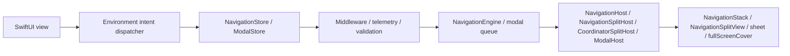
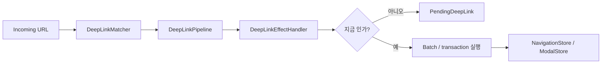

# InnoRouter

[English](README.md) | [한국어](README.ko.md) | [Español](README.es.md) | [Deutsch](README.de.md) | [简体中文](README.zh-Hans.md) | [日本語](README.ja.md) | [Русский](README.ru.md)

[](https://swiftpackageindex.com/InnoSquadCorp/InnoRouter)
[](https://swiftpackageindex.com/InnoSquadCorp/InnoRouter)
[](https://opensource.org/licenses/MIT)
[](https://codecov.io/gh/InnoSquadCorp/InnoRouter)

InnoRouter는 typed state, 명시적 command 실행, 그리고 앱 경계에서의 딥링크 planning을 중심으로 만들어진 SwiftUI 네이티브 네비게이션 프레임워크입니다.

네비게이션을 view 곳곳에 흩어진 부수효과가 아니라 일급(first-class) state machine으로 다룹니다.

## InnoRouter가 책임지는 것

InnoRouter는 다음을 책임집니다:

- `RouteStack`을 통한 stack 네비게이션 상태
- `NavigationCommand`와 `NavigationEngine`을 통한 command 실행
- `NavigationStore`를 통한 SwiftUI 네비게이션 권한
- `ModalStore`를 통한 `sheet`와 `fullScreenCover`의 모달 권한
- `DeepLinkMatcher`와 `DeepLinkPipeline`을 통한 딥링크 매칭과 planning
- `InnoRouterEffects`를 통한 앱 경계 실행 헬퍼

InnoRouter는 의도적으로 범용 애플리케이션 state machine이 아닙니다.

다음은 InnoRouter 외부에 두세요:

- 비즈니스 워크플로우 상태
- 인증/세션 lifecycle
- 네트워크 재시도나 transport 상태
- alert 및 confirmation dialog

## 요구 사항

- iOS 18+
- iPadOS 18+
- macOS 15+
- tvOS 18+
- watchOS 11+
- visionOS 2+
- Swift 6.3+

iOS 18 floor와 `swift-tools-version: 6.3` package baseline은 의도적인 선택입니다.
이 floor 덕분에 모든 public 타입이 `@preconcurrency` / `@unchecked Sendable`
탈출구 없이 strict concurrency와 `Sendable`을 채택할 수 있고, 결과적으로
view 코드와 store 사이 경계에서 네비게이션 상태가 main actor 밖으로 은밀하게
새지 않습니다. 비용은 iOS 13~16을 타깃하는 라이브러리들보다 채택 가능 시장이
좁다는 점이고, 이득은 라이브러리의 `Sendable`/`@MainActor` 규율이 산문이 아닌
컴파일러로 검증된다는 점입니다.

매크로 타깃은 `swift-syntax` `603.0.2`에 `.upToNextMinor` 제약으로 의존합니다.
InnoRouter 5.0은 이 host 의존성과 CI에 핀된 Xcode 26.6 toolchain에 맞춰 package
floor를 Swift 6.3으로 올립니다. 이후 Swift floor 상향도 메이저 버전에서만 진행합니다.

| Concurrency 자세 | InnoRouter | iOS 13+ 타깃의 TCA / FlowStacks 등 |
|---|---|---|
| public 타입이 무조건 `Sendable` 선언 | ✅ | ⚠ 부분적 — 다수가 `@preconcurrency` 사용 |
| Store가 `@MainActor` 격리, 런타임 hop 없음 | ✅ | ⚠ 라이브러리마다 다름 |
| 소스에 `@unchecked Sendable` / `nonisolated(unsafe)` | ❌ 없음 | ⚠ 일부 어댑터에서 사용 |
| Strict concurrency 모드 | ✅ 모듈별 강제 | ⚠ opt-in이거나 부분 적용 |

## 플랫폼 지원

InnoRouter는 SwiftUI를 통해 모든 Apple 플랫폼에서 동작합니다. UIKit이나
AppKit 브릿지 모듈은 필요하지 않습니다.

| 기능 | iOS | iPadOS | macOS | tvOS | watchOS | visionOS |
|---|---|---|---|---|---|---|
| `NavigationStore` / `NavigationHost` / `FlowStore` / `FlowHost` | ✅ | ✅ | ✅ | ✅ | ✅ | ✅ |
| `NavigationSplitHost` / `CoordinatorSplitHost` | ✅ | ✅ | ✅ | ✅ | ❌ | ✅ |
| `ModalHost` `.sheet` | ✅ | ✅ | ✅ | ✅ | ✅ | ✅ |
| `ModalHost` `.fullScreenCover` 네이티브 | ✅ | ✅ | ⚠ degrades | ✅ | ⚠ degrades | ⚠ degrades |
| `TabCoordinator.badge` 상태 API / 네이티브 시각 표현 | ✅ | ✅ | ✅ | ⚠ 상태 only | ⚠ 상태 only | ✅ |
| `DeepLinkPipeline` / `FlowDeepLinkPipeline` | ✅ | ✅ | ✅ | ✅ | ✅ | ✅ |
| `InnoRouterSpatial`: `SceneStore` / `innoRouterSceneHost` (windows, volumetric, immersive) | — | — | — | — | — | ✅ |
| `InnoRouterSpatial`: `innoRouterOrnament(_:content:)` view modifier | no-op | no-op | no-op | no-op | no-op | ✅ |

`⚠ degrades`는 store API가 요청을 그대로 수락하지만 SwiftUI host가 `.fullScreenCover`를
사용할 수 없어 `.sheet`로 렌더링한다는 뜻입니다. `⚠ 상태 only`는 coordinator가
badge 상태를 저장·노출하지만, `.badge(_:)`가 사용 불가능해 `TabCoordinatorView`가
SwiftUI의 네이티브 시각 badge를 생략한다는 뜻입니다. `❌`는 해당 플랫폼에서
심볼이 선언되지 않는다는 뜻이며, `#if !os(...)` 뒤에서 빌드해야 합니다.
공간 라우팅 surface는 5.0의 정식 opt-in API이며 experimental로 분류되지 않습니다.

## 설치

```swift skip package-manifest-fragment
dependencies: [
    .package(url: "https://github.com/InnoSquadCorp/InnoRouter.git", from: "5.0.0")
],
targets: [
    .target(
        name: "MyApp",
        dependencies: [
            .product(name: "InnoRouter", package: "InnoRouter")
        ]
    )
]
```

앱 타깃에는 기본 라우팅을 위한 `InnoRouter` product를 추가하세요. visionOS scene이나
ornament를 사용하는 타깃에는 `InnoRouterSpatial` product도 명시적으로 추가해야 합니다.
`InnoRouter` umbrella는 `InnoRouterSpatial`을 re-export하지 않습니다.

InnoRouter는 source-only SwiftPM 패키지로 배포됩니다. 바이너리 아티팩트를 제공하지
않으며, library evolution은 의도적으로 꺼져 있어 Apple 플랫폼 전반에서 source 빌드가
단순하게 유지됩니다.

## 30초 Quick Start

InnoRouter import 하나를 추가하고 enum에 `@Router`를 붙인 뒤, `destination`
프로퍼티에서 화면만 연결하면 됩니다. `Route`와 `DestinationRoute` 준수, SwiftUI에
필요한 actor와 result builder annotation은 매크로가 생성합니다.

```swift compile
import SwiftUI
import InnoRouter

@Router
enum HomeRoute {
    case detail(id: String)
    case settings

    var destination: some View {
        switch self {
        case .detail(let id):
            Text("Detail \(id)")
        case .settings:
            Text("Settings")
        }
    }
}

struct AppRoot: View {
    var body: some View {
        RouterHost(HomeRoute.self) {
            HomeView()
        }
    }
}

struct HomeView: View {
    @EnvironmentRouter(HomeRoute.self) private var router

    var body: some View {
        List {
            Button("Detail") {
                router.go(.detail(id: "123"))
            }
            Button("Settings") {
                router.go(.settings)
            }
        }
        .navigationTitle("Home")
    }
}
```

`@Router`를 잘못된 선언에 붙이거나 `destination`이 없거나 형태가 잘못된 경우,
수동 선언이 생성 코드와 충돌하는 경우에는 컴파일 시점 진단이 표시됩니다. host 누락이나
route 타입 불일치는 SwiftUI 계층이 만들어진 뒤에만 알 수 있으므로 InnoRouter의 설정된
environment 진단 정책을 따릅니다.

## OSS 릴리즈 및 SemVer 계약

`4.0.0`은 InnoRouter의 첫 OSS 릴리즈이며, public SemVer 계약이 적용되는 첫 버전입니다.
현재 호환성 라인은 `5.0.0`부터 시작합니다. 이전의 비공개/내부 패키지 스냅샷은
OSS 호환성 라인의 일부가 아닙니다. 4.x 릴리즈에서 이동하는 팀은
[`CHANGELOG.md`](CHANGELOG.md)의 5.0 마이그레이션 안내를 따라야 합니다.

### 5.x 라인의 SemVer 약속

`5.x.y` 릴리즈 내에서 InnoRouter는 [Semantic Versioning](https://semver.org/)을
엄격하게 따릅니다:

- **`5.x.y` → `5.x.(y+1)`** 패치 릴리즈: 버그 수정 only.
  public-API 시그니처 변경 없음. 문서화된 버그 수정 외에는 관찰 가능한 동작 변경 없음.
- **`5.x.y` → `5.(x+1).0`** 마이너 릴리즈: 추가만(additive only).
  새 타입, 새 메서드, 새 케이스, 새 설정 옵션. 기존 시그니처는 모양을 유지하고
  기존 호출 사이트는 수정 없이 컴파일됩니다.
- **`5.x.y` → `6.0.0`** 메이저 릴리즈: source 호환성을 깨거나, public 심볼을
  제거하거나, generic 제약을 좁히거나, 문서화된 런타임 동작을 기존 호출 사이트가
  놀랄 만한 방식으로 변경하는 모든 것.

Pre-release 태그는 `5.0.0-rc.1` / `5.1.0-beta.2` 형식을 사용합니다. 하나의
strict 버전 정책이 선행 0 없는 GA, `rc`, `beta` 식별자만 허용합니다. Pre-release
태그 push는 게시하지 않는 검증 run으로 완료되며, 실제 출시는
[`RELEASING.md`](RELEASING.md)에 따라 `release.yml`을 `prerelease=true`로 수동
실행합니다.

### Breaking change의 정의

5.x SemVer 약속의 목적상, *breaking change*는 다음 중 하나를 의미합니다:

- public 심볼(타입, 메서드, 프로퍼티, associated type, 케이스)의 제거 또는 이름 변경.
- 기존 호출 사이트에서 컴파일 실패를 일으키는 public 메서드 시그니처 변경
  (defaulted가 아닌 파라미터 추가, generic 제약 강화, 반환 타입 교체).
- 기존의 올바른 호출자가 다른 관찰 결과를 만들어내는 방향으로 public API의
  문서화된 동작을 변경하는 것 (예: 기본 `NavigationPathMismatchPolicy` 변경).
- 최소 지원 Swift toolchain 또는 플랫폼 floor 상향.

반대로 다음은 *breaking이 아니며* 어떤 마이너 릴리즈에서도 들어올 수 있습니다:

- non-`@frozen` public enum에 새 케이스 추가.
- public 메서드에 defaulted 파라미터 추가.
- internal-only 타입의 강화.
- 시멘틱을 보존하는 성능 개선.
- 문서만 변경.

### 4.x 역사 기록

`4.1.0`은 사용자 유입 전 cleanup 패스 이후의 채택 baseline입니다. 사용되지 않던
dispatcher-object API들을 제거하고, `replaceStack`을 단일 풀-스택 교체 intent로
유지하며, effect 관찰을 명시적 이벤트 스트림으로 옮겼습니다. 이는 4.x 라인에서
문서화된 유일한 source-breaking 예외입니다. `4.0.0` 태그는 첫 OSS 스냅샷으로
남아 있으며, 전체 4.x 이력과 5.0 마이그레이션은 [`CHANGELOG.md`](CHANGELOG.md)에
기록되어 있습니다.

### Imports

umbrella 타깃 `InnoRouter`는 `InnoRouterCore`, `InnoRouterSwiftUI`,
`InnoRouterDeepLink`, 라우터 매크로를 re-export합니다. 5.0의 기본 경험은
macro-first이며, 앱 타깃에는 product 하나, 소스에는 import 하나만 필요합니다.
공간 라우팅과 app-boundary effects는 계속 opt-in입니다:

```swift skip doc-fragment
import InnoRouter            // stores, hosts, deep links, macros
import InnoRouterSpatial     // visionOS scenes와 ornaments를 사용할 때만
import InnoRouterEffects     // app-boundary 실행과 pending replay
```

`InnoRouterCore`, `InnoRouterSwiftUI`, `InnoRouterDeepLink`,
`InnoRouterMacros` 직접 import는 의도적으로 더 작은 surface를 선택하는 고급 escape
hatch입니다. 특히 macro가 아닌 세부 product를 선택하면 해당 타깃의 빌드 그래프에서
compiler-plugin target을 제외할 수 있습니다. 다만 SwiftPM은 이 source package가 선언한
package-level `swift-syntax` dependency 자체는 계속 resolve합니다.

SwiftSyntax 기반 매크로 구현은 이 패키지에 포함되어 있습니다. package-traits 또는
매크로-패키지 분리는 `swift package show-traits`,
`swift build --target InnoRouter`, `swift build --target InnoRouterMacros`를
마이그레이션 비용에 비해 실측한 후에만 평가해야 합니다.

| Product | 언제 import할지 |
|---|---|
| `InnoRouter` | 앱 코드의 기본값. `@Router`, store, stack/modal host, intent, coordinator, deep link, persistence 헬퍼. |
| `InnoRouterSpatial` | visionOS scene, immersive space, ornament 라우팅을 사용하는 앱 타깃. `InnoRouter`와 별도로 product를 추가하고 import합니다. |
| `InnoRouterMacros` | macro와 Core/SwiftUI API는 필요하지만 전체 deep-link umbrella는 필요하지 않은 타깃용 granular product. 앱 타깃은 보통 `InnoRouter`를 사용합니다. |
| `InnoRouterEffects` | `NavigationCommand` 값을 실행하고 pending 딥링크를 처리하거나 재개하는 앱-경계 코드. |
| `InnoRouterTesting` | host-less `NavigationTestStore` / `ModalTestStore` / `FlowTestStore`를 원하는 테스트 타깃. |

## 모듈

- `InnoRouter`: `InnoRouterCore`, `InnoRouterSwiftUI`, `InnoRouterDeepLink`, `InnoRouterMacros`의 macro-first umbrella re-export
- `InnoRouterCore`: route stack, validator, command, result, batch/transaction executor, middleware
- `InnoRouterSwiftUI`: store, stack/split/modal host, coordinator, environment intent dispatch
- `InnoRouterSpatial`: opt-in visionOS scene/immersive-space store, host, anchor, ornament
- `InnoRouterDeepLink`: 패턴 매칭, 진단, pipeline planning, pending 딥링크
- `InnoRouterEffects`: 앱 경계용 네비게이션·딥링크 실행 헬퍼
- `InnoRouterMacros`: `@Router`, `@Routable`, `@CasePathable`

## 적합한 surface 고르기

전이 권한(transition authority)을 갖는 가장 작은 surface를 사용하세요:

| 필요 | 사용 |
|---|---|
| 자체 완결형 typed SwiftUI stack 한 개 | `@Router` + `RouterHost` |
| 딥링크·복원·middleware·앱 상태가 소유하는 stack | `NavigationStore` + `NavigationHost` |
| 지원 플랫폼에서 split-view stack | `NavigationStore` + `NavigationSplitHost` |
| stack reset 없는 sheet / cover 권한 | `ModalStore` + `ModalHost` |
| push + modal 흐름, 복원, 또는 multi-step 딥링크 | `FlowStore` + `FlowHost` + `FlowPlan` |
| URL을 push-only command plan으로 변환 | `DeepLinkMatcher` + `DeepLinkPipeline` |
| URL을 push-prefix + modal-tail 흐름으로 변환 | `DeepLinkMatcher<FlowPlan<R>>` + `FlowDeepLinkPipeline` |
| visionOS window, volume, immersive space | `InnoRouterSpatial` + `SceneStore` + `innoRouterSceneHost` / `innoRouterSceneAnchor` |
| Reducer, effect, 또는 앱-경계 실행 | `InnoRouterEffects` |
| SwiftUI host 없는 router assertion | `InnoRouterTesting` |

`NavigationStore`, `FlowStore`, `ModalStore`, `SceneStore`, effects, testing은
의도적으로 분리되어 있습니다. visionOS 공간 surface를 선택했다면 앱 타깃에
`InnoRouterSpatial` product를 추가하고 해당 소스 파일에서 `import InnoRouterSpatial`을
사용하세요. 이 라이브러리는 이 권한들을 명시적으로 유지해서 앱이 라우팅 경계에 맞는
조각만 채택할 수 있게 합니다.

### 빠른 의사결정 흐름도

```text
화면 surface가 push와 modal을 한 흐름에 결합하나요?
├── 예  → FlowStore + FlowHost (단일 진실, 단일 events 스트림)
└── 아니오 → modal 권한(sheet / cover)만 갖나요?
         ├── 예  → ModalStore + ModalHost
         └── 아니오 → @Router + RouterHost
                    (외부 authority: NavigationStore + NavigationHost;
                     split-view: NavigationSplitHost)
```

view의 일반적인 stack 네비게이션에는 `@EnvironmentRouter`의 `go` / `back`을
사용하세요. 명시적인 `NavigationIntent`, modal dispatch, 통합 `FlowIntent` 시멘틱이
필요할 때만 [`Docs/IntentSelectionGuide.md`](Docs/IntentSelectionGuide.md)의
하위 수준 intent 타입으로 내려갑니다.

## 문서

- 최신 DocC 포털: [InnoRouter latest docs](https://innosquadcorp.github.io/InnoRouter/latest/)
- 버전별 docs root: [InnoRouter docs](https://innosquadcorp.github.io/InnoRouter/)
- 릴리즈 체크리스트: [RELEASING.md](RELEASING.md)
- 메인테이너 빠른 가이드: [CLAUDE.md](CLAUDE.md)

`README.md`는 저장소 진입점입니다.
DocC는 상세한 모듈 레벨 레퍼런스 모음입니다.

### 튜토리얼 아티클

가장 흔한 채택 경로를 단계별로 설명합니다. 각 아티클은 관련 DocC 카탈로그 안에
들어 있어 렌더링된 DocC 사이트, GitHub 소스 뷰, 오프라인
`swift package generate-documentation` 빌드 모두 동일한 내용을 보여줍니다.

| 아티클 | 카탈로그 | 다루는 주제 |
| --- | --- | --- |
| [Tutorial-LoginOnboarding](Sources/InnoRouterSwiftUI/InnoRouterSwiftUI.docc/Articles/Tutorial-LoginOnboarding.md) | `InnoRouterSwiftUI` | `FlowStore`와 `ChildCoordinator`로 login → onboarding → home 흐름 만들기 |
| [Tutorial-DeepLinkReconciliation](Sources/InnoRouterSwiftUI/InnoRouterSwiftUI.docc/Articles/Tutorial-DeepLinkReconciliation.md) | `InnoRouterSwiftUI` | cold-start vs warm 딥링크 조정, pending replay 포함 |
| [Tutorial-MiddlewareComposition](Sources/InnoRouterSwiftUI/InnoRouterSwiftUI.docc/Articles/Tutorial-MiddlewareComposition.md) | `InnoRouterSwiftUI` | typed middleware 구성, command 가로채기, churn 관찰 |
| [Tutorial-MigratingFromNestedHosts](Sources/InnoRouterSwiftUI/InnoRouterSwiftUI.docc/Articles/Tutorial-MigratingFromNestedHosts.md) | `InnoRouterSwiftUI` | 중첩된 `NavigationHost` + `ModalHost` stack을 `FlowHost`로 교체 |
| [Tutorial-Throttling](Sources/InnoRouterSwiftUI/InnoRouterSwiftUI.docc/Articles/Tutorial-Throttling.md) | `InnoRouterSwiftUI` | 결정론적 test clock과 `ThrottleNavigationMiddleware` 사용 |
| [Tutorial-StoreObserver](Sources/InnoRouterSwiftUI/InnoRouterSwiftUI.docc/Articles/Tutorial-StoreObserver.md) | `InnoRouterSwiftUI` | 통합 `events` 스트림 위에서 `StoreObserver` 채택 |
| [Tutorial-VisionOSScenes](Sources/InnoRouterSpatial/InnoRouterSpatial.docc/Articles/Tutorial-VisionOSScenes.md) | `InnoRouterSpatial` | `SceneStore`로 visionOS window, volumetric scene, immersive space 구동 |
| [Tutorial-FlowDeepLinkPipeline](Sources/InnoRouterDeepLink/InnoRouterDeepLink.docc/Articles/Tutorial-FlowDeepLinkPipeline.md) | `InnoRouterDeepLink` | `FlowDeepLinkPipeline`을 통한 push + modal 합성 딥링크 |
| [Tutorial-StatePersistence](Sources/InnoRouterCore/InnoRouterCore.docc/Tutorial-StatePersistence.md) | `InnoRouterCore` | `StatePersistence`로 launch 간 `FlowPlan` / `RouteStack` 영속화 |
| [Tutorial-TestingFlows](Sources/InnoRouterTesting/InnoRouterTesting.docc/Articles/Tutorial-TestingFlows.md) | `InnoRouterTesting` | `FlowTestStore`를 통한 host-less Swift Testing assertion |

## 동작 방식

### 런타임 흐름



- View는 typed intent를 environment dispatcher를 통해 emit합니다.
- Store는 네비게이션 또는 모달 권한을 소유합니다.
- Host는 store 상태를 네이티브 SwiftUI 네비게이션 API로 변환합니다.

### 딥링크 흐름



- 매칭과 planning은 순수합니다.
- Effect 핸들러는 앱 정책이 지금 실행할지 미룰지 결정하는 경계입니다.
- Pending 딥링크는 앱이 replay 가능한 시점까지 계획된 전이를 보존합니다.

## 상태와 실행 모델

InnoRouter는 세 가지 별개의 실행 시멘틱을 노출합니다.

### 단일 command

`execute(_:)`는 하나의 `NavigationCommand`를 적용하고 typed `NavigationResult`를 반환합니다.

### Batch

`executeBatch(_:stopOnFailure:)`는 step 단위 command 실행을 유지하되 관찰을 합칩니다.

batch 실행을 사용하는 경우:

- 여러 command가 여전히 하나씩 실행되어야 할 때
- middleware가 각 step을 여전히 봐야 할 때
- 관찰자가 한 개의 집계된 전이 이벤트를 받아야 할 때

### Transaction

`executeTransaction(_:)`은 shadow stack에서 command를 미리보고 모든 step이 성공할 때만 commit합니다.

transaction 실행을 사용하는 경우:

- 부분 성공이 허용되지 않을 때
- 실패 또는 취소 시 rollback을 원할 때
- step 단위 관찰보다 all-or-nothing 단일 commit 이벤트가 더 중요할 때

### `.sequence`

`.sequence`는 transaction이 아닌 command algebra입니다.

의도적으로:

- 좌→우 순서
- 비원자적
- `NavigationResult.multiple`을 통해 typed

뒤 step이 실패해도 앞서 성공한 step은 그대로 적용됩니다.

### `send(_:)` vs `execute(_:)` — 올바른 진입점 고르기

InnoRouter는 목적에 따라 view action과 store/engine API를 계층화합니다.
데이터 모양이 아니라 호출 위치에 맞는 진입점을 고르세요.

| 계층 | 진입점 | 사용 시점 |
| --- | --- | --- |
| View action (기본) | `router.go(_:)`, `router.back()`, … | 일반 SwiftUI view에서 `@EnvironmentRouter`로 라우팅할 때. |
| View intent (고급) | `router.send(_:)` | 이름 있는 편의 메서드가 없는 `NavigationIntent`를 dispatch할 때. |
| 외부 store 경계 | `store.send(_:)` | 앱이 `NavigationStore`를 의도적으로 외부 소유하고 주입할 때. |
| Command | `store.execute(_:)` | 단일 `NavigationCommand`를 엔진에 전달하고 typed `NavigationResult`를 검사할 때. |
| Batch | `store.executeBatch(_:)` | 여러 command를 하나씩 실행하되 middleware 가시성과 단일 관찰자 이벤트를 유지할 때. |
| Transaction | `store.executeTransaction(_:)` | All-or-nothing으로 shadow stack에 미리보고 모든 step이 성공할 때만 commit할 때. |

경험칙:

- 일반 view는 `@EnvironmentRouter`를 사용하고, 명시적인 외부 store 경계에서만
  `store.send`를 호출합니다. Coordinator와 effect 경계는 execute합니다.
- `send`는 intent 모양 (반환값 없음); `execute*`는 command 모양 (분기, 텔레메트리, 재시도용 typed 결과 반환).
- 부분 실패 시 rollback이 필요한 atomic multi-step 흐름은 손수 만든 batch보다
  `executeTransaction`을 선호하세요.

`ModalStore`와 `FlowStore`에도 같은 계층이 적용됩니다:
view에서는 `send(_: ModalIntent)` / `send(_: FlowIntent)`, 엔진 경계에서는
`execute(_:)` / `executeBatch(_:)` / `executeTransaction(_:)`.

### `.sequence`, `executeBatch`, `executeTransaction` 중 고르기

| 원하는 것 | 사용 | 이유 |
|---|---|---|
| 여러 command에 대해 best-effort로 단일 관찰 가능 변경 | `executeBatch(_:stopOnFailure:)` | `onEvent` / `events`로 합쳐진 `.changed`와 `.batchExecuted`, 선택적 fail-fast |
| rollback과 함께 all-or-nothing 적용 | `executeTransaction(_:)` | shadow-state 미리보기, journal 기반 폐기 |
| 엔진이 plan/검증하는 합성 *값* | `NavigationCommand.sequence([...])` | 순수 command, 모든 middleware를 한 단위로 통과 |
| 조용한 시간 후 마지막 command만 실행 | `DebouncingNavigator` | async 래핑 navigator, `Clock` 주입 가능 |
| 키별 rate-limit | `ThrottleNavigationMiddleware` | 동기, 마지막 수락 timestamp |

워크 예제와 안티패턴을 포함한 전체 의사결정 매트릭스는 DocC 튜토리얼
[`Guide-SequenceVsBatchVsTransaction`](Sources/InnoRouterSwiftUI/InnoRouterSwiftUI.docc/Articles/Guide-SequenceVsBatchVsTransaction.md)에 있습니다.

## Stack 라우팅 surface

`NavigationIntent`는 전체 SwiftUI stack-intent surface입니다:

- `.go(Route)`
- `.goMany([Route])`
- `.back`
- `.backBy(Int)`
- `.backTo(Route)`
- `.backToRoot`
- `.replaceStack([Route])`

Macro-first view는 보통 store를 알 필요가 없습니다. `@EnvironmentRouter`로 action을 읽고,
일반 전환은 `router.go(_:)` / `router.back()`을, 고급 intent는 `router.send(_:)`를 사용하세요.
`NavigationStore.send(_:)`는 앱이 store를 의도적으로 외부 소유하고 주입하는 경계에서만
호출합니다.

## Modal 라우팅 surface

InnoRouter는 다음에 대한 모달 라우팅을 지원합니다:

- `sheet`
- `fullScreenCover`

사용:

- `ModalStore`
- `ModalHost`
- `ModalIntent`
- `@EnvironmentModalIntent`

예제:

```swift skip doc-fragment
@Routable
enum AppModalRoute {
    case profile
    case onboarding
}

struct ShellView: View {
    @State private var modalStore = ModalStore<AppModalRoute>()

    var body: some View {
        ModalHost(store: modalStore) { route in
            switch route {
            case .profile:
                ProfileView()
            case .onboarding:
                OnboardingView()
            }
        } content: {
            HomeView()
        }
    }
}
```

### 모달 scope 경계

iOS와 tvOS에서 `ModalHost`는 style을 `sheet`와 `fullScreenCover`로 직접 매핑합니다.
다른 지원 플랫폼에서는 `fullScreenCover`가 안전하게 `sheet`로 degrade됩니다.

InnoRouter는 의도적으로 다음을 소유하지 **않습니다**:

- `alert`
- `confirmationDialog`

이들은 feature-local 또는 coordinator-local presentation 상태로 두세요.

### 모달 관찰성

`ModalStoreConfiguration`은 하나의 typed 관찰 콜백과 async stream을 제공합니다:

- `logger`
- `onEvent: (ModalEvent<M>) -> Void`
- `ModalStore.events: AsyncStream<ModalEvent<M>>`

present, dismiss, replace, queue 변경, command 가로채기, middleware 변경은
`ModalEvent`를 switch해 처리합니다.

`ModalDismissalReason`은 다음을 구분합니다:

- `.dismiss`
- `.dismissAll`
- `.systemDismiss`

### 모달 middleware

`ModalStore`는 `NavigationStore`와 동일한 middleware surface를 노출합니다:

- `willExecute` / `didExecute`를 갖는 `ModalMiddleware` / `AnyModalMiddleware<M>`.
- `ModalInterception`은 middleware가 `.proceed(command)` (rewrite된 command 포함) 또는
  `ModalCancellationReason`과 함께 `.cancel(reason:)`을 할 수 있게 합니다.
- `ModalStore.addMiddleware` / `insertMiddleware` / `removeMiddleware` /
  `replaceMiddleware` / `moveMiddleware` — 네비게이션과 동일한 handle 기반 CRUD.
- `execute(_:) -> ModalExecutionResult<M>`은 모든 `.present`, `.dismissCurrent`, `.dismissAll`을
  registry를 통해 라우팅합니다.
- `ModalMiddlewareMutationEvent`는 분석을 위해 registry churn을 노출합니다.

## Split 네비게이션

iPad와 macOS의 detail 네비게이션은 다음을 사용:

- `NavigationSplitHost`
- `CoordinatorSplitHost`

InnoRouter는 split 레이아웃에서 detail stack만 소유합니다.

다음은 앱 소유로 남습니다:

- sidebar 선택
- 컬럼 가시성
- compact 적응

## Coordinator surface

Coordinator는 SwiftUI intent와 command 실행 사이에 위치하는 정책 객체입니다.

다음 경우에 `CoordinatorHost` 또는 `CoordinatorSplitHost`를 사용:

- view intent가 먼저 정책 라우팅을 거쳐야 할 때
- 앱 shell이 조정 로직을 필요로 할 때
- 여러 네비게이션 권한이 하나의 coordinator 뒤에 합성되어야 할 때

`StepCoordinator`와 `TabCoordinator`는 헬퍼이지 `NavigationStore`의 대체가 아닙니다.

권장 분담:

- `NavigationStore`: route-stack 권한
- `TabCoordinator`: shell/tab 선택 상태
- `StepCoordinator`: destination 안의 local step 진행

### Child coordinator chaining

`ChildCoordinator`는 부모 coordinator가 child의 finish 값을
`parent.push(child:) -> Task<Child.Result?, Never>`를 통해 inline으로 await할 수 있게 합니다:

```swift skip doc-fragment
let signupResult = await parentCoordinator.push(child: SignUpCoordinator())
if let user = signupResult {
    parentCoordinator.handle(.go(.home(user)))
}
```

콜백(`onFinish`, `onCancel`)은 동기적으로 설치되어 child가 부모의 `await` 이전을
포함한 어떤 시점에서도 발사할 수 있습니다. 설계 근거는
[`Docs/design-child-coordinator-handoff.md`](Docs/design-child-coordinator-handoff.md)
를 참조하세요.

부모 `Task` 취소는 `ChildCoordinator.parentDidCancel()` (기본 빈 no-op)을 통해
child로 전파됩니다. 부모 view가 dismiss되면 transient 상태를 정리하도록 override
하세요 — sheet dismiss, 진행 중 요청 취소, 임시 store 해제 등:

```swift skip doc-fragment
final class SignUpCoordinator: ChildCoordinator {
    typealias Result = UserID
    var onFinish: (@MainActor @Sendable (UserID) -> Void)?
    var onCancel: (@MainActor @Sendable () -> Void)?

    func parentDidCancel() {
        signUpAPIClient.cancelActiveRequests()
    }
}
```

`parentDidCancel`은 방향성을 가집니다 (parent → child). `onCancel`을 호출하지 않습니다
(`onCancel`은 child → parent로 유지). 두 훅은 직교합니다.

## Named 네비게이션 intent

빈도가 높은 intent는 기존 `NavigationCommand` 원시(primitive)에서 합성됩니다:

- `NavigationIntent.replaceStack([R])` — 한 번의 관찰 가능 step에서 stack을 주어진 route들로 reset.
- `NavigationIntent.backOrPush(R)` — `route`가 stack에 이미 있으면 거기까지 pop, 없으면 push.
- `NavigationIntent.pushUniqueRoot(R)` — stack에 동일 route가 없을 때만 push.

이들은 일반 `send` → `execute` pipeline을 통과하므로 middleware와 텔레메트리는
직접적인 `NavigationCommand` 호출과 동일하게 관찰합니다.

## Case-typed destination 바인딩

`NavigationStore`와 `ModalStore`는 `@Routable` / `@CasePathable`이 emit하는 `CasePath`로
키된 `binding(case:)` 헬퍼를 노출합니다:

```swift skip doc-fragment
struct DetailSheet: View {
    let store: NavigationStore<AppRoute>

    var body: some View {
        SomeDetailView()
            .sheet(item: store.binding(case: AppRoute.Cases.detail)) { detail in
                DetailView(detail: detail)
            }
    }
}
```

binding은 모든 set을 기존 command pipeline을 통해 라우팅하므로 middleware와
텔레메트리가 직접적인 `execute(...)` 호출과 정확히 동일하게 관찰합니다.
`ModalStore.binding(case:style:)`은 presentation style별로 (`.sheet` / `.fullScreenCover`)
범위가 지정됩니다.

## 딥링크 모델

딥링크는 숨겨진 부수효과가 아닌 plan으로 처리됩니다.

핵심 구성:

- `DeepLinkMatcher`
- `DeepLinkPipeline`
- `DeepLinkDecision`
- `PendingDeepLink`
- `NavigationPlan`

전형적 흐름:

1. URL을 route로 매칭
2. scheme/host로 거부 또는 수락
3. 인증 정책 적용
4. `.plan`, `.pending`, `.rejected`, `.unhandled` 중 하나 emit
5. 결과 네비게이션 plan을 명시적으로 실행

### Matcher 진단

`DeepLinkMatcher`는 route와 `FlowPlan` 출력에 동일한 진단을 제공합니다:

- 중복 패턴
- wildcard shadowing
- 파라미터 shadowing
- 비종단(non-terminal) wildcard

진단은 선언 순서 우선권을 변경하지 않습니다. 런타임 동작을 조용히 바꾸지 않으면서
저작 실수를 잡는 데 도움이 됩니다. 진단이 빌드를 실패시켜야 하는 release-readiness
게이트에서는 `try DeepLinkMatcher(strict:)`를 사용하세요.

### 합성 딥링크 (push + modal tail)

`FlowDeepLinkPipeline`은 push-only pipeline을 확장해 단일 URL이 push prefix와
modal terminal step을 하나의 atomic `FlowStore.apply(_:)` 안에서 rehydrate할 수 있게 합니다:

```swift skip doc-fragment
let matcher = DeepLinkMatcher<FlowPlan<AppRoute>> {
    DeepLinkMapping("/home/detail/:id") { params in
        guard let id = params.firstValue(forName: "id") else { return nil }
        return FlowPlan(steps: [.push(.home), .push(.detail(id: id))])
    }
    DeepLinkMapping("/onboarding/privacy") { _ in
        FlowPlan(steps: [.sheet(.privacyPolicy)])
    }
}

let pipeline = FlowDeepLinkPipeline(
    allowedSchemes: ["myapp"],
    allowedHosts: ["app"],
    matcher: matcher,
    authenticationPolicy: .required(
        shouldRequireAuthentication: { _ in true },
        isAuthenticated: { SessionStore.shared.isAuthenticated }
    )
)

let handler = FlowDeepLinkEffectHandler(pipeline: pipeline, applier: flowStore)

FlowHost(store: flowStore, destination: destination) { RootView() }
    .onOpenURL { _ = handler.handle($0) }
```

각 `DeepLinkMapping<FlowPlan<R>>` 핸들러는 **완전한** `FlowPlan`을 반환하므로 multi-segment URL이
선언 사이트에서 명시적입니다. pipeline은 push-only pipeline의 `DeepLinkAuthenticationPolicy`
+ `PendingDeepLink` 시멘틱을 그대로 재사용해 인증 지연과 replay가 대칭이 됩니다.
전체 walk-through는 [`Sources/InnoRouterDeepLink/InnoRouterDeepLink.docc/Articles/Tutorial-FlowDeepLinkPipeline.md`](Sources/InnoRouterDeepLink/InnoRouterDeepLink.docc/Articles/Tutorial-FlowDeepLinkPipeline.md)
를 참조하세요.

## Middleware

Middleware는 command 실행을 둘러싸는 횡단 정책 계층(cross-cutting policy layer)을 제공합니다.

Pre-execution:

- `willExecute(_:state:) -> NavigationInterception`
- `.proceed(updatedCommand)`
- `.cancel(reason)`

Post-execution:

- `didExecute(_:result:state:) -> NavigationResult`

Middleware는 다음을 할 수 있습니다:

- command rewrite
- typed cancellation 사유로 실행 차단
- 실행 후 결과 fold

Middleware는 store 상태를 직접 변경할 수 없습니다.

### Typed cancellation

Cancellation 사유는 `NavigationCancellationReason`을 사용:

- `.middleware(debugName:command:)`
- `.conditionFailed`
- `.custom(String)`

### Middleware 관리

`NavigationStore`는 handle 기반 관리를 노출합니다:

- `addMiddleware`
- `insertMiddleware`
- `removeMiddleware`
- `replaceMiddleware`
- `moveMiddleware`
- `middlewareMetadata`

## Path 조정 (Reconciliation)

SwiftUI `NavigationStack(path:)` 업데이트는 시맨틱 command로 다시 매핑됩니다.

규칙:

- prefix shrink → `.popCount` 또는 `.popToRoot`
- prefix expand → batched `.push`
- non-prefix mismatch → `NavigationPathMismatchPolicy`

사용 가능한 mismatch 정책:

- `.replace` — 기본 production 자세. SwiftUI의 non-prefix path rewrite를 수락하고 mismatch 이벤트 emit.
- `.assertAndReplace` — debug / pre-release 자세. assert 후 동일한 교체 시멘틱으로 복구.
- `.ignore` — store-authoritative 자세. rewrite를 관찰하되 현재 stack을 변경하지 않음.
- `.custom` — 도메인 복구 자세. 옛/새 path를 하나의 command, batch, 또는 no-op으로 매핑.

`NavigationStoreConfiguration.logger`가 설정되면 mismatch 처리는 구조화된 텔레메트리를 emit합니다.

## Effect 모듈

### `InnoRouterEffects`

앱 shell 코드가 navigator 경계 위의 작은 실행 façade를 원할 때 사용합니다.

핵심 API:

- `execute(_:)`
- `execute(_ commands:)`
- `executeTransaction(_:)`
- `executeGuarded(_:, prepare:)`

명시적 async guard 헬퍼를 제외한 이 API들은 동기 `@MainActor` API입니다.

앱 경계에서 typed 결과와 함께 딥링크 plan을 실행해야 할 때 사용합니다.

핵심 API:

- `handle(_ url:)`
- `resumePendingDeepLink()`
- `resumePendingDeepLinkIfAllowed(_:)`
- `restore(pending:)`

### Coordinator 통합

Coordinator 기반 앱은 store 옆에 `DeepLinkEffectHandler` 하나를 소유하고
`init(pipeline:navigator:)`로 구성된 pipeline을 주입합니다. URL은 `handle(_:)`로,
replay는 `resumePendingDeepLink()` 또는 `resumePendingDeepLinkIfAllowed(_:)`로 위임하고
`DeepLinkEffectHandler.Result`를 처리합니다. Pending 요청 identity는 handler가 소유하며,
앱이 메모리에서 넘겨받은 값은 `restore(pending:)`로 다시 설치합니다. UI 관찰이 필요하면
반환 결과를 coordinator 상태에 mirror합니다. launch 간 영속화에는
`FlowPendingDeepLinkPersistence`를 사용합니다.

## `Examples` vs `ExamplesSmoke`

저장소는 의도적으로 문서 예제와 CI 예제를 분리합니다.

- `Examples/`: 사람용, 관용적, 매크로 기반 예제
- `ExamplesSmoke/`: CI용 컴파일러 안정 smoke fixture

현재 예제는 다음을 다룹니다:

- 단독 stack 라우팅
- coordinator 라우팅
- 딥링크
- split 네비게이션
- 앱 shell 구성
- 모달 라우팅

## 문서와 릴리즈 흐름

### DocC

DocC는 모듈별로 빌드되어 GitHub Pages에 게시됩니다.

게시 구조:

- `/InnoRouter/latest/`
- `/InnoRouter/4.3.0/`
- `/InnoRouter/` 루트 포털

### CI

CI는 다음을 검증합니다:

- `swift test`
- `principle-gates`
- 전체 Apple 컴파일 매트릭스와 tvOS/watchOS/visionOS 런타임 테스트를 위한 `platforms` 워크플로우
- 예제 smoke 빌드
- DocC 미리보기 빌드

### CD

GA 게시는 strict bare semver tag에서 동작합니다:

- `5.0.0`

유효하지 않은 tag 예:

- 선행 `v`가 있는 모든 tag
- `release-5.0.0`

릴리즈 워크플로우 책임:

- exact tag, `main` ancestry, tag의 `CHANGELOG.md` 검증
- 코드/문서 게이트 재실행
- 재사용 가능한 `platforms` 게이트를 호출하고 green이 될 때까지 게시 차단; 로컬 `./scripts/principle-gates.sh --platforms=all`은 컴파일만 확인하며 런타임 테스트를 대체하지 않음
- 버전별 DocC 빌드
- GA가 게시된 최고 GA 이상일 때만 `/latest/` 업데이트
- 이전 버전별 docs 보존
- GitHub Release 게시

### SwiftUI 철학 정렬

InnoRouter는 SwiftUI의 declarative 방향을 따르되 공유 네비게이션 권한을 위해 의도적인 트레이드오프를 합니다.

- View는 router state를 직접 변경하지 않고 intent를 emit합니다.
- Stack, split-detail, 모달 권한은 분리되어 있습니다.
- environment wiring 누락은 fail fast.
- `NavigationStore`는 ephemeral local state가 아닌 공유 권한이므로 reference 타입으로 유지됩니다.
- `Coordinator`는 같은 이유로 `AnyObject`로 유지됩니다.

이는 SwiftUI에서 우연히 멀어진 것이 아닌 의도적이고 실용적인 트레이드오프입니다.

## Examples

사람용 예제는 여기에 있습니다:

- [Examples/StandaloneExample.swift](https://github.com/InnoSquadCorp/InnoRouter/blob/main/Examples/StandaloneExample.swift)
- [Examples/CoordinatorExample.swift](https://github.com/InnoSquadCorp/InnoRouter/blob/main/Examples/CoordinatorExample.swift)
- [Examples/DeepLinkExample.swift](https://github.com/InnoSquadCorp/InnoRouter/blob/main/Examples/DeepLinkExample.swift)
- [Examples/SplitCoordinatorExample.swift](https://github.com/InnoSquadCorp/InnoRouter/blob/main/Examples/SplitCoordinatorExample.swift)
- [Examples/AppShellExample.swift](https://github.com/InnoSquadCorp/InnoRouter/blob/main/Examples/AppShellExample.swift)

## Quality 게이트

릴리즈 cut 전에 로컬에서 다음을 실행하세요:

```bash
swift test
./scripts/principle-gates.sh
./scripts/build-docc-site.sh --version preview --skip-latest
```

## Flow stack

`FlowStore<R>`는 통합된 push + sheet + cover 흐름을 단일 `RouteStep<R>` 값 배열로 표현합니다.
내부 `NavigationStore<R>`와 `ModalStore<R>`를 소유하며, 각각에 위임하면서 불변식을 강제합니다
(modal은 끝에 최대 하나, modal은 항상 끝, middleware rollback이 path를 조정).

이 내부 store들은 4.0에서 `@_spi(FlowStoreInternals)`입니다. 앱 코드는
`FlowStore.path`, `send(_:)`, `apply(_:)`, `events`, `intentDispatcher`를 public 권한 surface로
취급해야 하며, 직접적인 inner-store 변경은 host와 집중된 invariant 테스트에 한정됩니다.

전형적 사용:

```swift skip doc-fragment
let flow = FlowStore<AppRoute>()
let restoredFlow = try FlowStore<AppRoute>(
    validating: persistedSteps
)

flow.send(.push(.home))
flow.send(.push(.detail(id)))
flow.send(.presentSheet(.share))   // tail modal
flow.apply(FlowPlan(steps: [.push(.home), .cover(.paywall)]))
```

- `FlowHost`는 `NavigationHost` 위에 `ModalHost`를 합성하고 `@EnvironmentFlowIntent(Route.self)`
  dispatch를 위한 environment 클로저를 주입합니다.
- `FlowStoreConfiguration`은 `NavigationStoreConfiguration`과 `ModalStoreConfiguration`을 합성하며,
  `FlowEvent`를 받는 하나의 `onEvent`를 추가합니다. 이 콜백은 flow-level path/rejection뿐 아니라
  `.navigation(...)` / `.modal(...)`로 감싼 inner-store 이벤트도 받습니다.
- `FlowStore(validating:configuration:)`는 복원된 또는 외부에서 공급된 `[RouteStep]` 값을 위한
  throwing initializer입니다. 호환용 `initial:` initializer는 여전히 유효하지 않은 입력을 빈 path로 강제합니다.
- `FlowRejectionReason`은 실행 중 거부 사유를 노출합니다
  (`pushBlockedByModalTail`, `invalidResetPath`, `middlewareRejected(debugName:)`,
  `reentrantApply`).

## Host-less 테스트 (`InnoRouterTesting`)

`InnoRouterTesting`은 `NavigationStore`, `ModalStore`, `FlowStore`를 감싸는
shippable Swift Testing 네이티브 assertion 하네스입니다. 테스트는 더 이상
`@testable import InnoRouterSwiftUI`나 손수 만든 `Mutex<[Event]>` 수집기가 필요 없습니다.
모든 public 관찰 이벤트가 FIFO queue에 버퍼링되고, 테스트는 TCA 스타일의 `receive(...)`
호출로 그것을 drain합니다.

product를 테스트 타깃에만 추가하세요:

```swift skip doc-fragment
// Package.swift
.testTarget(
    name: "AppTests",
    dependencies: [
        .product(name: "InnoRouter", package: "InnoRouter"),
        .product(name: "InnoRouterTesting", package: "InnoRouter"),
    ]
)
```

그 다음 production intent에 대해 테스트를 작성하세요:

```swift skip doc-fragment
import Testing
import InnoRouter
import InnoRouterTesting

@Test
@MainActor
func pushHomeThenDetail() {
    let store = NavigationTestStore<AppRoute>()

    store.send(.go(.home))
    store.receiveChange { _, new in new.path == [.home] }

    store.executeBatch([.push(.detail("42"))])
    store.receiveChange { _, new in new.path == [.home, .detail("42")] }
    store.receiveBatch { $0.isSuccess }

    store.finish()
}
```

하네스가 다루는 범위:

- **`NavigationTestStore<R>`** — 모든 `NavigationEvent` case: `.changed`, `.batchExecuted`,
  `.transactionExecuted`, `.middlewareMutation`, `.pathMismatch`. `send`, `execute`, `executeBatch`,
  `executeTransaction`을 그대로 underlying store로 forward.
- **`ModalTestStore<M>`** — `.presented`, `.dismissed`, `.replaced`, `.queueChanged`,
  `.commandIntercepted`, `.middlewareMutation`을 포함한 모든 `ModalEvent` case.
- **`FlowTestStore<R>`** — FlowStore 레벨의 `.pathChanged` + `.intentRejected` +
  내부 store emission을 단일 queue 위에서 감싸는 `.navigation(...)` / `.modal(...)`.
  하나의 테스트가 단일 `FlowIntent`로 트리거되는 전체 chain (middleware cancellation 경로 포함)을
  assert할 수 있습니다.

Exhaustivity는 기본 `.strict`: store deinit 시 unasserted 이벤트가 있으면 Swift Testing issue 발화.
레거시 fixture에서 점진 마이그레이션 시 `.off` 사용.

## 상태 복원

`Codable`을 채택한 route는 round-trip 가능한 `RouteStack`, `RouteStep`, `FlowPlan` 값을 무료로 얻습니다:

```swift skip doc-fragment
enum AppRoute: Route, Codable {
    case home
    case detail(String)
    case settings
}

let persistence = StatePersistence<AppRoute>()

// scene background / checkpoint 시:
let data = try persistence.encode(FlowPlan(steps: flowStore.path))
try data.write(to: restorationURL, options: .atomic)

// launch 시:
if let data = try? Data(contentsOf: restorationURL) {
    flowStore.apply(try persistence.decode(data))
}
```

`StatePersistence<R: Route & Codable>`은 `JSONEncoder`와 `JSONDecoder`(둘 다 설정 가능)를
감싸고 `Data` 경계에서 멈춥니다 — 파일 URL, `UserDefaults`, iCloud, scene-phase 훅은 앱의 관심사입니다.
오류는 underlying `EncodingError` / `DecodingError`로 전파되어 호출자가 schema drift와 I/O
실패를 구분할 수 있습니다.

`FlowPlan(steps: flowStore.path)`은 현재 가시 흐름의 스냅샷입니다. 네비게이션 push stack에
가시 modal tail이 있으면 그것을 함께 저장합니다. 모달 backlog는 직렬화하지 않습니다.
queued presentation은 `ModalStore.queuedPresentations`에 내부 실행 상태로 존재하며 현재
`FlowPlan` persistence 계약 외부입니다. queued 모달 작업을 복원해야 하는 앱은 `FlowPlan`과
함께 앱 소유 queue 스냅샷을 영속화하고 launch 후 자체 라우팅 정책으로 replay해야 합니다.

## 통합 관찰 스트림

모든 store는 stack 변화, batch / transaction 완료, path-mismatch 해결,
middleware-registry 변경, modal present / dismiss / queue 업데이트, command 가로채기,
flow-level path 또는 intent-rejection 시그널 등 전체 관찰 surface를 단일 `events: AsyncStream`
하나로 publish합니다.

```swift skip doc-fragment
Task {
    for await event in flowStore.events {
        switch event {
        case .navigation(.changed(_, let to)):
            analytics.track("nav_path", to.path)
        case .modal(.commandIntercepted(_, .cancelled(let reason))):
            Log.warning("modal cancelled: \(reason)")
        case .intentRejected(let intent, let reason):
            Log.info("flow rejected \(intent) because \(reason)")
        default:
            continue
        }
    }
}
```

5.0부터 각 `*Configuration`은 typed `onEvent` 콜백 하나만 제공합니다.
동기 전달이 필요하면 `NavigationEvent`, `ModalEvent`, `FlowEvent`를 switch하고,
비동기 순회에는 `events`를 사용하세요. 기존 per-event 콜백은 호환 shim 없이 제거됩니다.
Flow 콜백은 자체 `.pathChanged` / `.intentRejected`와 함께
`.navigation(...)` / `.modal(...)`도 받습니다.

### Backpressure (역압)

각 store는 모든 이벤트를 subscriber별 `AsyncStream.Continuation`을 통해
모든 subscriber에게 fan-out합니다. 부하 상황에서 subscriber별 queue를 제한하기
위해, 모든 store는 configuration에서 `eventBufferingPolicy`를 받습니다:

- `.bufferingNewest(1024)` (기본값) — subscriber당 가장 최근 1024개 이벤트만
  유지, 버퍼가 차면 오래된 이벤트를 drop. 현실적인 navigation 폭주를 견딜
  크기이면서 유지되는 working set를 한정.
- `.bufferingOldest(N)` — subscriber당 가장 오래된 N개 이벤트만 유지, 버퍼가
  차면 새 이벤트를 drop.
- `.unbounded` — subscriber가 drain할 때까지 모든 이벤트를 버퍼링. 결정적이고
  무손실 순서가 필요한 테스트 하네스 또는 lifetime을 통제할 수 있는
  단명 subscriber에서 사용.

```swift skip doc-fragment
let store = try NavigationStore<HomeRoute>(
    initialPath: [.list],
    configuration: NavigationStoreConfiguration(
        eventBufferingPolicy: .bufferingNewest(2048)
    )
)
```

`ModalStoreConfiguration.eventBufferingPolicy`는 `ModalStore.events`를 제어합니다.
`FlowStoreConfiguration.eventBufferingPolicy`는 flow-level `FlowStore.events`
fan-out을 제어하고, `FlowStoreConfiguration.navigation.eventBufferingPolicy`와
`FlowStoreConfiguration.modal.eventBufferingPolicy`는 감싸진 inner store stream을
제어합니다. drop은 silent하게 일어납니다. analytics pipeline이 "이벤트 없음"과
"이벤트가 버퍼 밖으로 밀려남"을 구분해야 한다면 `.unbounded`로 구독하고 스스로
pacing하세요.

전체 계약은 [`Event-Stream-Backpressure`](Sources/InnoRouterCore/InnoRouterCore.docc/Articles/Event-Stream-Backpressure.md)에 문서화되어 있습니다.

## 로드맵

[`Docs/competitive-analysis-and-roadmap.md`](Docs/competitive-analysis-and-roadmap.md)에서 추적합니다.
P3 polish 클러스터가 출하되면서 P0 / P1 / P3 backlog는 비어 있습니다. public OSS 라인은
4.0 baseline에서 시작합니다. 출하된 surface 변경은 [`CHANGELOG.md`](CHANGELOG.md)를 참조하세요.

- [x] **P2-3 UIKit 탈출구** — 4.0.0 OSS 릴리즈에서는 거절. InnoRouter는 SwiftUI-only
      포지셔닝을 유지합니다. UIKit / AppKit 어댑터가 필요한 팀은 InnoRouter 외부에서 그 surface를 합성할 수 있습니다.
- [x] **Debounce 시멘틱** — 4.0.0에서 `DebouncingNavigator`로 출하. `NavigationCommandExecutor` 위의
      `Clock` 주입 가능 wrapper. 동기 `NavigationCommand` algebra는 timer-free로 유지.

## 채택자

InnoRouter는 public 채택 곡선의 시작점에 있습니다. production에서 InnoRouter를
출하하신다면, 아래 목록에 프로젝트를 추가하는 PR을 열어 주세요. public 이름이
아직 가능하지 않다면 일반적 descriptor (`a finance app at $company`) 도 좋습니다.
채택자 시그널은 잠재 사용자가 성숙도를 가늠하는 데 도움이 됩니다.

- _귀하의 프로젝트._

[`Examples/SampleAppExample.swift`](Examples/SampleAppExample.swift) 파일은 헤드라인 기능
surface 전체를 보여줍니다 — 인증 게이팅이 있는 딥링크 pipeline, FlowStore push+modal projection,
DebouncingNavigator 검색 디바운싱이 하나의 자기완결적 권한 클래스로 합성된 모습입니다.

## 기여

브랜치, 커밋 컨벤션, public-API 변경 규칙, 매크로 테스트 요구 사항은
[`CONTRIBUTING.md`](CONTRIBUTING.md)를 참조하세요. 보안 발견은
[`SECURITY.md`](SECURITY.md)의 비공개 프로세스를 따릅니다. 참여는
[`CODE_OF_CONDUCT.md`](CODE_OF_CONDUCT.md)를 따라야 합니다.

## 라이선스

MIT
