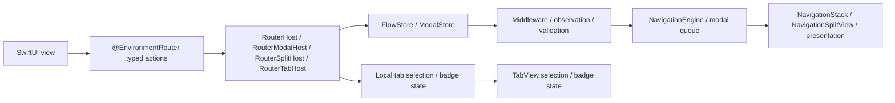
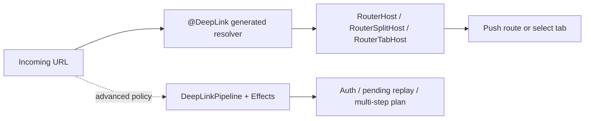

# InnoRouter

[English](README.md) | [한국어](README.ko.md) | [Español](README.es.md) | [Deutsch](README.de.md) | [简体中文](README.zh-Hans.md) | [日本語](README.ja.md) | [Русский](README.ru.md)

[](https://swiftpackageindex.com/InnoSquadCorp/InnoRouter)
[](https://swiftpackageindex.com/InnoSquadCorp/InnoRouter)
[](https://opensource.org/licenses/MIT)
[](https://codecov.io/gh/InnoSquadCorp/InnoRouter)

InnoRouter is a SwiftUI-native navigation framework built around typed state, explicit command execution, and app-boundary deep-link planning.

It treats navigation as a first-class state machine instead of a scattering of view-local side effects.

## What InnoRouter owns

InnoRouter is responsible for:

- macro-generated route and destination wiring through `@Router`
- locally owned stack, modal, split-detail, and tab authority through
  `RouterHost`, `RouterModalHost`, `RouterSplitHost`, and `RouterTabHost`
- fail-closed URL-to-route mapping through `@DeepLink`
- opt-in spatial scene composition through `@SceneRouter` and `@Scene`
- advanced store-owned navigation through `NavigationStore`, `ModalStore`, and
  `FlowStore`
- command execution through `NavigationCommand` and `NavigationEngine`
- advanced deep-link planning and pending replay through `DeepLinkPipeline`
  and `InnoRouterEffects`

It is intentionally not a general application state machine.

Keep these concerns outside InnoRouter:

- business workflow state
- authentication/session lifecycle
- networking retry or transport state
- alerts and confirmation dialogs

## Requirements

- iOS 18+
- iPadOS 18+
- macOS 15+
- tvOS 18+
- watchOS 11+
- visionOS 2+
- Swift 6.3+

The iOS 18 floor and `swift-tools-version: 6.3` package baseline are
deliberate: they let every public type adopt strict concurrency and
`Sendable` without the `@preconcurrency` / `@unchecked Sendable` escape
hatches, which means navigation state never silently leaks off the main
actor at the boundary between view code and the store. The cost is a
smaller adoption window than libraries that target iOS 13–16; the
benefit is a router whose `Sendable`/`@MainActor` discipline is checked
by the compiler instead of documented in prose.

The macro target depends on `swift-syntax` `603.0.2` with an
`.upToNextMinor` constraint. InnoRouter 5.0 aligns its Swift 6.3 package
floor with that host dependency and CI's pinned Xcode 26.6 toolchain.
Future Swift floor increases remain major-version changes.

| Concurrency posture | InnoRouter | TCA / FlowStacks / others on iOS 13+ |
|---|---|---|
| Public types declare `Sendable` unconditionally | ✅ | ⚠ partial — many use `@preconcurrency` |
| Stores are `@MainActor`-isolated, no runtime hops | ✅ | ⚠ varies |
| `@unchecked Sendable` / `nonisolated(unsafe)` in source | ❌ none | ⚠ used in some adapters |
| Strict concurrency mode | ✅ enforced per module | ⚠ opt-in or partial |

## Platform support

InnoRouter ships on every Apple platform through SwiftUI. No UIKit or
AppKit bridge modules are required.

| Capability | iOS | iPadOS | macOS | tvOS | watchOS | visionOS |
|---|---|---|---|---|---|---|
| `@Router` + `RouterHost` / `RouterModalHost` / `RouterTabHost` | ✅ | ✅ | ✅ | ✅ | ✅ | ✅ |
| `@Router` + `RouterSplitHost` | ✅ | ✅ | ✅ | ✅ | ❌ | ✅ |
| `NavigationStore` / `NavigationHost` / `FlowStore` / `FlowHost` | ✅ | ✅ | ✅ | ✅ | ✅ | ✅ |
| `NavigationSplitHost` / `CoordinatorSplitHost` | ✅ | ✅ | ✅ | ✅ | ❌ | ✅ |
| `ModalHost` `.sheet` | ✅ | ✅ | ✅ | ✅ | ✅ | ✅ |
| `ModalHost` `.fullScreenCover` native | ✅ | ✅ | ⚠ degrades | ✅ | ⚠ degrades | ⚠ degrades |
| Tab badge state API / native visual | ✅ | ✅ | ✅ | ⚠ state only | ⚠ state only | ✅ |
| `DeepLinkPipeline` / `FlowDeepLinkPipeline` | ✅ | ✅ | ✅ | ✅ | ✅ | ✅ |
| `InnoRouterSpatial`: `@SceneRouter` / `@Scene` (windows, volumetric, immersive) | — | — | — | — | — | ✅ |
| `InnoRouterSpatial`: `innoRouterOrnament(_:content:)` view modifier | no-op | no-op | no-op | no-op | no-op | ✅ |

`⚠ degrades` means the store API accepts the request unchanged but the
SwiftUI host renders it as a `.sheet` because `.fullScreenCover` is
unavailable. `⚠ state only` means the router retains and exposes badge
state, but `RouterTabHost` and `TabCoordinatorView` omit SwiftUI's native visual
badge because `.badge(_:)` is unavailable. `❌` means the API cannot be used on
that platform, whether absent or explicitly unavailable; compile the call
behind the appropriate availability or conditional-compilation guard.

## Installation

```swift skip package-manifest-fragment
dependencies: [
    .package(url: "https://github.com/InnoSquadCorp/InnoRouter.git", from: "5.0.0")
],
targets: [
    .target(
        name: "MyApp",
        dependencies: [
            .product(name: "InnoRouter", package: "InnoRouter")
        ]
    )
]
```

The default `InnoRouter` product does not include spatial scene routing.
Targets that own visionOS windows, volumes, immersive spaces, or ornaments
must also add the `InnoRouterSpatial` product explicitly.

InnoRouter is distributed as a source-only SwiftPM package. It does
not ship binary artifacts, and library evolution is intentionally off
so source builds stay simple across Apple platforms.

## 30-second quick start

Add one InnoRouter import, attach `@Router` to an enum, and describe each
destination in the enum's `destination` property. The macro supplies `Route` and
`DestinationRoute` conformance, plus the actor and result-builder annotations
needed by SwiftUI.

```swift compile
import SwiftUI
import InnoRouter

@Router
enum HomeRoute {
    case detail(id: String)
    case settings

    var destination: some View {
        switch self {
        case .detail(let id):
            Text("Detail \(id)")
        case .settings:
            Text("Settings")
        }
    }
}

struct AppRoot: View {
    var body: some View {
        RouterHost(HomeRoute.self) {
            HomeView()
        }
    }
}

struct HomeView: View {
    @EnvironmentRouter(HomeRoute.self) private var router

    var body: some View {
        List {
            Button("Detail") {
                router.go(.detail(id: "123"))
            }
            Button("Settings") {
                router.go(.settings)
            }
        }
        .navigationTitle("Home")
    }
}
```

`@Router` reports compile-time diagnostics when it is attached to the wrong
declaration, the `destination` property is missing or malformed, or generated
members would conflict with manual declarations. A missing or mismatched host
is a runtime hierarchy problem and follows InnoRouter's configured environment
diagnostic policy.

### Add another surface without adding a store

Keep the same route-first model and choose the host that matches the UI:

| Add | Declare | Host |
|---|---|---|
| sheet / cover | the same `@Router` cases | `RouterHost` or modal-only `RouterModalHost` |
| split detail | the same `@Router` enum | `RouterSplitHost` |
| native tabs | `@TabItem` on every `@Router` case | `RouterTabHost` |
| one-route deep links | literal allowlists on `@Router` plus `@DeepLink` cases | `RouterHost`, `RouterSplitHost`, or `RouterTabHost` |
| visionOS scenes | `@SceneRouter` plus one `@Scene` per case | install `<Route>.scenes` in `App.body` |

Every route action still comes from `@EnvironmentRouter`; spatial scene actions
come from `@EnvironmentSceneRouter`. Invalid or incomplete macro declarations
produce actionable compiler diagnostics. Missing or mismatched runtime host
authority follows the configured environment diagnostic policy.

## OSS release and SemVer contract

`4.0.0` is InnoRouter's first OSS release and the first version
covered by the public SemVer contract. The current compatibility line
starts at `5.0.0`. Earlier private/internal package snapshots are not
part of the OSS compatibility line; teams moving from a 4.x release
should follow the 5.0 migration notes in [`CHANGELOG.md`](CHANGELOG.md).

### SemVer commitment for the 5.x line

Within `5.x.y` releases, InnoRouter follows
[Semantic Versioning](https://semver.org/) strictly:

- **`5.x.y` → `5.x.(y+1)`** patch releases: bug fixes only. No
  public-API signature changes. No observable behavior changes other
  than fixing the documented bug.
- **`5.x.y` → `5.(x+1).0`** minor releases: additive only. New types,
  new methods, new cases, new configuration options. Existing
  signatures keep their shape and existing call sites keep compiling
  unmodified.
- **`5.x.y` → `6.0.0`** major releases: anything that breaks source
  compatibility, removes a public symbol, narrows a generic
  constraint, or changes documented runtime behavior in a way that
  can surprise existing call sites.

Pre-release tags use the `5.0.0-rc.1` / `5.1.0-beta.2` form. One strict
version policy accepts GA, `rc`, and `beta` identifiers without leading zeroes.
A pre-release tag push validates as a publication no-op; publish it by manually
dispatching `release.yml` with `prerelease=true` as documented in
[`RELEASING.md`](RELEASING.md).

### What counts as a breaking change

For the purposes of the 5.x SemVer commitment, a *breaking change*
means any of:

- Removing or renaming a public symbol (type, method, property,
  associated type, case).
- Changing a public method signature in a way that fails to compile
  for an existing call site (adding a non-defaulted parameter,
  tightening a generic constraint, swapping return type).
- Changing the documented behavior of a public API such that an
  existing correct caller produces a different observable outcome
  (e.g., flipping a default `NavigationPathMismatchPolicy`).
- Raising the minimum supported Swift toolchain or platform floor.

Conversely, the following are *not* breaking and may land in any
minor release:

- Adding new cases to a non-`@frozen` public enum.
- Adding new defaulted parameters to a public method.
- Tightening internal-only types.
- Performance improvements that preserve semantics.
- Doc-only changes.

### Historical 4.x note

`4.1.0` is the adoption baseline after the pre-user cleanup pass. It
removes unused dispatcher-object APIs, keeps `replaceStack` as the
single full-stack replacement intent, and moves effect observation to
explicit event streams. This is the only documented source-breaking
exception in the 4.x line. The `4.0.0` tag remains available as the
first OSS snapshot; the complete 4.x history and 5.0 migration are
recorded in [`CHANGELOG.md`](CHANGELOG.md).

### Imports

The umbrella target `InnoRouter` re-exports `InnoRouterCore`,
`InnoRouterSwiftUI`, `InnoRouterDeepLink`, and the router macros. The default
5.0 experience is macro-first: application targets add one product and source
files use one import. Spatial scenes and app-boundary effects remain opt-in:

```swift skip doc-fragment
import InnoRouter            // stores, hosts, deep links, and macros
import InnoRouterSpatial     // visionOS scenes and ornaments
import InnoRouterEffects     // app-boundary execution and pending replay
```

Direct imports are advanced modularization choices. `InnoRouterCore`,
`InnoRouterSwiftUI`, and `InnoRouterDeepLink` let a target select a smaller
non-macro surface; `InnoRouterMacros` directly exposes the macro declarations
and re-exports the Core, SwiftUI, and DeepLink APIs they generate against.
Choosing a granular non-macro product keeps the compiler-plugin target out of
that target's build graph. SwiftPM still resolves the package-level
`swift-syntax` dependency recorded by this source package.

The SwiftSyntax-backed macro implementation remains in this package.
A package-traits or separate-macro-package split should be
evaluated only after measuring `swift package show-traits`,
`swift build --target InnoRouter`, and
`swift build --target InnoRouterMacros` against the migration cost.

| Product | Import when |
|---|---|
| `InnoRouter` | Default for app code: `@Router`, `@TabItem`, `@DeepLink`, macro-first hosts, and the advanced stores beneath them. |
| `InnoRouterSpatial` | Targets that declare visionOS windows, volumes, or immersive spaces with `@SceneRouter` / `@Scene`, or use the manual scene store and ornament APIs. This product is not re-exported by `InnoRouter`. |
| `InnoRouterMacros` | Direct macro module that re-exports the Core, SwiftUI, and DeepLink APIs used by generated code; app targets normally use the `InnoRouter` umbrella. |
| `InnoRouterEffects` | App-boundary code that executes `NavigationCommand` values, handles or resumes deep links, or both. |
| `InnoRouterTesting` | Test targets that want host-less `NavigationTestStore`, `ModalTestStore`, or `FlowTestStore`. |

## Modules

- `InnoRouter`: default macro-first umbrella re-export of `InnoRouterCore`, `InnoRouterSwiftUI`, `InnoRouterDeepLink`, and `InnoRouterMacros`
- `InnoRouterCore`: route stack, validators, commands, results, batch/transaction executors, middleware
- `InnoRouterSwiftUI`: `RouterHost`, `RouterModalHost`, `RouterSplitHost`, `RouterTabHost`, advanced stores/hosts, coordinators, and typed `EnvironmentRouter` actions
- `InnoRouterSpatial`: opt-in `@SceneRouter` / `@Scene`, generated scene composition, manual scene registry/store, host/anchor modifiers, and ornaments
- `InnoRouterDeepLink`: pattern matching, diagnostics, pipeline planning, pending deep links
- `InnoRouterEffects`: opt-in app-boundary navigation and deep-link execution helpers
- `InnoRouterMacros`: `@Router`, `@TabItem`, `@DeepLink`, `@Routable`, and `@CasePathable`

## Choosing the right surface

Start with a route enum and a macro-first host. Move to an externally owned
store only when the application boundary needs restoration, mutable
middleware, direct observation, authenticated pending replay, or an atomic
multi-step plan.

| Need | Use |
|---|---|
| Stack plus sheet / cover in one local feature | `@Router` + `RouterHost` |
| Modal-only local feature | `@Router` + `RouterModalHost` |
| Split-detail navigation on supported platforms | `@Router` + `RouterSplitHost` |
| Native tabs with generated labels and images | `@Router` + `@TabItem` + `RouterTabHost` |
| One admitted URL selecting or pushing one route | `@Router(deepLinkSchemes:deepLinkHosts:)` + `@DeepLink` + `RouterHost`, `RouterSplitHost`, or `RouterTabHost` |
| visionOS windows, volumes, and immersive spaces | `InnoRouterSpatial`: `@SceneRouter` + `@Scene` + `<Route>.scenes` |
| Externally owned stack, restoration, middleware, or direct observation | `NavigationStore` + `NavigationHost` |
| Externally owned modal queue | `ModalStore` + `ModalHost` |
| Atomic push + modal plans or restored flows | `FlowStore` + `FlowHost` + `FlowPlan` |
| Authentication, pending replay, or multi-step URL planning | `DeepLinkPipeline` / `FlowDeepLinkPipeline` + `InnoRouterEffects` |
| Manual visionOS scene authority or custom scene composition | `SceneStore` + `innoRouterSceneHost` / `innoRouterSceneAnchor` |
| Reducer, effect, or app-boundary execution | `InnoRouterEffects` |
| Router assertions without SwiftUI hosts | `InnoRouterTesting` |

The macro-first hosts own their stores locally and publish typed actions through
`@EnvironmentRouter`. The Store, Effects, Testing, and manual spatial APIs stay
available as explicit escalation paths rather than setup required for a normal
feature.

### Quick decision flowchart

```text
Is this an app-boundary flow that must own or restore routing state?
├── No  → declare @Router, then choose a local host
│        ├── stack + modal → RouterHost
│        ├── modal only   → RouterModalHost
│        ├── split detail → RouterSplitHost
│        └── tabs         → @TabItem + RouterTabHost
└── Yes → choose NavigationStore, ModalStore, or FlowStore for that authority
         (authenticated or multi-step URLs: DeepLinkPipeline + Effects)
```

For ordinary stack navigation from a view, use `@EnvironmentRouter` and its
`go` / `back` actions; the same value also exposes modal and tab actions when
the installed host supports them. Use the lower-level intent types in
[`Docs/IntentSelectionGuide.md`](Docs/IntentSelectionGuide.md) when a feature
needs explicit `NavigationIntent`, modal actions, or unified `FlowIntent`
semantics.

## Documentation

- Latest DocC portal: [InnoRouter latest docs](https://innosquadcorp.github.io/InnoRouter/latest/)
- Versioned docs root: [InnoRouter docs](https://innosquadcorp.github.io/InnoRouter/)
- Release checklist: [RELEASING.md](RELEASING.md)
- Maintainer quick guide: [CLAUDE.md](CLAUDE.md)

`README.md` is the repository entry point.  
DocC is the detailed module-level reference set.

### Tutorial articles

Step-by-step walkthroughs for the most common adoption paths. Each
article lives inside the relevant DocC catalog so the rendered DocC
site, the GitHub source view, and an offline `swift package
generate-documentation` build all show the same content.

| Article | Catalog | Covers |
| --- | --- | --- |
| [Tutorial-LoginOnboarding](Sources/InnoRouterSwiftUI/InnoRouterSwiftUI.docc/Articles/Tutorial-LoginOnboarding.md) | `InnoRouterSwiftUI` | Building a login → onboarding → home flow with `FlowStore` and `ChildCoordinator` |
| [Tutorial-DeepLinkReconciliation](Sources/InnoRouterSwiftUI/InnoRouterSwiftUI.docc/Articles/Tutorial-DeepLinkReconciliation.md) | `InnoRouterSwiftUI` | Reconciling cold-start vs warm deep links, including pending replay |
| [Tutorial-MiddlewareComposition](Sources/InnoRouterSwiftUI/InnoRouterSwiftUI.docc/Articles/Tutorial-MiddlewareComposition.md) | `InnoRouterSwiftUI` | Composing typed middleware, intercepting commands, observing churn |
| [Tutorial-MigratingFromNestedHosts](Sources/InnoRouterSwiftUI/InnoRouterSwiftUI.docc/Articles/Tutorial-MigratingFromNestedHosts.md) | `InnoRouterSwiftUI` | Replacing nested `NavigationHost` + `ModalHost` stacks with `FlowHost` |
| [Tutorial-Throttling](Sources/InnoRouterSwiftUI/InnoRouterSwiftUI.docc/Articles/Tutorial-Throttling.md) | `InnoRouterSwiftUI` | Using `ThrottleNavigationMiddleware` with deterministic test clocks |
| [Tutorial-VisionOSScenes](Sources/InnoRouterSpatial/InnoRouterSpatial.docc/Articles/Tutorial-VisionOSScenes.md) | `InnoRouterSpatial` | Declaring visionOS windows, volumetric scenes, and immersive spaces with `@SceneRouter` and `@Scene` |
| [Tutorial-FlowDeepLinkPipeline](Sources/InnoRouterDeepLink/InnoRouterDeepLink.docc/Articles/Tutorial-FlowDeepLinkPipeline.md) | `InnoRouterDeepLink` | Building composite push + modal deep links through `FlowDeepLinkPipeline` |
| [Tutorial-StatePersistence](Sources/InnoRouterCore/InnoRouterCore.docc/Tutorial-StatePersistence.md) | `InnoRouterCore` | Persisting `FlowPlan` / `RouteStack` across launches with `StatePersistence` |
| [Tutorial-TestingFlows](Sources/InnoRouterTesting/InnoRouterTesting.docc/Articles/Tutorial-TestingFlows.md) | `InnoRouterTesting` | Host-less Swift Testing assertions via `FlowTestStore` |

## How it works

### Runtime flow



- Views invoke route-typed actions through `@EnvironmentRouter`.
- `RouterHost`, `RouterModalHost`, and `RouterSplitHost` own a local
  `FlowStore` or `ModalStore`; `RouterTabHost` owns selection and badge state
  directly. Each host translates its authority into native SwiftUI APIs.
- Advanced applications can choose the equivalent explicit Store or Coordinator
  authority for external ownership and injection.

### Deep-link flow



- Literal origin allowlists and `@DeepLink` cases provide the zero-plumbing path.
- Hosts resolve incoming URLs automatically and arbitrate nested macro-first hosts.
- Move to the pipeline and Effects APIs only when app policy must authorize,
  defer, replay, or compose multiple transitions.

## State and execution model

InnoRouter exposes three distinct execution semantics.

### Single command

`execute(_:)` applies one `NavigationCommand` and returns a typed `NavigationResult`.

### Batch

`executeBatch(_:stopOnFailure:)` preserves per-step command execution but coalesces observation.

Use batch execution when:

- multiple commands should still run one-by-one
- middleware should still see each step
- observers should still receive one aggregated transition event

### Transaction

`executeTransaction(_:)` previews commands on a shadow stack and commits only if every step succeeds.

Use transaction execution when:

- partial success is not acceptable
- you want rollback on failure or cancellation
- one all-or-nothing commit event matters more than step-by-step observation

### `.sequence`

`.sequence` is command algebra, not a transaction.

It is intentionally:

- left-to-right
- non-atomic
- typed through `NavigationResult.multiple`

Earlier successful steps stay applied even if a later step fails.

### `send(_:)` vs `execute(_:)` — picking the right entry point

InnoRouter layers view actions and store/engine APIs by purpose. Pick the entry
point that matches the call site, not the one that matches the data shape.

| Layer                   | Entry                                          | Use when                                                                                          |
| ----------------------- | ---------------------------------------------- | ------------------------------------------------------------------------------------------------- |
| View action (default)   | `router.go(_:)`, `router.back()`, …            | Routing from an ordinary SwiftUI view through `@EnvironmentRouter`.                               |
| View intent (advanced)  | `router.send(_:)`                              | Sending a `NavigationIntent` that has no named convenience method.                                |
| External store boundary | `store.send(_:)`                               | The app deliberately owns and injects a `NavigationStore`.                                       |
| Command                 | `store.execute(_:)`                            | Forwarding a single `NavigationCommand` to the engine and inspecting the typed `NavigationResult`. |
| Batch                   | `store.executeBatch(_:)`                       | Running multiple commands one-by-one while keeping middleware visibility and a single observer event. |
| Transaction             | `store.executeTransaction(_:)`                 | Committing all-or-nothing — preview against a shadow stack, then commit only if every step succeeds. |

Rule of thumb:

- Ordinary views use `@EnvironmentRouter`; only an explicitly external-store
  boundary calls `store.send`. Coordinators and effect boundaries execute.
- `send` is intent-shaped (no return value to inspect); `execute*` is
  command-shaped (returns a typed result for branching, telemetry, retries).
- For atomic multi-step flows that must roll back on partial failure, prefer
  `executeTransaction` over hand-rolled batches.

The same layering applies to `ModalStore` and `FlowStore`:
`send(_: ModalIntent)` / `send(_: FlowIntent)` from views, and
`execute(_:)` / `executeBatch(_:)` / `executeTransaction(_:)` at the engine
boundary.

### Choosing between `.sequence`, `executeBatch`, and `executeTransaction`

| You want… | Reach for | Why |
|---|---|---|
| One observable change for many commands, best-effort | `executeBatch(_:stopOnFailure:)` | Coalesced `.changed` plus `.batchExecuted` through `onEvent` / `events`, optional fail-fast |
| All-or-nothing apply with rollback | `executeTransaction(_:)` | Shadow-state preview, journal-based discard |
| A composite *value* the engine plans / validates | `NavigationCommand.sequence([...])` | Pure command, flows through every middleware as one unit |
| Fire only the latest command after a quiet window | `DebouncingNavigator` | Async wrapping navigator, `Clock`-injectable |
| Rate-limit per key | `ThrottleNavigationMiddleware` | Synchronous, last-accept timestamp |

The full decision matrix with worked examples and anti-patterns
lives in the DocC tutorial
[`Guide-SequenceVsBatchVsTransaction`](Sources/InnoRouterSwiftUI/InnoRouterSwiftUI.docc/Articles/Guide-SequenceVsBatchVsTransaction.md).

## Stack routing surface

`NavigationIntent` is the complete SwiftUI stack-intent surface:

- `.go(Route)`
- `.goMany([Route])`
- `.back`
- `.backBy(Int)`
- `.backTo(Route)`
- `.backToRoot`
- `.replaceStack([Route])`

Intent projection is stable across `NavigationStore` and `FlowStore`:
an empty `goMany` / `pushMany` is a no-op, one route becomes `.push`, and
multiple routes become one atomic `.pushAll` command. A `backBy` / `popCount`
equal to the full navigation depth becomes `.popToRoot`.

When no modal tail is active, pop and dismiss attempts still cross their
respective middleware boundary even if the underlying stack or modal state is
empty. This lets middleware observe, cancel, or rewrite no-op attempts exactly
as it can on the direct stores. Cancelled FlowStore previews still finalize the
captured `didExecute` / `.commandIntercepted` lifecycle; modal cancellation
also applies `ModalQueueCancellationPolicy` before the rejection is emitted.
An aborted reset discards successful navigation previews and never commits an
intermediate modal shadow state.

Macro-first views normally do not need the store. Read actions with
`@EnvironmentRouter`, use `router.go(_:)` / `router.back()` for common
transitions, and use `router.send(_:)` for advanced intents. Call
`NavigationStore.send(_:)` only at a boundary where the app deliberately owns
and injects the store.

## Modal routing surface

InnoRouter supports modal routing for:

- `sheet`
- `fullScreenCover`

Use:

- `@Router`
- `RouterModalHost` for a modal-only feature, or `RouterHost` for stack + modal
- `@EnvironmentRouter`

Example:

```swift skip doc-fragment
@Router
enum AppModalRoute {
    case profile
    case onboarding

    var destination: some View {
        switch self {
        case .profile: ProfileView()
        case .onboarding: OnboardingView()
        }
    }
}

struct ShellView: View {
    var body: some View {
        RouterModalHost(AppModalRoute.self) {
            ModalLauncher()
        }
    }
}

struct ModalLauncher: View {
    @EnvironmentRouter(AppModalRoute.self) private var router

    var body: some View {
        Button("Profile") {
            router.sheet(.profile)
        }
    }
}
```

Descendants present with `router.sheet(.profile)` or
`router.cover(.onboarding)`, then dismiss with `router.dismiss()`. Use
`ModalStore` + `ModalHost` only when the application must own the modal queue,
restore it, mutate middleware, or observe it directly.

### Modal scope boundary

On iOS and tvOS, the macro-first hosts and `ModalHost` map styles directly to
`sheet` and `fullScreenCover`. On other supported platforms,
`fullScreenCover` safely degrades to `sheet`.

InnoRouter intentionally does **not** own:

- `alert`
- `confirmationDialog`

Keep those as feature-local or coordinator-local presentation state.

### Modal observability

`ModalStoreConfiguration` provides one typed observation callback plus
the asynchronous stream:

- `logger`
- `onEvent: (ModalEvent<M>) -> Void`
- `events: AsyncStream<ModalEvent<M>>` on `ModalStore`

Switch over `ModalEvent` for presented, dismissed, replaced, queue-changed,
command-intercepted, and middleware-mutation cases.

`ModalDismissalReason` distinguishes:

- `.dismiss`
- `.dismissAll`
- `.systemDismiss`

### Modal middleware

`ModalStore` exposes the same middleware surface as `NavigationStore`:

- `ModalMiddleware` / `AnyModalMiddleware<M>` with `willExecute` / `didExecute`.
- `ModalInterception` lets middleware `.proceed(command)` (including
  rewritten commands) or `.cancel(reason:)` with a
  `ModalCancellationReason`.
- `ModalStore.addMiddleware` / `insertMiddleware` / `removeMiddleware` /
  `replaceMiddleware` / `moveMiddleware` — handle-based CRUD matching
  navigation.
- `execute(_:) -> ModalExecutionResult<M>` routes all `.present`,
  `.dismissCurrent`, and `.dismissAll` commands through the registry.
- `ModalMiddlewareMutationEvent` surfaces registry churn for analytics.

## Split navigation

For a local split-detail surface on supported platforms, use
`@Router` + `RouterSplitHost`:

```swift skip doc-fragment
RouterSplitHost(AppRoute.self) {
    SidebarView()
} root: {
    ContentUnavailableView("Select an item", systemImage: "sidebar.left")
}
```

The host owns the detail stack and modal authority. Descendants keep using the
same `@EnvironmentRouter` actions. Use `NavigationSplitHost` or
`CoordinatorSplitHost` when the app must own the stack or route intents through
a coordinator. `RouterSplitHost` is unavailable on watchOS.

These remain app-owned:

- sidebar selection
- column visibility
- compact adaptation

## Tab routing surface

Annotate every parameterless `@Router` case with `@TabItem`; the macros generate
`RouterTab`, `CaseIterable`, titles, and system images:

```swift skip doc-fragment
@Router
enum AppTab {
    @TabItem("Home", systemImage: "house")
    case home

    @TabItem("Settings", systemImage: "gear")
    case settings

    var destination: some View {
        switch self {
        case .home: HomeView()
        case .settings: SettingsView()
        }
    }
}

RouterTabHost(AppTab.self, initial: .home)
```

Descendants use `router.select(_:)`, `router.setBadge(_:for:)`, and the clear
badge actions. Use `TabCoordinatorView` when the application must own selection,
provide a custom shell, or compose independent per-tab stores.

## Coordinator surface

Coordinators are policy objects that sit between SwiftUI intent and command execution.

Use `CoordinatorHost` or `CoordinatorSplitHost` when:

- view intent needs policy routing first
- app shells need coordination logic
- multiple navigation authorities should be composed behind one coordinator

`StepCoordinator` and `TabCoordinator` are helpers, not replacements for `NavigationStore`.

Recommended division:

- `NavigationStore`: route-stack authority
- `TabCoordinator`: shell/tab selection state
- `StepCoordinator`: local step progression inside a destination

### Child coordinator chaining

`ChildCoordinator` lets a parent coordinator await a finish value inline
through `parent.push(child:) -> Task<Child.Result?, Never>`:

```swift skip doc-fragment
let signupResult = await parentCoordinator.push(child: SignUpCoordinator())
if let user = signupResult {
    parentCoordinator.handle(.go(.home(user)))
}
```

Callbacks (`onFinish`, `onCancel`) are installed synchronously so the
child can fire them at any point, including before the parent's
`await`. See [`Docs/design-child-coordinator-handoff.md`](Docs/design-child-coordinator-handoff.md)
for the design rationale.

Parent `Task` cancellation propagates to the child through
`ChildCoordinator.parentDidCancel()` (default empty no-op). Override
it to tear down transient state — dismiss sheets, cancel in-flight
requests, release temporary stores — when the parent view is
dismissed:

```swift skip doc-fragment
final class SignUpCoordinator: ChildCoordinator {
    typealias Result = UserID
    var onFinish: (@MainActor @Sendable (UserID) -> Void)?
    var onCancel: (@MainActor @Sendable () -> Void)?

    func parentDidCancel() {
        signUpAPIClient.cancelActiveRequests()
    }
}
```

`parentDidCancel` is directional (parent → child). It does not
invoke `onCancel` (which stays child → parent); the two hooks are
orthogonal.

## Named navigation intents

High-frequency intents compose from existing `NavigationCommand`
primitives:

- `NavigationIntent.replaceStack([R])` — reset the stack to the given
  routes in one observable step.
- `NavigationIntent.backOrPush(R)` — pop to `route` if it already
  exists in the stack, otherwise push it.
- `NavigationIntent.pushUniqueRoot(R)` — push only if the stack does
  not already contain an equal route.

These route through the normal `send` → `execute` pipeline so middleware
and telemetry observe them identically to direct `NavigationCommand`
calls.

## Case-typed destination bindings

`NavigationStore` and `ModalStore` expose `binding(case:)` helpers keyed
by the `CasePath` emitted by `@Routable` / `@CasePathable`:

```swift skip doc-fragment
struct DetailSheet: View {
    let store: NavigationStore<AppRoute>

    var body: some View {
        SomeDetailView()
            .sheet(item: store.binding(case: AppRoute.Cases.detail)) { detail in
                DetailView(detail: detail)
            }
    }
}
```

Bindings route every set through the existing command pipeline so
middleware and telemetry observe them exactly as they do direct
`execute(...)` calls. `ModalStore.binding(case:style:)` is scoped per
presentation style (`.sheet` / `.fullScreenCover`).

## Deep-link model

The default path is one annotation per route. Literal scheme and host allowlists
make the generated resolver fail closed, and a matching macro-first host handles
incoming URLs automatically:

```swift skip doc-fragment
@Router(
    deepLinkSchemes: ["myapp", "https"],
    deepLinkHosts: ["app.example.com"]
)
enum AppRoute {
    @DeepLink("/products/:id")
    case product(id: String)

    var destination: some View {
        switch self {
        case .product(let id): ProductView(id: id)
        }
    }
}

RouterHost(AppRoute.self) { HomeView() }
```

`RouterHost` and `RouterSplitHost` push the resolved route;
`RouterTabHost` selects it. The macros diagnose malformed patterns, missing
origin allowlists, unsupported payloads, conflicting generated members, and
unreachable or order-sensitive mappings during compilation.

Deep-link plans remain the advanced path when the application owns policy:

Core pieces:

- `DeepLinkMatcher`
- `DeepLinkPipeline`
- `DeepLinkDecision`
- `PendingDeepLink`
- `NavigationPlan`

Typical flow:

1. match a URL into a route
2. reject or accept by scheme/host
3. apply auth policy
4. emit `.plan`, `.pending`, `.rejected`, or `.unhandled`
5. execute the resulting navigation plan explicitly

### Matcher diagnostics

`DeepLinkMatcher` reports the same diagnostics for route and `FlowPlan` outputs:

- duplicate patterns
- wildcard shadowing
- parameter shadowing
- non-terminal wildcards

Diagnostics do not change declaration-order precedence. They help catch authoring mistakes without silently changing runtime behavior.
Use `try DeepLinkMatcher(strict:)` in release-readiness gates when
diagnostics should fail the build.

### Composite deep links (push + modal tail)

`FlowDeepLinkPipeline` extends the push-only pipeline so a single URL
can rehydrate a push prefix **plus** a modal terminal step in one
atomic `FlowStore.apply(_:)`:

```swift skip doc-fragment
let matcher = DeepLinkMatcher<FlowPlan<AppRoute>> {
    DeepLinkMapping("/home/detail/:id") { params in
        guard let id = params.firstValue(forName: "id") else { return nil }
        return FlowPlan(steps: [.push(.home), .push(.detail(id: id))])
    }
    DeepLinkMapping("/onboarding/privacy") { _ in
        FlowPlan(steps: [.sheet(.privacyPolicy)])
    }
}

let pipeline = FlowDeepLinkPipeline(
    allowedSchemes: ["myapp"],
    allowedHosts: ["app"],
    matcher: matcher,
    authenticationPolicy: .required(
        shouldRequireAuthentication: { _ in true },
        isAuthenticated: { SessionStore.shared.isAuthenticated }
    )
)

let handler = FlowDeepLinkEffectHandler(pipeline: pipeline, applier: flowStore)

FlowHost(store: flowStore, destination: destination) { RootView() }
    .onOpenURL { _ = handler.handle($0) }
```

Each `DeepLinkMapping<FlowPlan<R>>` handler returns a **complete** `FlowPlan`,
so multi-segment URLs are explicit at the declaration site. The
pipeline reuses `DeepLinkAuthenticationPolicy` + `PendingDeepLink`
semantics from the push-only pipeline for symmetric authentication
deferral and replay. See
[`Sources/InnoRouterDeepLink/InnoRouterDeepLink.docc/Articles/Tutorial-FlowDeepLinkPipeline.md`](Sources/InnoRouterDeepLink/InnoRouterDeepLink.docc/Articles/Tutorial-FlowDeepLinkPipeline.md)
for the full walk-through.

## Spatial scene surface

Spatial routing is macro-first in the opt-in `InnoRouterSpatial` product. Add
`@SceneRouter` to one enum, annotate every case with `@Scene`, and install the
generated scene tree in `App.body`:

```swift skip doc-fragment
import InnoRouterSpatial

@SceneRouter
enum AppScene {
    @Scene(.window)
    case main

    @Scene(.immersive(style: .mixed))
    case theatre

    var destination: some View {
        switch self {
        case .main: MainView()
        case .theatre: TheatreView()
        }
    }
}

@main
struct ExampleApp: App {
    var body: some Scene { AppScene.scenes }
}
```

Descendants use `@EnvironmentSceneRouter(AppScene.self)` and route-aware
`open(_:)`, `dismissWindow(_:)`, and `dismissImmersive()` actions. Reach for
`SceneStore`, `innoRouterSceneHost`, and `innoRouterSceneAnchor` only for custom
scene composition or externally owned scene authority.

## Middleware

Middleware provides a cross-cutting policy layer around command execution.

Pre-execution:

- `willExecute(_:state:) -> NavigationInterception`
- `.proceed(updatedCommand)`
- `.cancel(reason)`

Post-execution:

- `didExecute(_:result:state:) -> NavigationResult`

Middleware can:

- rewrite commands
- block execution with typed cancellation reasons
- fold results after execution

Middleware cannot mutate store state directly.

### Typed cancellation

Cancellation reasons use `NavigationCancellationReason`:

- `.middleware(debugName:command:)`
- `.conditionFailed`
- `.custom(String)`

### Middleware management

`NavigationStore` exposes handle-based management:

- `addMiddleware`
- `insertMiddleware`
- `removeMiddleware`
- `replaceMiddleware`
- `moveMiddleware`
- `middlewareMetadata`

## Path reconciliation

SwiftUI `NavigationStack(path:)` updates are mapped back into semantic commands.

Rules:

- prefix shrink -> `.popCount` or `.popToRoot`
- prefix expand -> batched `.push`
- non-prefix mismatch -> `NavigationPathMismatchPolicy`

Available mismatch policies:

- `.replace` — default production stance; accept SwiftUI's non-prefix path
  rewrite and emit a mismatch event.
- `.assertAndReplace` — debug / pre-release stance; assert, then recover
  with the same replacement semantics.
- `.ignore` — store-authoritative stance; observe the rewrite but keep the
  current stack unchanged.
- `.custom` — domain repair stance; map the old/new paths to one command,
  a batch, or no-op.

When `NavigationStoreConfiguration.logger` is set, mismatch handling emits structured telemetry.

## Effect modules

### `InnoRouterEffects`

Use this when app-shell code wants a small execution façade over a navigator boundary.

Key API:

- `execute(_:)`
- `execute(_ commands:)`
- `executeTransaction(_:)`
- `executeGuarded(_:, prepare:)`

These APIs are synchronous `@MainActor` APIs, except the explicit async guard helper.

The same module executes deep-link plans at an app boundary with typed outcomes.

Key API:

- `handle(_ url:)`
- `resumePendingDeepLink()`
- `resumePendingDeepLinkIfAllowed(_:)`
- `restore(pending:)`

### Coordinator integration

Coordinator-based apps own one `DeepLinkEffectHandler` beside their store and
inject a preconfigured pipeline with `init(pipeline:navigator:)`. Delegate URLs
to `handle(_:)`, replay with `resumePendingDeepLink()` or
`resumePendingDeepLinkIfAllowed(_:)`, and switch over
`DeepLinkEffectHandler.Result`. The handler owns pending-request identity;
app-owned in-memory handoffs return through `restore(pending:)`, while UI-facing
coordinator state can mirror the returned result when observation is needed.
Use `FlowPendingDeepLinkPersistence` for cross-launch pending links.

## `Examples` vs `ExamplesSmoke`

The repository intentionally separates documentation examples from CI examples.

- `Examples/`: human-facing examples for both macro-first entry points and
  explicit Store / Coordinator escalation
- `ExamplesSmoke/`: compiler-stable smoke fixtures for CI

`InnoRouterMacroFirstSmoke` compiles the downstream `@Router`, `@TabItem`, and
`@DeepLink` contract together with `RouterHost`, `RouterModalHost`,
`RouterSplitHost`, and `RouterTabHost` across the supported platform matrix.
The separate spatial consumer smoke compiles `@SceneRouter` on visionOS.

Human-facing examples cover:

- [`Examples/MacrosExample.swift`](Examples/MacrosExample.swift): macro-first
  stack, modal-only, split-detail, native-tab, and one-route deep-link surfaces
- standalone stack routing
- coordinator routing
- deep links
- split navigation
- app shell composition
- modal routing
- macro-first visionOS scene routing

## Docs and release flow

### DocC

DocC is built per module and published to GitHub Pages.

Published structure:

- `/InnoRouter/latest/`
- `/InnoRouter/4.3.0/`
- `/InnoRouter/` root portal

### CI

CI validates:

- `swift test`
- `principle-gates`
- `platforms` workflow for the full Apple compile matrix and tvOS/watchOS/visionOS runtime tests
- example smoke builds
- DocC preview build

### CD

GA publication runs on strict bare semver tags:

- `5.0.0`

Invalid tag examples:

- any tag with a leading `v`
- `release-5.0.0`

Release workflow responsibilities:

- verify the exact tag, `main` ancestry, and tagged `CHANGELOG.md`
- rerun code/documentation gates
- invoke the reusable `platforms` gate and block publishing until it is green; local `./scripts/principle-gates.sh --platforms=all` is compile-only and does not replace the runtime tests
- build versioned DocC
- update `/latest/` only when the GA is at least the highest published GA
- preserve older versioned docs
- publish GitHub Release

### SwiftUI Philosophy Alignment

InnoRouter follows SwiftUI’s declarative direction while making deliberate trade-offs for shared navigation authority.

- Views emit intent instead of directly mutating router state.
- Stack, split-detail, and modal authorities stay separate.
- Missing environment wiring fails fast.
- `NavigationStore` remains a reference type because it is shared authority, not ephemeral local state.
- `Coordinator` remains `AnyObject` for the same reason.

This is an intentional pragmatic trade-off, not an accidental drift away from SwiftUI.

## Examples

Human-facing examples live here:

- Macro-first modal, split, and tab surfaces: [Examples/MacrosExample.swift](https://github.com/InnoSquadCorp/InnoRouter/blob/main/Examples/MacrosExample.swift)
- Macro-first stack: [Examples/StandaloneExample.swift](https://github.com/InnoSquadCorp/InnoRouter/blob/main/Examples/StandaloneExample.swift)
- Macro-first deep links: [Examples/DeepLinkExample.swift](https://github.com/InnoSquadCorp/InnoRouter/blob/main/Examples/DeepLinkExample.swift)
- Macro-first visionOS scenes: [Examples/VisionOSImmersiveExample.swift](https://github.com/InnoSquadCorp/InnoRouter/blob/main/Examples/VisionOSImmersiveExample.swift)
- Advanced coordinator: [Examples/CoordinatorExample.swift](https://github.com/InnoSquadCorp/InnoRouter/blob/main/Examples/CoordinatorExample.swift)
- Advanced split coordinator: [Examples/SplitCoordinatorExample.swift](https://github.com/InnoSquadCorp/InnoRouter/blob/main/Examples/SplitCoordinatorExample.swift)
- Advanced app shell: [Examples/AppShellExample.swift](https://github.com/InnoSquadCorp/InnoRouter/blob/main/Examples/AppShellExample.swift)

## Quality gates

Run these locally before cutting a release:

```bash
swift test
./scripts/principle-gates.sh
./scripts/build-docc-site.sh --version preview --skip-latest
```

## Flow stack

`FlowStore<R>` represents a unified push + sheet + cover flow as a
single array of `RouteStep<R>` values. It owns an inner
`NavigationStore<R>` and `ModalStore<R>`, delegating to each while
enforcing invariants (one trailing modal at most, modal always at the
tail, middleware rollbacks reconcile the path).

Those inner stores are implementation details. App code should treat
`FlowStore.path`, `send(_:)`, `apply(_:)`, and `events` as the public authority
surface; direct inner-store mutation is reserved for hosts and focused
invariant tests.

Typical usage:

```swift skip doc-fragment
let flow = FlowStore<AppRoute>()
let restoredFlow = try FlowStore<AppRoute>(
    validating: persistedSteps
)

flow.send(.push(.home))
flow.send(.push(.detail(id)))
flow.send(.presentSheet(.share))   // tail modal
flow.apply(FlowPlan(steps: [.push(.home), .cover(.paywall)]))
```

- `FlowHost` renders environment-free navigation and modal surfaces backed by
  `FlowStore`, then publishes one unified authority for
  `@EnvironmentRouter(Route.self)`. Send flow-specific intents with
  `router.send(flow:)`.
- `FlowStoreConfiguration` composes `NavigationStoreConfiguration` and
  `ModalStoreConfiguration`, adding one `onEvent` callback for
  `FlowEvent`. It receives flow-level path/rejection cases and wrapped
  `.navigation(...)` / `.modal(...)` inner-store events.
- `FlowStore(validating:configuration:)` is the throwing initializer
  for restored or externally supplied `[RouteStep]` values; the
  compatibility `initial:` initializer still coerces invalid input to
  an empty path.
- `FlowRejectionReason` surfaces runtime rejection reasons
  (`pushBlockedByModalTail`, `invalidResetPath`,
  `middlewareRejected(debugName:)`, `reentrantApply`).

## Host-less testing (`InnoRouterTesting`)

`InnoRouterTesting` is a shippable Swift-Testing-native assertion
harness that wraps `NavigationStore`, `ModalStore`, and `FlowStore`.
Tests no longer need `@testable import InnoRouterSwiftUI` or
hand-rolled `Mutex<[Event]>` collectors — every public observation
event is buffered into a FIFO queue, and tests drain it with
TCA-style `receive(...)` calls.

Add the product to the test target only:

```swift skip doc-fragment
// Package.swift
.testTarget(
    name: "AppTests",
    dependencies: [
        .product(name: "InnoRouter", package: "InnoRouter"),
        .product(name: "InnoRouterTesting", package: "InnoRouter"),
    ]
)
```

Then author tests against the production intents:

```swift skip doc-fragment
import Testing
import InnoRouter
import InnoRouterTesting

@Test
@MainActor
func pushHomeThenDetail() {
    let store = NavigationTestStore<AppRoute>()

    store.send(.go(.home))
    store.receiveChange { _, new in new.path == [.home] }

    store.executeBatch([.push(.detail("42"))])
    store.receiveChange { _, new in new.path == [.home, .detail("42")] }
    store.receiveBatch { $0.isSuccess }

    store.finish()
}
```

What the harness covers:

- **`NavigationTestStore<R>`** — all `NavigationEvent` cases:
  `.changed`, `.batchExecuted`, `.transactionExecuted`,
  `.middlewareMutation`, and `.pathMismatch`. Forwards `send`, `execute`, `executeBatch`,
  `executeTransaction` to the underlying store unchanged.
- **`ModalTestStore<M>`** — all `ModalEvent` cases, including
  `.presented`, `.dismissed`, `.replaced`, `.queueChanged`,
  `.commandIntercepted`, and `.middlewareMutation`.
- **`FlowTestStore<R>`** — FlowStore-level `.pathChanged` and
  `.intentRejected`, plus `.navigation(...)` and
  `.modal(...)` wrappers around the inner store emissions on a
  single queue. One test can assert the complete chain triggered by
  a single `FlowIntent`, including middleware cancellation paths.

Exhaustivity defaults to `.strict`: any unasserted event at store
deinit fires a Swift Testing issue. Use `.off` for incremental
migrations from legacy test fixtures.

## State restoration

Routes that opt into `Codable` get round-trippable `RouteStack`,
`RouteStep`, and `FlowPlan` values for free:

```swift skip doc-fragment
enum AppRoute: Route, Codable {
    case home
    case detail(String)
    case settings
}

let persistence = StatePersistence<AppRoute>()

// On scene background / checkpoint:
let data = try persistence.encode(FlowPlan(steps: flowStore.path))
try data.write(to: restorationURL, options: .atomic)

// On launch:
if let data = try? Data(contentsOf: restorationURL) {
    flowStore.apply(try persistence.decode(data))
}
```

`StatePersistence<R: Route & Codable>` wraps a `JSONEncoder` and
`JSONDecoder` (both configurable) and stops at the `Data`
boundary — file URLs, `UserDefaults`, iCloud, and scene-phase
hooks are app concerns. Errors propagate as the underlying
`EncodingError` / `DecodingError` so callers can distinguish
schema drift from I/O failures.

`FlowPlan(steps: flowStore.path)` is a current-visible-flow snapshot:
it stores the navigation push stack plus the active modal tail, if one
is visible. It does not serialize the modal backlog. Queued
presentations live in `ModalStore.queuedPresentations` as internal
execution state and are outside the current `FlowPlan` persistence
contract. Apps that must restore queued modal work should persist an
app-owned queue snapshot alongside the `FlowPlan` and replay it through
their own routing policy after launch.

## Unified observation stream

Every store publishes a single `events: AsyncStream` that covers
the complete observation surface — stack changes, batch /
transaction completions, path-mismatch resolutions,
middleware-registry mutations, modal present / dismiss / queue
updates, command interceptions, and flow-level path or
intent-rejection signals.

Capture a fresh stream before starting its lifecycle-owned task. This registers
the subscriber synchronously, so an event emitted immediately after task
creation is not lost. Cancel `observationTask` when its owner ends.

```swift skip doc-fragment
let events = flowStore.events
let observationTask = Task { @MainActor in
    for await event in events {
        switch event {
        case .navigation(.changed(_, let to)):
            analytics.track("nav_path", to.path)
        case .modal(.commandIntercepted(_, .cancelled(let reason))):
            Log.warning("modal cancelled: \(reason)")
        case .intentRejected(let intent, let reason):
            Log.info("flow rejected \(intent) because \(reason)")
        default:
            continue
        }
    }
}
```

In 5.0, each `*Configuration` has one typed `onEvent` callback. Switch
over `NavigationEvent`, `ModalEvent`, or `FlowEvent` when synchronous
delivery is useful; use `events` for asynchronous iteration. The former
per-event callbacks were removed without compatibility shims. A flow
callback receives `.navigation(...)` and `.modal(...)` as well as its
own `.pathChanged` and `.intentRejected` cases.

### Backpressure

Each store fans every event out to every subscriber through a
per-subscriber `AsyncStream.Continuation`. To bound the per-subscriber
queue under load, every store accepts an `eventBufferingPolicy` in
its configuration:

- `.bufferingNewest(1024)` (default) — retain the most recent 1024
  events per subscriber, drop older events when the buffer fills.
  Sized for realistic navigation bursts while keeping the retained
  working set bounded.
- `.bufferingOldest(N)` — retain the oldest N events per subscriber,
  drop newer events when the buffer fills.
- `.unbounded` — buffer every event until the subscriber drains it.
  Use this for test harnesses or short-lived subscribers where you
  control lifetime and require deterministic, lossless ordering.

```swift skip doc-fragment
let store = try NavigationStore<HomeRoute>(
    initialPath: [.list],
    configuration: NavigationStoreConfiguration(
        eventBufferingPolicy: .bufferingNewest(2048)
    )
)
```

`ModalStoreConfiguration.eventBufferingPolicy` controls `ModalStore.events`.
`FlowStoreConfiguration.eventBufferingPolicy` controls the flow-level
`FlowStore.events` fan-out, while
`FlowStoreConfiguration.navigation.eventBufferingPolicy` and
`FlowStoreConfiguration.modal.eventBufferingPolicy` control the wrapped
inner store streams. Drops are silent — if your analytics pipeline must
distinguish "no event happened" from "an event was buffered out", subscribe
with `.unbounded` and pace yourself instead.

The full contract is documented in
[`Event-Stream-Backpressure`](Sources/InnoRouterCore/InnoRouterCore.docc/Articles/Event-Stream-Backpressure.md).

## Roadmap

Tracked in
[`Docs/competitive-analysis-and-roadmap.md`](Docs/competitive-analysis-and-roadmap.md).
With the P3 polish cluster shipped, the P0 / P1 / P3 backlog is
empty. The public OSS line starts at the 4.0 baseline; see
[`CHANGELOG.md`](CHANGELOG.md) for shipped surface changes.

- [x] **P2-3 UIKit escape hatch** — declined for the 4.0.0 OSS
      release. InnoRouter keeps a SwiftUI-only positioning stance;
      teams that need UIKit / AppKit adapters can compose those
      surfaces outside InnoRouter.
- [x] **Debounce semantics** — shipped in 4.0.0 as
      `DebouncingNavigator`, a `Clock`-injectable wrapper around a
      `NavigationCommandExecutor`. The synchronous
      `NavigationCommand` algebra stays timer-free.

## Adopters

InnoRouter is at the start of its public adoption curve. If you
ship InnoRouter in production, please open a PR that appends your
project to the list below — a generic descriptor
(`a finance app at $company`) is fine if a public name is not yet
possible. Adopter signal helps prospective users gauge maturity.

- _Your project here._

[`Examples/SampleAppExample.swift`](Examples/SampleAppExample.swift) is an
advanced app-boundary policy sketch: it constructs authenticated deep-link
handling, Store authorities, and debounced navigation in one authority type.
Start with the macro-first examples above; use this file when those policies
must be owned outside a feature-local host.

## Contributing

See [`CONTRIBUTING.md`](CONTRIBUTING.md) for branching, commit
conventions, public-API change rules, and macro test requirements.
Security findings follow the private process in
[`SECURITY.md`](SECURITY.md). Participation is expected to follow
[`CODE_OF_CONDUCT.md`](CODE_OF_CONDUCT.md).

## License

MIT
