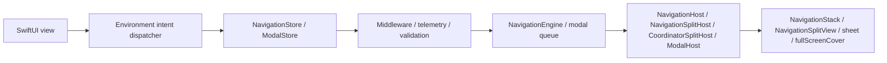
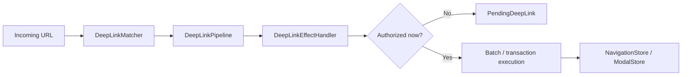

# InnoRouter

[English](README.md) | [한국어](README.ko.md) | [Español](README.es.md) | [Deutsch](README.de.md) | [简体中文](README.zh-Hans.md) | [日本語](README.ja.md) | [Русский](README.ru.md)

[](https://swiftpackageindex.com/InnoSquadCorp/InnoRouter)
[](https://swiftpackageindex.com/InnoSquadCorp/InnoRouter)
[](https://opensource.org/licenses/MIT)
[](https://codecov.io/gh/InnoSquadCorp/InnoRouter)

InnoRouter is a SwiftUI-native navigation framework built around typed state, explicit command execution, and app-boundary deep-link planning.

It treats navigation as a first-class state machine instead of a scattering of view-local side effects.

## What InnoRouter owns

InnoRouter is responsible for:

- stack navigation state through `RouteStack`
- command execution through `NavigationCommand` and `NavigationEngine`
- SwiftUI navigation authority through `NavigationStore`
- modal authority for `sheet` and `fullScreenCover` through `ModalStore`
- deep-link matching and planning through `DeepLinkMatcher` and `DeepLinkPipeline`
- app-boundary execution helpers through `InnoRouterNavigationEffects` and `InnoRouterDeepLinkEffects`

It is intentionally not a general application state machine.

Keep these concerns outside InnoRouter:

- business workflow state
- authentication/session lifecycle
- networking retry or transport state
- alerts and confirmation dialogs

## Requirements

- iOS 18+
- iPadOS 18+
- macOS 15+
- tvOS 18+
- watchOS 11+
- visionOS 2+
- Swift 6.2+

The iOS 18 floor and `swift-tools-version: 6.2` package baseline are
deliberate: they let every public type adopt strict concurrency and
`Sendable` without the `@preconcurrency` / `@unchecked Sendable` escape
hatches, which means navigation state never silently leaks off the main
actor at the boundary between view code and the store. The cost is a
smaller adoption window than libraries that target iOS 13–16; the
benefit is a router whose `Sendable`/`@MainActor` discipline is checked
by the compiler instead of documented in prose.

The macro target currently depends on `swift-syntax` `603.0.1` with an
`.upToNextMinor` constraint. That dependency and CI's pinned Xcode /
Swift toolchain may validate the package with a newer Swift host build
(for example Swift 6.3), but the supported package floor remains Swift
6.2 until a major release explicitly raises it.

| Concurrency posture | InnoRouter | TCA / FlowStacks / others on iOS 13+ |
|---|---|---|
| Public types declare `Sendable` unconditionally | ✅ | ⚠ partial — many use `@preconcurrency` |
| Stores are `@MainActor`-isolated, no runtime hops | ✅ | ⚠ varies |
| `@unchecked Sendable` / `nonisolated(unsafe)` in source | ❌ none | ⚠ used in some adapters |
| Strict concurrency mode | ✅ enforced per module | ⚠ opt-in or partial |

## Platform support

InnoRouter ships on every Apple platform through SwiftUI. No UIKit or
AppKit bridge modules are required.

| Capability | iOS | iPadOS | macOS | tvOS | watchOS | visionOS |
|---|---|---|---|---|---|---|
| `NavigationStore` / `NavigationHost` / `FlowStore` / `FlowHost` | ✅ | ✅ | ✅ | ✅ | ✅ | ✅ |
| `NavigationSplitHost` / `CoordinatorSplitHost` | ✅ | ✅ | ✅ | ✅ | ❌ | ✅ |
| `ModalHost` `.sheet` | ✅ | ✅ | ✅ | ✅ | ✅ | ✅ |
| `ModalHost` `.fullScreenCover` native | ✅ | ✅ | ⚠ degrades | ✅ | ⚠ degrades | ⚠ degrades |
| `TabCoordinator.badge` state API / native visual | ✅ | ✅ | ✅ | ⚠ state only | ⚠ state only | ✅ |
| `DeepLinkPipeline` / `FlowDeepLinkPipeline` | ✅ | ✅ | ✅ | ✅ | ✅ | ✅ |
| `SceneStore` / `SceneHost` (windows, volumetric, immersive) ⚠ experimental | — | — | — | — | — | ✅ |
| `innoRouterOrnament(_:content:)` view modifier | no-op | no-op | no-op | no-op | no-op | ✅ |

`⚠ degrades` means the store API accepts the request unchanged but the
SwiftUI host renders it as a `.sheet` because `.fullScreenCover` is
unavailable. `⚠ state only` means the coordinator stores and exposes badge
state, but `TabCoordinatorView` omits SwiftUI's native visual badge because
`.badge(_:)` is unavailable. `❌` means the symbol is not declared on that
platform; build it behind `#if !os(...)`. `⚠ experimental` means the
surface is **not under the 4.x SemVer additive guarantee**: shape and
behavior may change between minor releases until it graduates. See
[`Docs/v2-principle-scorecard.md`](Docs/v2-principle-scorecard.md) for the
current experimental list.

## Installation

```swift skip package-manifest-fragment
dependencies: [
    .package(url: "https://github.com/InnoSquadCorp/InnoRouter.git", from: "4.3.0")
]
```

InnoRouter is distributed as a source-only SwiftPM package. It does
not ship binary artifacts, and library evolution is intentionally off
so source builds stay simple across Apple platforms.

The documentation gate also keeps at least one complete Swift snippet
typechecked against the package:

```swift compile
import InnoRouter

enum CompileCheckedRoute: Route {
    case home
}

let compileCheckedStack = RouteStack<CompileCheckedRoute>()
_ = compileCheckedStack.path
```

## 4.0.0 OSS release contract

`4.0.0` is InnoRouter's first OSS release and the first version
covered by the public SemVer contract. New adopters should install
from `4.3.0` or newer. Earlier private/internal package snapshots are
not part of the OSS compatibility line; teams that tested them should
validate public API usage against the 4.x docs as a one-time source
migration.

### SemVer commitment for the 4.x line

Within `4.x.y` releases, InnoRouter follows
[Semantic Versioning](https://semver.org/) strictly:

- **`4.x.y` → `4.x.(y+1)`** patch releases: bug fixes only. No
  public-API signature changes. No observable behavior changes other
  than fixing the documented bug.
- **`4.x.y` → `4.(x+1).0`** minor releases: additive only. New types,
  new methods, new cases, new configuration options. Existing
  signatures keep their shape and existing call sites keep compiling
  unmodified.
- **`4.x.y` → `5.0.0`** major releases: anything that breaks source
  compatibility, removes a public symbol, narrows a generic
  constraint, or changes documented runtime behavior in a way that
  can surprise existing call sites.

Exception: `4.1.0` is the documented one-time historical cleanup
described below. After that adoption baseline, 4.x minor releases are
additive-only under this contract.

Pre-release tags use the `4.1.0-rc.1` / `4.2.0-beta.2` form. The
release workflow's `^[0-9]+\.[0-9]+\.[0-9]+$` regex only accepts
final tags; pre-release tags ship through a separate manual flow
documented in [`RELEASING.md`](RELEASING.md).

### What counts as a breaking change

For the purposes of the 4.x SemVer commitment, a *breaking change*
means any of:

- Removing or renaming a public symbol (type, method, property,
  associated type, case).
- Changing a public method signature in a way that fails to compile
  for an existing call site (adding a non-defaulted parameter,
  tightening a generic constraint, swapping return type).
- Changing the documented behavior of a public API such that an
  existing correct caller produces a different observable outcome
  (e.g., flipping a default `NavigationPathMismatchPolicy`).
- Raising the minimum supported Swift toolchain or platform floor.

Conversely, the following are *not* breaking and may land in any
minor release:

- Adding new cases to a non-`@frozen` public enum.
- Adding new defaulted parameters to a public method.
- Tightening internal-only types.
- Performance improvements that preserve semantics.
- Doc-only changes.

The full 4.0 baseline sweep is summarized in
[`CHANGELOG.md`](CHANGELOG.md).

### Exception: 4.1.0 historical cleanup

`4.1.0` is the adoption baseline after the pre-user cleanup pass. It
removes unused dispatcher-object APIs, keeps `replaceStack` as the
single full-stack replacement intent, and moves effect observation to
explicit event streams. This is the only documented source-breaking
exception in the 4.x line; new apps should start from `4.3.0`, and the
`4.0.0` tag remains available as the first OSS snapshot.

### Imports

The umbrella target `InnoRouter` re-exports everything except the
macros product. `@Routable` / `@CasePathable` require an explicit
`import InnoRouterMacros` — the umbrella deliberately skips that
re-export so non-macro files don't pay the macro-plugin resolution
cost:

```swift skip doc-fragment
import InnoRouter            // stores, hosts, intents, deep links, scenes
import InnoRouterMacros      // only in files that use @Routable / @CasePathable
```

`@EnvironmentNavigationIntent`, `@EnvironmentModalIntent`, and every
other property-wrapper or view modifier come from `InnoRouter`, not
from `InnoRouterMacros`.

The SwiftSyntax-backed macro implementation remains in this package
for the 4.x line. A package-traits or separate-macro-package split should be
evaluated only after measuring `swift package show-traits`,
`swift build --target InnoRouter`, and
`swift build --target InnoRouterMacros` against the migration cost.

| Product | Import when |
|---|---|
| `InnoRouter` | App code that needs stores, hosts, intents, coordinators, deep links, scenes, or persistence helpers. |
| `InnoRouterMacros` | Only files that use `@Routable` or `@CasePathable`. |
| `InnoRouterEffects` | **Recommended.** App-boundary code that executes `NavigationCommand` values, handles or resumes deep links, or both. As of 4.1.0 this is the canonical entry point for effect adapters. |
| `InnoRouterNavigationEffects` | Source-compatibility split product — navigation-only execution helpers. New code should import `InnoRouterEffects` instead; this product remains available through the 4.x line and is folded into the umbrella in a future major. |
| `InnoRouterDeepLinkEffects` | Source-compatibility split product — deep-link execution helpers. New code should import `InnoRouterEffects` instead; this product remains available through the 4.x line and is folded into the umbrella in a future major. |
| `InnoRouterTesting` | Test targets that want host-less `NavigationTestStore`, `ModalTestStore`, or `FlowTestStore`. |

## Modules

- `InnoRouter`: umbrella re-export of `InnoRouterCore`, `InnoRouterSwiftUI`, and `InnoRouterDeepLink`
- `InnoRouterCore`: route stack, validators, commands, results, batch/transaction executors, middleware
- `InnoRouterSwiftUI`: stores, stack/split/modal hosts, coordinators, environment intent dispatch
- `InnoRouterDeepLink`: pattern matching, diagnostics, pipeline planning, pending deep links
- `InnoRouterEffects`: recommended umbrella for app-boundary execution helpers (re-exports both split products)
- `InnoRouterNavigationEffects`: source-compatibility split product (navigation-only); prefer `InnoRouterEffects` in new code
- `InnoRouterDeepLinkEffects`: source-compatibility split product (deep-link); prefer `InnoRouterEffects` in new code
- `InnoRouterMacros`: `@Routable` and `@CasePathable`

## Choosing the right surface

> New to InnoRouter? Start with
> [`Docs/StoreSelectionGuide.md`](Docs/StoreSelectionGuide.md) — a
> decision tree plus four worked examples (single push stack,
> push + independent modal, atomic URL → push + modal, iPad split).
> The table below is the dense reference once you know the shape.

Use the smallest surface that owns the transition authority you need:

| Need | Use |
|---|---|
| One typed SwiftUI stack | `NavigationStore` + `NavigationHost` |
| Split-view stack on supported platforms | `NavigationStore` + `NavigationSplitHost` |
| Sheet / cover authority without stack resets | `ModalStore` + `ModalHost` |
| Push + modal flows, restoration, or multi-step deep links | `FlowStore` + `FlowHost` + `FlowPlan` |
| URL to push-only command plan | `DeepLinkMatcher` + `DeepLinkPipeline` |
| URL to push-prefix plus modal-tail flow | `FlowDeepLinkMatcher` + `FlowDeepLinkPipeline` |
| visionOS windows, volumes, immersive spaces | `SceneStore` + `SceneHost` / `SceneAnchor` ⚠ experimental |
| Reducer, effect, or app-boundary execution | `InnoRouterEffects` (split products `InnoRouterNavigationEffects` / `InnoRouterDeepLinkEffects` remain for source compatibility) |
| Router assertions without SwiftUI hosts | `InnoRouterTesting` |

`NavigationStore`, `FlowStore`, `ModalStore`, `SceneStore`, effects,
and testing are intentionally separate. The library keeps these
authorities explicit so apps can adopt only the pieces that match
their routing boundary.

### Quick decision flowchart

```text
Does the screen surface combine push and modal in one flow?
├── Yes → FlowStore + FlowHost (one source of truth, one events stream)
└── No  → does it own modal authority (sheet / cover) only?
         ├── Yes → ModalStore + ModalHost
         └── No  → NavigationStore + NavigationHost
                  (split-view variant: NavigationSplitHost)
```

For dispatching from view code (no store reference), use the matching
intent type in [`Docs/IntentSelectionGuide.md`](Docs/IntentSelectionGuide.md):
`NavigationIntent` for the stack-only stores, `FlowIntent` for
`FlowStore` (six overlapping cases plus modal-aware variants only
`FlowIntent` knows about).

## Documentation

- Latest DocC portal: [InnoRouter latest docs](https://innosquadcorp.github.io/InnoRouter/latest/)
- Versioned docs root: [InnoRouter docs](https://innosquadcorp.github.io/InnoRouter/)
- Release checklist: [RELEASING.md](RELEASING.md)
- Maintainer quick guide: [CLAUDE.md](CLAUDE.md)

`README.md` is the repository entry point.  
DocC is the detailed module-level reference set.

### Tutorial articles

Step-by-step walkthroughs for the most common adoption paths. Each
article lives inside the relevant DocC catalog so the rendered DocC
site, the GitHub source view, and an offline `swift package
generate-documentation` build all show the same content.

| Article | Catalog | Covers |
| --- | --- | --- |
| [Tutorial-LoginOnboarding](Sources/InnoRouterSwiftUI/InnoRouterSwiftUI.docc/Articles/Tutorial-LoginOnboarding.md) | `InnoRouterSwiftUI` | Building a login → onboarding → home flow with `FlowStore` and `ChildCoordinator` |
| [Tutorial-DeepLinkReconciliation](Sources/InnoRouterSwiftUI/InnoRouterSwiftUI.docc/Articles/Tutorial-DeepLinkReconciliation.md) | `InnoRouterSwiftUI` | Reconciling cold-start vs warm deep links, including pending replay |
| [Tutorial-MiddlewareComposition](Sources/InnoRouterSwiftUI/InnoRouterSwiftUI.docc/Articles/Tutorial-MiddlewareComposition.md) | `InnoRouterSwiftUI` | Composing typed middleware, intercepting commands, observing churn |
| [Tutorial-MigratingFromNestedHosts](Sources/InnoRouterSwiftUI/InnoRouterSwiftUI.docc/Articles/Tutorial-MigratingFromNestedHosts.md) | `InnoRouterSwiftUI` | Replacing nested `NavigationHost` + `ModalHost` stacks with `FlowHost` |
| [Tutorial-Throttling](Sources/InnoRouterSwiftUI/InnoRouterSwiftUI.docc/Articles/Tutorial-Throttling.md) | `InnoRouterSwiftUI` | Using `ThrottleNavigationMiddleware` with deterministic test clocks |
| [Tutorial-StoreObserver](Sources/InnoRouterSwiftUI/InnoRouterSwiftUI.docc/Articles/Tutorial-StoreObserver.md) | `InnoRouterSwiftUI` | Adopting `StoreObserver` over the unified `events` stream |
| [Tutorial-VisionOSScenes](Sources/InnoRouterSwiftUI/InnoRouterSwiftUI.docc/Articles/Tutorial-VisionOSScenes.md) | `InnoRouterSwiftUI` | Driving visionOS windows, volumetric scenes, and immersive spaces from `SceneStore` |
| [Tutorial-FlowDeepLinkPipeline](Sources/InnoRouterDeepLink/InnoRouterDeepLink.docc/Articles/Tutorial-FlowDeepLinkPipeline.md) | `InnoRouterDeepLink` | Building composite push + modal deep links through `FlowDeepLinkPipeline` |
| [Tutorial-StatePersistence](Sources/InnoRouterCore/InnoRouterCore.docc/Tutorial-StatePersistence.md) | `InnoRouterCore` | Persisting `FlowPlan` / `RouteStack` across launches with `StatePersistence` |
| [Tutorial-TestingFlows](Sources/InnoRouterTesting/InnoRouterTesting.docc/Articles/Tutorial-TestingFlows.md) | `InnoRouterTesting` | Host-less Swift Testing assertions via `FlowTestStore` |

## How it works

### Runtime flow



- Views emit typed intent through environment dispatchers.
- Stores own navigation or modal authority.
- Hosts translate store state into native SwiftUI navigation APIs.

### Deep-link flow



- Matching and planning stay pure.
- Effect handlers are the boundary where app policy decides whether to execute now or defer.
- Pending deep links preserve the planned transition until the app is ready to replay it.

## Quick Start

### 1. Define a route

Without macros:

```swift skip doc-fragment
import InnoRouter

enum HomeRoute: Route {
    case list
    case detail(id: String)
    case settings
}
```

With macros:

```swift skip doc-fragment
import InnoRouter
import InnoRouterMacros

@Routable
enum HomeRoute {
    case list
    case detail(id: String)
    case settings
}
```

### 2. Create a `NavigationStore`

```swift skip doc-fragment
import InnoRouter
import OSLog

let store = try NavigationStore<HomeRoute>(
    initialPath: [.list],
    configuration: NavigationStoreConfiguration(
        routeStackValidator: .nonEmpty.combined(with: .rooted(at: .list)),
        logger: Logger(subsystem: "com.example.app", category: "navigation")
    )
)
```

### 3. Host it in SwiftUI

```swift skip doc-fragment
import SwiftUI
import InnoRouter

struct AppRoot: View {
    @State private var store = try! NavigationStore<HomeRoute>(
        initialPath: [.list]
    )

    var body: some View {
        NavigationHost(store: store) { route in
            switch route {
            case .list:
                HomeListView()
            case .detail(let id):
                DetailView(id: id)
            case .settings:
                SettingsView()
            }
        } root: {
            HomeListView()
        }
    }
}
```

### 4. Emit intent from a child view

```swift skip doc-fragment
struct HomeListView: View {
    @EnvironmentNavigationIntent(HomeRoute.self) private var navigationIntent

    var body: some View {
        List {
            Button("Detail") {
                navigationIntent(.go(.detail(id: "123")))
            }

            Button("Settings") {
                navigationIntent(.go(.settings))
            }

            Button("Back") {
                navigationIntent(.back)
            }
        }
    }
}
```

Views should emit intent. They should not hold direct mutation authority over the router state.

## State and execution model

InnoRouter exposes three distinct execution semantics.

### Single command

`execute(_:)` applies one `NavigationCommand` and returns a typed `NavigationResult`.

### Batch

`executeBatch(_:stopOnFailure:)` preserves per-step command execution but coalesces observation.

Use batch execution when:

- multiple commands should still run one-by-one
- middleware should still see each step
- observers should still receive one aggregated transition event

### Transaction

`executeTransaction(_:)` previews commands on a shadow stack and commits only if every step succeeds.

Use transaction execution when:

- partial success is not acceptable
- you want rollback on failure or cancellation
- one all-or-nothing commit event matters more than step-by-step observation

### `.sequence`

`.sequence` is command algebra, not a transaction.

It is intentionally:

- left-to-right
- non-atomic
- typed through `NavigationResult.multiple`

Earlier successful steps stay applied even if a later step fails.

### `send(_:)` vs `execute(_:)` — picking the right entry point

InnoRouter exposes navigation through four entry points layered by purpose.
Pick the one that matches the call site, not the one that matches the data
shape.

| Layer        | Entry                              | Use when                                                                                          |
| ------------ | ---------------------------------- | ------------------------------------------------------------------------------------------------- |
| View intent  | `store.send(_:)`                   | Dispatching a named `NavigationIntent` from a SwiftUI view (`go`, `back`, `backToRoot`, …).       |
| Command      | `store.execute(_:)`                | Forwarding a single `NavigationCommand` to the engine and inspecting the typed `NavigationResult`. |
| Batch        | `store.executeBatch(_:)`           | Running multiple commands one-by-one while keeping middleware visibility and a single observer event. |
| Transaction  | `store.executeTransaction(_:)`     | Committing all-or-nothing — preview against a shadow stack, then commit only if every step succeeds. |

Rule of thumb:

- Views send. Coordinators and effect boundaries execute.
- `send` is intent-shaped (no return value to inspect); `execute*` is
  command-shaped (returns a typed result for branching, telemetry, retries).
- For atomic multi-step flows that must roll back on partial failure, prefer
  `executeTransaction` over hand-rolled batches.

The same layering applies to `ModalStore` and `FlowStore`:
`send(_: ModalIntent)` / `send(_: FlowIntent)` from views, and
`execute(_:)` / `executeBatch(_:)` / `executeTransaction(_:)` at the engine
boundary.

### Choosing between `.sequence`, `executeBatch`, and `executeTransaction`

| You want… | Reach for | Why |
|---|---|---|
| One observable change for many commands, best-effort | `executeBatch(_:stopOnFailure:)` | Coalesced `onChange` / `events`, optional fail-fast |
| All-or-nothing apply with rollback | `executeTransaction(_:)` | Shadow-state preview, journal-based discard |
| A composite *value* the engine plans / validates | `NavigationCommand.sequence([...])` | Pure command, flows through every middleware as one unit |
| Fire only the latest command after a quiet window | `DebouncingNavigator` | Async wrapping navigator, `Clock`-injectable |
| Rate-limit per key | `ThrottleNavigationMiddleware` | Synchronous, last-accept timestamp |

The full decision matrix with worked examples and anti-patterns
lives in the DocC tutorial
[`Guide-SequenceVsBatchVsTransaction`](Sources/InnoRouterSwiftUI/InnoRouterSwiftUI.docc/Articles/Guide-SequenceVsBatchVsTransaction.md).

## Stack routing surface

`NavigationIntent` is the official SwiftUI stack-intent surface:

- `.go(Route)`
- `.goMany([Route])`
- `.back`
- `.backBy(Int)`
- `.backTo(Route)`
- `.backToRoot`
- `.replaceStack([Route])`

`NavigationStore.send(_:)` is the SwiftUI entry point for these intents.

## Modal routing surface

InnoRouter supports modal routing for:

- `sheet`
- `fullScreenCover`

Use:

- `ModalStore`
- `ModalHost`
- `ModalIntent`
- `@EnvironmentModalIntent`

Example:

```swift skip doc-fragment
@Routable
enum AppModalRoute {
    case profile
    case onboarding
}

struct ShellView: View {
    @State private var modalStore = ModalStore<AppModalRoute>()

    var body: some View {
        ModalHost(store: modalStore) { route in
            switch route {
            case .profile:
                ProfileView()
            case .onboarding:
                OnboardingView()
            }
        } content: {
            HomeView()
        }
    }
}
```

### Modal scope boundary

On iOS and tvOS, `ModalHost` maps styles directly to `sheet` and `fullScreenCover`.
On other supported platforms, `fullScreenCover` safely degrades to `sheet`.

InnoRouter intentionally does **not** own:

- `alert`
- `confirmationDialog`

Keep those as feature-local or coordinator-local presentation state.

### Modal observability

`ModalStoreConfiguration` provides lightweight lifecycle hooks:

- `logger`
- `onPresented`
- `onDismissed`
- `onQueueChanged`
- `onMiddlewareMutation`
- `onCommandIntercepted`

`ModalDismissalReason` distinguishes:

- `.dismiss`
- `.dismissAll`
- `.systemDismiss`

### Modal middleware

`ModalStore` exposes the same middleware surface as `NavigationStore`:

- `ModalMiddleware` / `AnyModalMiddleware<M>` with `willExecute` / `didExecute`.
- `ModalInterception` lets middleware `.proceed(command)` (including
  rewritten commands) or `.cancel(reason:)` with a
  `ModalCancellationReason`.
- `ModalStore.addMiddleware` / `insertMiddleware` / `removeMiddleware` /
  `replaceMiddleware` / `moveMiddleware` — handle-based CRUD matching
  navigation.
- `execute(_:) -> ModalExecutionResult<M>` routes all `.present`,
  `.dismissCurrent`, and `.dismissAll` commands through the registry.
- `ModalMiddlewareMutationEvent` surfaces registry churn for analytics.

## Split navigation

For iPad and macOS detail navigation, use:

- `NavigationSplitHost`
- `CoordinatorSplitHost`

InnoRouter owns only the detail stack in split layouts.

These remain app-owned:

- sidebar selection
- column visibility
- compact adaptation

## Coordinator surface

Coordinators are policy objects that sit between SwiftUI intent and command execution.

Use `CoordinatorHost` or `CoordinatorSplitHost` when:

- view intent needs policy routing first
- app shells need coordination logic
- multiple navigation authorities should be composed behind one coordinator

`StepCoordinator` and `TabCoordinator` are helpers, not replacements for `NavigationStore`.

Recommended division:

- `NavigationStore`: route-stack authority
- `TabCoordinator`: shell/tab selection state
- `StepCoordinator`: local step progression inside a destination

### Child coordinator chaining

`ChildCoordinator` lets a parent coordinator await a finish value inline
through `parent.push(child:) -> Task<Child.Result?, Never>`:

```swift skip doc-fragment
let signupResult = await parentCoordinator.push(child: SignUpCoordinator())
if let user = signupResult {
    parentCoordinator.handle(.go(.home(user)))
}
```

Callbacks (`onFinish`, `onCancel`) are installed synchronously so the
child can fire them at any point, including before the parent's
`await`. See [`Docs/design-child-coordinator-handoff.md`](Docs/design-child-coordinator-handoff.md)
for the design rationale.

Parent `Task` cancellation propagates to the child through
`ChildCoordinator.parentDidCancel()` (default empty no-op). Override
it to tear down transient state — dismiss sheets, cancel in-flight
requests, release temporary stores — when the parent view is
dismissed:

```swift skip doc-fragment
final class SignUpCoordinator: ChildCoordinator {
    typealias Result = UserID
    var onFinish: (@MainActor @Sendable (UserID) -> Void)?
    var onCancel: (@MainActor @Sendable () -> Void)?

    func parentDidCancel() {
        signUpAPIClient.cancelActiveRequests()
    }
}
```

`parentDidCancel` is directional (parent → child). It does not
invoke `onCancel` (which stays child → parent); the two hooks are
orthogonal.

## Named navigation intents

High-frequency intents compose from existing `NavigationCommand`
primitives:

- `NavigationIntent.replaceStack([R])` — reset the stack to the given
  routes in one observable step.
- `NavigationIntent.backOrPush(R)` — pop to `route` if it already
  exists in the stack, otherwise push it.
- `NavigationIntent.pushUniqueRoot(R)` — push only if the stack does
  not already contain an equal route.

These route through the normal `send` → `execute` pipeline so middleware
and telemetry observe them identically to direct `NavigationCommand`
calls.

## Case-typed destination bindings

`NavigationStore` and `ModalStore` expose `binding(case:)` helpers keyed
by the `CasePath` emitted by `@Routable` / `@CasePathable`:

```swift skip doc-fragment
struct DetailSheet: View {
    @Environment(\.navigationStore) private var store: NavigationStore<AppRoute>

    var body: some View {
        SomeDetailView()
            .sheet(item: store.binding(case: \AppRoute.detail)) { detail in
                DetailView(detail: detail)
            }
    }
}
```

Bindings route every set through the existing command pipeline so
middleware and telemetry observe them exactly as they do direct
`execute(...)` calls. `ModalStore.binding(case:style:)` is scoped per
presentation style (`.sheet` / `.fullScreenCover`).

## Deep-link model

Deep links are handled as plans, not hidden side effects.

Core pieces:

- `DeepLinkMatcher`
- `DeepLinkPipeline`
- `DeepLinkDecision`
- `PendingDeepLink`
- `NavigationPlan`

Typical flow:

1. match a URL into a route
2. reject or accept by scheme/host
3. apply auth policy
4. emit `.plan`, `.pending`, `.rejected`, or `.unhandled`
5. execute the resulting navigation plan explicitly

### Matcher diagnostics

`DeepLinkMatcher` and `FlowDeepLinkMatcher` can report:

- duplicate patterns
- wildcard shadowing
- parameter shadowing
- non-terminal wildcards

Diagnostics do not change declaration-order precedence. They help catch authoring mistakes without silently changing runtime behavior.
Use `try DeepLinkMatcher(strict:)` or `try FlowDeepLinkMatcher(strict:)`
in release-readiness gates when diagnostics should fail the build.

### Composite deep links (push + modal tail)

`FlowDeepLinkPipeline` extends the push-only pipeline so a single URL
can rehydrate a push prefix **plus** a modal terminal step in one
atomic `FlowStore.apply(_:)`:

```swift skip doc-fragment
let matcher = FlowDeepLinkMatcher<AppRoute> {
    FlowDeepLinkMapping("/home/detail/:id") { params in
        guard let id = params.firstValue(forName: "id") else { return nil }
        return FlowPlan(steps: [.push(.home), .push(.detail(id: id))])
    }
    FlowDeepLinkMapping("/onboarding/privacy") { _ in
        FlowPlan(steps: [.sheet(.privacyPolicy)])
    }
}

let pipeline = FlowDeepLinkPipeline(
    allowedSchemes: ["myapp"],
    allowedHosts: ["app"],
    matcher: matcher,
    authenticationPolicy: .required(
        shouldRequireAuthentication: { _ in true },
        isAuthenticated: { SessionStore.shared.isAuthenticated }
    )
)

let handler = FlowDeepLinkEffectHandler(pipeline: pipeline, applier: flowStore)

FlowHost(store: flowStore, destination: destination) { RootView() }
    .onOpenURL { _ = handler.handle($0) }
```

Each `FlowDeepLinkMapping` handler returns a **complete** `FlowPlan`,
so multi-segment URLs are explicit at the declaration site. The
pipeline reuses `DeepLinkAuthenticationPolicy` + `PendingDeepLink`
semantics from the push-only pipeline for symmetric authentication
deferral and replay. See
[`Sources/InnoRouterDeepLink/InnoRouterDeepLink.docc/Articles/Tutorial-FlowDeepLinkPipeline.md`](Sources/InnoRouterDeepLink/InnoRouterDeepLink.docc/Articles/Tutorial-FlowDeepLinkPipeline.md)
for the full walk-through.

## Middleware

Middleware provides a cross-cutting policy layer around command execution.

Pre-execution:

- `willExecute(_:state:) -> NavigationInterception`
- `.proceed(updatedCommand)`
- `.cancel(reason)`

Post-execution:

- `didExecute(_:result:state:) -> NavigationResult`

Middleware can:

- rewrite commands
- block execution with typed cancellation reasons
- fold results after execution

Middleware cannot mutate store state directly.

### Typed cancellation

Cancellation reasons use `NavigationCancellationReason`:

- `.middleware(debugName:command:)`
- `.conditionFailed`
- `.custom(String)`

### Middleware management

`NavigationStore` exposes handle-based management:

- `addMiddleware`
- `insertMiddleware`
- `removeMiddleware`
- `replaceMiddleware`
- `moveMiddleware`
- `middlewareMetadata`

## Path reconciliation

SwiftUI `NavigationStack(path:)` updates are mapped back into semantic commands.

Rules:

- prefix shrink -> `.popCount` or `.popToRoot`
- prefix expand -> batched `.push`
- non-prefix mismatch -> `NavigationPathMismatchPolicy`

Available mismatch policies:

- `.replace` — default production stance; accept SwiftUI's non-prefix path
  rewrite and emit a mismatch event.
- `.assertAndReplace` — debug / pre-release stance; assert, then recover
  with the same replacement semantics.
- `.ignore` — store-authoritative stance; observe the rewrite but keep the
  current stack unchanged.
- `.custom` — domain repair stance; map the old/new paths to one command,
  a batch, or no-op.

When `NavigationStoreConfiguration.logger` is set, mismatch handling emits structured telemetry.

## Effect modules

### `InnoRouterNavigationEffects`

Use this when app-shell code wants a small execution façade over a navigator boundary.

Key API:

- `execute(_:)`
- `execute(_ commands:)`
- `executeTransaction(_:)`
- `executeGuarded(_:, prepare:)`

These APIs are synchronous `@MainActor` APIs, except the explicit async guard helper.

### `InnoRouterDeepLinkEffects`

Use this when deep-link plans should be executed at an app boundary with typed outcomes.

Key API:

- `handle(_ url:)`
- `resumePendingDeepLink()`
- `resumePendingDeepLinkIfAllowed(_:)`

### Umbrella `DeepLinkCoordinating`

Coordinators that adopt `DeepLinkCoordinating` get the same typed-outcome
surface through `DeepLinkCoordinationOutcome<Route>`. Pipeline refusals
(`rejected`, `unhandled`) and resume states (`pending`, `executed`,
`noPendingDeepLink`) are all observable without peeking at stack state.

- `handleDeepLink(_:) -> DeepLinkCoordinationOutcome<Route>`
- `resumePendingDeepLinkIfPossible() -> DeepLinkCoordinationOutcome<Route>`
- `resumePendingDeepLinkIfAllowed(_:) async -> DeepLinkCoordinationOutcome<Route>`

## `Examples` vs `ExamplesSmoke`

The repository intentionally separates documentation examples from CI examples.

- `Examples/`: human-facing, idiomatic, macro-based examples
- `ExamplesSmoke/`: compiler-stable smoke fixtures for CI

Current examples cover:

- standalone stack routing
- coordinator routing
- deep links
- split navigation
- app shell composition
- modal routing

## Docs and release flow

### DocC

DocC is built per module and published to GitHub Pages.

Published structure:

- `/InnoRouter/latest/`
- `/InnoRouter/4.3.0/`
- `/InnoRouter/` root portal

### CI

CI validates:

- `swift test`
- `principle-gates`
- `platforms` workflow for per-platform SwiftUI coverage
- example smoke builds
- DocC preview build

### CD

CD runs on bare semver tags only:

- `4.1.0`

Invalid tag examples:

- any tag with a leading `v`
- `release-4.1.0`

Release workflow responsibilities:

- rerun code/documentation gates
- require local `./scripts/principle-gates.sh --platforms=all` or a green GitHub `platforms` workflow before tagging
- build versioned DocC
- update `/latest/`
- preserve older versioned docs
- publish GitHub Release

### SwiftUI Philosophy Alignment

InnoRouter follows SwiftUI’s declarative direction while making deliberate trade-offs for shared navigation authority.

- Views emit intent instead of directly mutating router state.
- Stack, split-detail, and modal authorities stay separate.
- Missing environment wiring fails fast.
- `NavigationStore` remains a reference type because it is shared authority, not ephemeral local state.
- `Coordinator` remains `AnyObject` for the same reason.

This is an intentional pragmatic trade-off, not an accidental drift away from SwiftUI.

## Examples

Human-facing examples live here:

- [Examples/StandaloneExample.swift](https://github.com/InnoSquadCorp/InnoRouter/blob/main/Examples/StandaloneExample.swift)
- [Examples/CoordinatorExample.swift](https://github.com/InnoSquadCorp/InnoRouter/blob/main/Examples/CoordinatorExample.swift)
- [Examples/DeepLinkExample.swift](https://github.com/InnoSquadCorp/InnoRouter/blob/main/Examples/DeepLinkExample.swift)
- [Examples/SplitCoordinatorExample.swift](https://github.com/InnoSquadCorp/InnoRouter/blob/main/Examples/SplitCoordinatorExample.swift)
- [Examples/AppShellExample.swift](https://github.com/InnoSquadCorp/InnoRouter/blob/main/Examples/AppShellExample.swift)

## Quality gates

Run these locally before cutting a release:

```bash
swift test
./scripts/principle-gates.sh
./scripts/build-docc-site.sh --version preview --skip-latest
```

## Flow stack

`FlowStore<R>` represents a unified push + sheet + cover flow as a
single array of `RouteStep<R>` values. It owns an inner
`NavigationStore<R>` and `ModalStore<R>`, delegating to each while
enforcing invariants (one trailing modal at most, modal always at the
tail, middleware rollbacks reconcile the path).

Those inner stores are `@_spi(FlowStoreInternals)` in 4.0. App code
should treat `FlowStore.path`, `send(_:)`, `apply(_:)`, `events`, and
`intentDispatcher` as the public authority surface; direct inner-store
mutation is reserved for hosts and focused invariant tests.

Typical usage:

```swift skip doc-fragment
let flow = FlowStore<AppRoute>()
let restoredFlow = try FlowStore<AppRoute>(
    validating: persistedSteps
)

flow.send(.push(.home))
flow.send(.push(.detail(id)))
flow.send(.presentSheet(.share))   // tail modal
flow.apply(FlowPlan(steps: [.push(.home), .cover(.paywall)]))
```

- `FlowHost` composes `ModalHost` over `NavigationHost` and injects an
  environment closure for `@EnvironmentFlowIntent(Route.self)` dispatch.
- `FlowStoreConfiguration` composes `NavigationStoreConfiguration` and
  `ModalStoreConfiguration`, adding `onPathChanged` and
  `onIntentRejected`.
- `FlowStore(validating:configuration:)` is the throwing initializer
  for restored or externally supplied `[RouteStep]` values; the
  compatibility `initial:` initializer still coerces invalid input to
  an empty path.
- `FlowRejectionReason` surfaces invariant violations
  (`pushBlockedByModalTail`, `invalidResetPath`,
  `middlewareRejected(debugName:)`).

## Host-less testing (`InnoRouterTesting`)

`InnoRouterTesting` is a shippable Swift-Testing-native assertion
harness that wraps `NavigationStore`, `ModalStore`, and `FlowStore`.
Tests no longer need `@testable import InnoRouterSwiftUI` or
hand-rolled `Mutex<[Event]>` collectors — every public observation
callback is buffered into a FIFO queue, and tests drain it with
TCA-style `receive(...)` calls.

Add the product to the test target only:

```swift skip doc-fragment
// Package.swift
.testTarget(
    name: "AppTests",
    dependencies: [
        .product(name: "InnoRouter", package: "InnoRouter"),
        .product(name: "InnoRouterTesting", package: "InnoRouter"),
    ]
)
```

Then author tests against the production intents:

```swift skip doc-fragment
import Testing
import InnoRouter
import InnoRouterTesting

@Test
@MainActor
func pushHomeThenDetail() {
    let store = NavigationTestStore<AppRoute>()

    store.send(.go(.home))
    store.receiveChange { _, new in new.path == [.home] }

    store.executeBatch([.push(.detail("42"))])
    store.receiveChange { _, new in new.path == [.home, .detail("42")] }
    store.receiveBatch { $0.isSuccess }

    store.finish()
}
```

What the harness covers:

- **`NavigationTestStore<R>`** — `onChange`, `onBatchExecuted`,
  `onTransactionExecuted`, `onMiddlewareMutation`, and
  `onPathMismatch`. Forwards `send`, `execute`, `executeBatch`,
  `executeTransaction` to the underlying store unchanged.
- **`ModalTestStore<M>`** — `onPresented`, `onDismissed`, `onReplaced`,
  `onQueueChanged`, `onCommandIntercepted`, `onMiddlewareMutation`.
- **`FlowTestStore<R>`** — FlowStore-level
  `onPathChanged` + `onIntentRejected`, plus `.navigation(...)` and
  `.modal(...)` wrappers around the inner store emissions on a
  single queue. One test can assert the complete chain triggered by
  a single `FlowIntent`, including middleware cancellation paths.

Exhaustivity defaults to `.strict`: any unasserted event at store
deinit fires a Swift Testing issue. Use `.off` for incremental
migrations from legacy test fixtures.

## State restoration

Routes that opt into `Codable` get round-trippable `RouteStack`,
`RouteStep`, and `FlowPlan` values for free:

```swift skip doc-fragment
enum AppRoute: Route, Codable {
    case home
    case detail(String)
    case settings
}

let persistence = StatePersistence<AppRoute>()

// On scene background / checkpoint:
let data = try persistence.encode(FlowPlan(steps: flowStore.path))
try data.write(to: restorationURL, options: .atomic)

// On launch:
if let data = try? Data(contentsOf: restorationURL) {
    flowStore.apply(try persistence.decode(data))
}
```

`StatePersistence<R: Route & Codable>` wraps a `JSONEncoder` and
`JSONDecoder` (both configurable) and stops at the `Data`
boundary — file URLs, `UserDefaults`, iCloud, and scene-phase
hooks are app concerns. Errors propagate as the underlying
`EncodingError` / `DecodingError` so callers can distinguish
schema drift from I/O failures.

`FlowPlan(steps: flowStore.path)` is a current-visible-flow snapshot:
it stores the navigation push stack plus the active modal tail, if one
is visible. It does not serialize the modal backlog. Queued
presentations live in `ModalStore.queuedPresentations` as internal
execution state and are outside the current `FlowPlan` persistence
contract. Apps that must restore queued modal work should persist an
app-owned queue snapshot alongside the `FlowPlan` and replay it through
their own routing policy after launch.

## Unified observation stream

Every store publishes a single `events: AsyncStream` that covers
the complete observation surface — stack changes, batch /
transaction completions, path-mismatch resolutions,
middleware-registry mutations, modal present / dismiss / queue
updates, command interceptions, and flow-level path or
intent-rejection signals.

```swift skip doc-fragment
Task {
    for await event in flowStore.events {
        switch event {
        case .navigation(.changed(_, let to)):
            analytics.track("nav_path", to.path)
        case .modal(.commandIntercepted(_, .cancelled(let reason))):
            Log.warning("modal cancelled: \(reason)")
        case .intentRejected(let intent, let reason):
            Log.info("flow rejected \(intent) because \(reason)")
        default:
            continue
        }
    }
}
```

Individual `onChange`, `onPresented`, `onCommandIntercepted`, etc.
callbacks on each `*Configuration` type remain source-compatible;
the `events` stream is an additional channel, not a replacement.

### Backpressure

Each store fans every event out to every subscriber through a
per-subscriber `AsyncStream.Continuation`. To bound the per-subscriber
queue under load, every store accepts an `eventBufferingPolicy` in
its configuration:

- `.bufferingNewest(1024)` (default) — retain the most recent 1024
  events per subscriber, drop older events when the buffer fills.
  Sized for realistic navigation bursts while keeping the retained
  working set bounded.
- `.bufferingOldest(N)` — retain the oldest N events per subscriber,
  drop newer events when the buffer fills.
- `.unbounded` — buffer every event until the subscriber drains it.
  Use this for test harnesses or short-lived subscribers where you
  control lifetime and require deterministic, lossless ordering.

```swift skip doc-fragment
let store = try NavigationStore<HomeRoute>(
    initialPath: [.list],
    configuration: NavigationStoreConfiguration(
        eventBufferingPolicy: .bufferingNewest(2048)
    )
)
```

`ModalStoreConfiguration.eventBufferingPolicy` controls `ModalStore.events`.
`FlowStoreConfiguration.eventBufferingPolicy` controls the flow-level
`FlowStore.events` fan-out, while
`FlowStoreConfiguration.navigation.eventBufferingPolicy` and
`FlowStoreConfiguration.modal.eventBufferingPolicy` control the wrapped
inner store streams. Drops are silent — if your analytics pipeline must
distinguish "no event happened" from "an event was buffered out", subscribe
with `.unbounded` and pace yourself instead.

The full contract is documented in
[`Event-Stream-Backpressure`](Sources/InnoRouterCore/InnoRouterCore.docc/Articles/Event-Stream-Backpressure.md).

## Roadmap

Tracked in
[`Docs/competitive-analysis-and-roadmap.md`](Docs/competitive-analysis-and-roadmap.md).
With the P3 polish cluster shipped, the P0 / P1 / P3 backlog is
empty. The public OSS line starts at the 4.0 baseline; see
[`CHANGELOG.md`](CHANGELOG.md) for shipped surface changes.

- [x] **P2-3 UIKit escape hatch** — declined for the 4.0.0 OSS
      release. InnoRouter keeps a SwiftUI-only positioning stance;
      teams that need UIKit / AppKit adapters can compose those
      surfaces outside InnoRouter.
- [x] **Debounce semantics** — shipped in 4.0.0 as
      `DebouncingNavigator`, a `Clock`-injectable wrapper around a
      `NavigationCommandExecutor`. The synchronous
      `NavigationCommand` algebra stays timer-free.

## Adopters

InnoRouter is at the start of its public adoption curve. If you
ship InnoRouter in production, please open a PR that appends your
project to the list below — a generic descriptor
(`a finance app at $company`) is fine if a public name is not yet
possible. Adopter signal helps prospective users gauge maturity.

- _Your project here._

The
[`Examples/SampleAppExample.swift`](Examples/SampleAppExample.swift)
file shows the full headline feature surface — deep-link pipeline
with auth gating, FlowStore push+modal projection, and
DebouncingNavigator search debouncing — composed into one
self-contained authority class.

## Contributing

See [`CONTRIBUTING.md`](CONTRIBUTING.md) for branching, commit
conventions, public-API change rules, and macro test requirements.
Security findings follow the private process in
[`SECURITY.md`](SECURITY.md). Participation is expected to follow
[`CODE_OF_CONDUCT.md`](CODE_OF_CONDUCT.md).

## License

MIT
