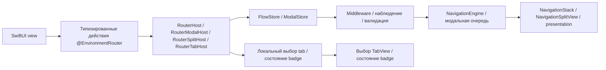
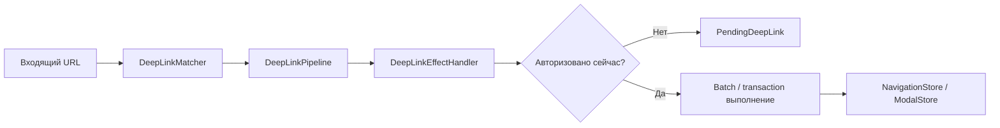

# InnoRouter

[English](README.md) | [한국어](README.ko.md) | [Español](README.es.md) | [Deutsch](README.de.md) | [简体中文](README.zh-Hans.md) | [日本語](README.ja.md) | [Русский](README.ru.md)

[](https://swiftpackageindex.com/InnoSquadCorp/InnoRouter)
[](https://swiftpackageindex.com/InnoSquadCorp/InnoRouter)
[](https://opensource.org/licenses/MIT)
[](https://codecov.io/gh/InnoSquadCorp/InnoRouter)

InnoRouter — это SwiftUI-нативный фреймворк навигации, построенный вокруг типизированного состояния, явного выполнения команд и планирования deep-link на границе приложения.

Он рассматривает навигацию как state machine первого класса, а не как разбросанные view-локальные побочные эффекты.

## Что принадлежит InnoRouter

InnoRouter отвечает за:

- генерацию route и destination через `@Router`
- локальный authority стека, modal, split-detail и tabs через
  `RouterHost`, `RouterModalHost`, `RouterSplitHost` и `RouterTabHost`
- fail-closed сопоставление URL с route через `@DeepLink`
- opt-in композицию spatial scenes через `@SceneRouter` и `@Scene`
- расширенную навигацию со внешним владением через `NavigationStore`, `ModalStore` и `FlowStore`
- выполнение команд через `NavigationCommand` и `NavigationEngine`
- расширенное планирование deep-link и pending replay через `DeepLinkPipeline` и `InnoRouterEffects`

Он намеренно не является общим state machine приложения.

Держите эти заботы вне InnoRouter:

- состояние бизнес-workflow
- жизненный цикл аутентификации/сессии
- состояние повтора сети или транспорта
- алерты и диалоги подтверждения

## Требования

- iOS 18+
- iPadOS 18+
- macOS 15+
- tvOS 18+
- watchOS 11+
- visionOS 2+
- Swift 6.3+

Минимум iOS 18 и базовая линия пакета `swift-tools-version: 6.3` — это
осознанный выбор: они позволяют каждому публичному типу принять строгую
concurrency и `Sendable` без аварийных выходов `@preconcurrency` /
`@unchecked Sendable`, что означает, что состояние навигации никогда тихо
не утекает с main actor на границе между view-кодом и store. Цена — окно
адопции меньше, чем у библиотек, нацеленных на iOS 13–16; выгода —
маршрутизатор, чья дисциплина `Sendable`/`@MainActor` проверяется
компилятором, а не задокументирована в прозе.

Macros target зависит от `swift-syntax` `603.0.2` с ограничением
`.upToNextMinor`. InnoRouter 5.0 поднимает базовую линию пакета до Swift 6.3,
согласуя её с этой host-зависимостью и закреплённым в CI toolchain Xcode 26.6.
Дальнейшие повышения минимума Swift остаются изменениями major-версии.

| Стойка concurrency | InnoRouter | TCA / FlowStacks / другие на iOS 13+ |
|---|---|---|
| Публичные типы безусловно объявляют `Sendable` | ✅ | ⚠ частично — многие используют `@preconcurrency` |
| Stores изолированы `@MainActor`, без хопов в runtime | ✅ | ⚠ варьируется |
| `@unchecked Sendable` / `nonisolated(unsafe)` в коде | ❌ нет | ⚠ используется в некоторых адаптерах |
| Режим строгой concurrency | ✅ принудительно по модулю | ⚠ opt-in или частично |

## Поддержка платформ

InnoRouter поставляется на каждой платформе Apple через SwiftUI. Мостовые
модули UIKit или AppKit не требуются.

| Возможность | iOS | iPadOS | macOS | tvOS | watchOS | visionOS |
|---|---|---|---|---|---|---|
| `@Router` + `RouterHost` / `RouterModalHost` / `RouterTabHost` | ✅ | ✅ | ✅ | ✅ | ✅ | ✅ |
| `@Router` + `RouterSplitHost` | ✅ | ✅ | ✅ | ✅ | ❌ | ✅ |
| `NavigationStore` / `NavigationHost` / `FlowStore` / `FlowHost` | ✅ | ✅ | ✅ | ✅ | ✅ | ✅ |
| `NavigationSplitHost` / `CoordinatorSplitHost` | ✅ | ✅ | ✅ | ✅ | ❌ | ✅ |
| `ModalHost` `.sheet` | ✅ | ✅ | ✅ | ✅ | ✅ | ✅ |
| `ModalHost` `.fullScreenCover` нативно | ✅ | ✅ | ⚠ деградирует | ✅ | ⚠ деградирует | ⚠ деградирует |
| API состояния badge / нативное визуальное представление | ✅ | ✅ | ✅ | ⚠ только состояние | ⚠ только состояние | ✅ |
| `DeepLinkPipeline` / `FlowDeepLinkPipeline` | ✅ | ✅ | ✅ | ✅ | ✅ | ✅ |
| `InnoRouterSpatial`: `@SceneRouter` / `@Scene` (windows, volumetric, immersive) | — | — | — | — | — | ✅ |
| `InnoRouterSpatial`: `innoRouterOrnament(_:content:)` view modifier | no-op | no-op | no-op | no-op | no-op | ✅ |

`⚠ деградирует` означает, что store API принимает запрос без изменений, но
SwiftUI host рендерит его как `.sheet`, потому что `.fullScreenCover`
недоступен. `⚠ только состояние` означает, что router хранит и
выставляет состояние badge, но `RouterTabHost` и `TabCoordinatorView` опускают
нативный визуальный badge SwiftUI, потому что `.badge(_:)` недоступен. `❌`
означает, что API нельзя использовать на этой платформе: он либо отсутствует,
либо явно помечен unavailable. Компилируйте вызов за подходящим availability
или conditional-compilation guard.

## Установка

```swift skip package-manifest-fragment
dependencies: [
    .package(url: "https://github.com/InnoSquadCorp/InnoRouter.git", from: "5.0.0")
],
targets: [
    .target(
        name: "MyApp",
        dependencies: [
            .product(name: "InnoRouter", package: "InnoRouter")
        ]
    )
]
```

InnoRouter распространяется как SwiftPM-пакет только из исходников. Он не
поставляет бинарные артефакты, и library evolution намеренно отключена,
чтобы сборки из исходников оставались простыми на всех платформах Apple.
Обычный target приложения начинайте с product `InnoRouter`. Он предоставляет
runtime API и macros, поэтому в исходном коде достаточно `import InnoRouter`.
Targets, использующие маршрутизацию сцен visionOS или выполнение на границе
приложения, явно добавляют `InnoRouterSpatial` или `InnoRouterEffects`; test
targets при необходимости добавляют `InnoRouterTesting`. Umbrella
`InnoRouter` не реэкспортирует эти opt-in products.

## Быстрый старт за 30 секунд

Импортируйте InnoRouter один раз, добавьте `@Router` к enum и опишите каждый
destination в свойстве `destination`. Macro добавит conformance `Route` и
`DestinationRoute`, а также actor- и result-builder-аннотации для SwiftUI.

```swift compile
import SwiftUI
import InnoRouter

@Router
enum HomeRoute {
    case detail(id: String)
    case settings

    var destination: some View {
        switch self {
        case .detail(let id):
            Text("Detail \(id)")
        case .settings:
            Text("Settings")
        }
    }
}

struct AppRoot: View {
    var body: some View {
        RouterHost(HomeRoute.self) {
            HomeView()
        }
    }
}

struct HomeView: View {
    @EnvironmentRouter(HomeRoute.self) private var router

    var body: some View {
        List {
            Button("Detail") {
                router.go(.detail(id: "123"))
            }

            Button("Settings") {
                router.go(.settings)
            }
        }
        .navigationTitle("Home")
    }
}
```

`@Router` выдаёт compile-time диагностику, если он прикреплён не к тому объявлению,
`destination` отсутствует или неверен, либо сгенерированные members конфликтуют с
ручными. Отсутствующий или несовпадающий host считается ошибкой runtime hierarchy и
следует настроенной environment diagnostic policy.

### Добавьте другую surface без нового store

| Что добавить | Что объявить | Host |
|---|---|---|
| sheet / cover | те же cases `@Router` | `RouterHost` или modal-only `RouterModalHost` |
| split detail | тот же enum `@Router` | `RouterSplitHost` |
| нативные tabs | `@TabItem` на каждом case `@Router` | `RouterTabHost` |
| deep links на один route | literal allowlists в `@Router` и cases с `@DeepLink` | `RouterHost`, `RouterSplitHost` или `RouterTabHost` |
| scenes visionOS | `@SceneRouter` и по одному `@Scene` на case | установите `<Route>.scenes` в `App.body` |

Все обычные route actions по-прежнему идут из `@EnvironmentRouter`, а spatial scene actions —
из `@EnvironmentSceneRouter`. Неверные или неполные macro-объявления получают
применимую compiler-диагностику.

## Контракт OSS-релиза и SemVer

`4.0.0` — это первый OSS-релиз InnoRouter и первая версия, покрытая
публичным контрактом SemVer. Текущая линия совместимости начинается с
`5.0.0`. Более ранние приватные/внутренние снимки пакета не являются частью
линии OSS-совместимости; команды, переходящие с релиза 4.x, должны следовать
указаниям по миграции 5.0 в [`CHANGELOG.md`](CHANGELOG.md).

### SemVer-обязательство для линии 5.x

В рамках релизов `5.x.y` InnoRouter строго следует
[Semantic Versioning](https://semver.org/):

- **`5.x.y` → `5.x.(y+1)`** patch релизы: только исправления багов. Никаких
  изменений сигнатуры публичного API. Никаких наблюдаемых изменений
  поведения, кроме исправления документированного бага.
- **`5.x.y` → `5.(x+1).0`** minor релизы: только аддитивные. Новые типы,
  новые методы, новые case, новые опции конфигурации. Существующие
  сигнатуры сохраняют свою форму, и существующие места вызова продолжают
  компилироваться без изменений.
- **`5.x.y` → `6.0.0`** major релизы: всё, что нарушает совместимость
  исходного кода, удаляет публичный символ, сужает обобщённое ограничение
  или изменяет задокументированное поведение в runtime таким образом,
  что может удивить существующие места вызова.

Pre-release теги используют форму `5.0.0-rc.1` / `5.1.0-beta.2`. Единая strict
политика версий принимает только GA-, `rc`- и `beta`-идентификаторы без ведущих
нулей. Push pre-release тега выполняет проверку без публикации; релиз публикуется
ручным запуском `release.yml` с `prerelease=true`, как описано в
[`RELEASING.md`](RELEASING.md).

### Что считается breaking change

Для целей обязательства SemVer 5.x, *breaking change* означает любое из:

- Удаление или переименование публичного символа (тип, метод, свойство,
  associated type, case).
- Изменение сигнатуры публичного метода таким образом, что компиляция
  существующего места вызова не удаётся (добавление параметра без
  значения по умолчанию, ужесточение обобщённого ограничения, замена
  возвращаемого типа).
- Изменение задокументированного поведения публичного API таким образом,
  что существующий корректный вызывающий производит другой наблюдаемый
  результат (например, переключение `NavigationPathMismatchPolicy` по
  умолчанию).
- Поднятие минимально поддерживаемого Swift toolchain или базы платформы.

Напротив, следующие *не* являются breaking и могут попадать в любой
minor релиз:

- Добавление новых case в не-`@frozen` публичный enum.
- Добавление новых параметров со значением по умолчанию в публичный метод.
- Ужесточение только-внутренних типов.
- Улучшения производительности, сохраняющие семантику.
- Изменения только в документации.

### Историческая справка о линии 4.x

`4.1.0` — это базовая линия адопции после прохода предпользовательской
очистки. Удаляются неиспользуемые API диспетчер-объектов, `replaceStack`
сохраняется как единственный intent полной замены стека, и наблюдение
эффектов перемещается в явные потоки событий. Это единственное
задокументированное source-breaking исключение в линии 4.x. Тег `4.0.0`
остаётся доступным как первый OSS-снимок; полная история 4.x и миграция 5.0
зафиксированы в [`CHANGELOG.md`](CHANGELOG.md).

### Imports

Зонтичный target `InnoRouter` реэкспортирует `InnoRouterCore`,
`InnoRouterSwiftUI`, `InnoRouterDeepLink` и router macros. По умолчанию 5.0
использует macro-first подход: target приложения добавляет один product,
а исходный файл — один import для `@Router`, `@TabItem` и `@DeepLink`.
Spatial scenes и app-boundary effects остаются opt-in:

```swift skip doc-fragment
import InnoRouter            // stores, hosts, deep links и macros
import InnoRouterSpatial     // scenes visionOS и ornaments
import InnoRouterEffects     // app-boundary выполнение и pending replay
```

Прямые imports — это расширенный выбор модуляризации. `InnoRouterMacros`
напрямую открывает объявления macros и реэкспортирует API Core, SwiftUI и DeepLink,
на которые опирается сгенерированный код. Обычные targets приложения
используют зонтичный `InnoRouter`.

Реализация macro на основе SwiftSyntax включена в этот пакет. Разделение на
package-traits или отдельный macro-пакет должно
оцениваться только после измерения `swift package show-traits`,
`swift build --target InnoRouter` и `swift build --target InnoRouterMacros`
относительно стоимости миграции.

| Product | Когда импортировать |
|---|---|
| `InnoRouter` | По умолчанию для кода приложения: `@Router`, `@TabItem`, `@DeepLink`, macro-first hosts и расширенные stores под ними. |
| `InnoRouterSpatial` | Targets, объявляющие windows, volumes и immersive spaces visionOS через `@SceneRouter` / `@Scene`, либо использующие manual scene store и ornaments. `InnoRouter` не реэкспортирует этот product. |
| `InnoRouterMacros` | Прямой macro module, который реэкспортирует API Core, SwiftUI и DeepLink для сгенерированного кода; targets приложения обычно используют `InnoRouter`. |
| `InnoRouterEffects` | Код границы приложения, который выполняет значения `NavigationCommand` и обрабатывает или возобновляет ожидающие deep links. |
| `InnoRouterTesting` | Test targets, которые хотят host-less `NavigationTestStore`, `ModalTestStore` или `FlowTestStore`. |

## Модули

- `InnoRouter`: macro-first зонтичный product, реэкспортирующий `InnoRouterCore`, `InnoRouterSwiftUI`, `InnoRouterDeepLink` и `InnoRouterMacros`
- `InnoRouterCore`: route stack, validators, commands, results, batch/transaction executors, middleware
- `InnoRouterSwiftUI`: `RouterHost`, `RouterModalHost`, `RouterSplitHost`, `RouterTabHost`, расширенные stores/hosts, coordinators и типизированные действия `EnvironmentRouter`
- `InnoRouterSpatial`: opt-in `@SceneRouter` / `@Scene`, сгенерированная композиция scenes, manual registry/store, modifiers host/anchor и ornaments
- `InnoRouterDeepLink`: сопоставление шаблонов, диагностика, планирование pipeline, ожидающие deep links
- `InnoRouterEffects`: помощники выполнения навигации и deep-link для границ приложения
- `InnoRouterMacros`: `@Router`, `@TabItem`, `@DeepLink`, `@Routable` и `@CasePathable`

## Выбор правильной поверхности

Начинайте с route enum и macro-first host. Переходите к store со внешним
владением только когда границе приложения нужны восстановление, изменяемая
middleware, прямое наблюдение, authenticated pending replay или атомарный multi-step план:

| Потребность | Используйте |
|---|---|
| Локальный feature со stack + sheet / cover | `@Router` + `RouterHost` |
| Локальный feature только с modal | `@Router` + `RouterModalHost` |
| Split-detail на поддерживаемых платформах | `@Router` + `RouterSplitHost` |
| Нативные tabs со сгенерированными labels и images | `@Router` + `@TabItem` + `RouterTabHost` |
| Один разрешённый URL выбирает или push один route | `@Router(deepLinkSchemes:deepLinkHosts:)` + `@DeepLink` + `RouterHost`, `RouterSplitHost` или `RouterTabHost` |
| Windows, volumes и immersive spaces visionOS | `InnoRouterSpatial`: `@SceneRouter` + `@Scene` + `<Route>.scenes` |
| Стек со внешним владением, восстановлением, middleware или прямым наблюдением | `NavigationStore` + `NavigationHost` |
| Modal queue со внешним владением | `ModalStore` + `ModalHost` |
| Атомарные push + modal планы или восстановленные flows | `FlowStore` + `FlowHost` + `FlowPlan` |
| Аутентификация, pending replay или multi-step URL | `DeepLinkPipeline` / `FlowDeepLinkPipeline` + `InnoRouterEffects` |
| Manual authority scenes visionOS или custom composition | `SceneStore` + `innoRouterSceneHost` / `innoRouterSceneAnchor` |
| Reducer, effect или выполнение на границе приложения | `InnoRouterEffects` |
| Утверждения router без SwiftUI hosts | `InnoRouterTesting` |

Macro-first hosts локально владеют stores и публикуют типизированные действия
через `@EnvironmentRouter`. Store, Effects, Testing и manual spatial API — явные пути
расширения, а не обязательная настройка обычного feature.

### Быстрая блок-схема решений

```text
Это flow на границе приложения, который должен владеть или восстанавливать routing state?
├── Нет → объявите @Router и выберите локальный host
│        ├── stack + modal → RouterHost
│        ├── только modal → RouterModalHost
│        ├── split detail → RouterSplitHost
│        └── tabs → @TabItem + RouterTabHost
└── Да → выберите NavigationStore, ModalStore или FlowStore для этого authority
         (аутентифицированные или multi-step URL: DeepLinkPipeline + Effects)
```

Для обычной stack-навигации из view используйте `@EnvironmentRouter` с
`go` / `back`. Переходите к низкоуровневым intents из
[`Docs/IntentSelectionGuide.md`](Docs/IntentSelectionGuide.md) только когда
нужна явная navigation-, modal- или flow-семантика.

## Документация

- Последний DocC портал: [InnoRouter latest docs](https://innosquadcorp.github.io/InnoRouter/latest/)
- Корень версионных docs: [InnoRouter docs](https://innosquadcorp.github.io/InnoRouter/)
- Контрольный список релиза: [RELEASING.md](RELEASING.md)
- Быстрое руководство сопровождающего: [CLAUDE.md](CLAUDE.md)

`README.md` — точка входа в репозиторий.
DocC — детальный модульный набор справочников.

### Tutorial-статьи

Пошаговые руководства для самых распространённых путей адопции. Каждая
статья находится внутри соответствующего DocC-каталога, поэтому
отрендеренный DocC-сайт, исходный вид GitHub и offline сборка
`swift package generate-documentation` показывают одинаковое содержимое.

| Статья | Каталог | Покрывает |
| --- | --- | --- |
| [Tutorial-LoginOnboarding](Sources/InnoRouterSwiftUI/InnoRouterSwiftUI.docc/Articles/Tutorial-LoginOnboarding.md) | `InnoRouterSwiftUI` | Создание flow login → onboarding → home с `FlowStore` и `ChildCoordinator` |
| [Tutorial-DeepLinkReconciliation](Sources/InnoRouterSwiftUI/InnoRouterSwiftUI.docc/Articles/Tutorial-DeepLinkReconciliation.md) | `InnoRouterSwiftUI` | Согласование cold-start vs warm deep links, включая ожидающий replay |
| [Tutorial-MiddlewareComposition](Sources/InnoRouterSwiftUI/InnoRouterSwiftUI.docc/Articles/Tutorial-MiddlewareComposition.md) | `InnoRouterSwiftUI` | Композиция типизированной middleware, перехват команд, наблюдение churn |
| [Tutorial-MigratingFromNestedHosts](Sources/InnoRouterSwiftUI/InnoRouterSwiftUI.docc/Articles/Tutorial-MigratingFromNestedHosts.md) | `InnoRouterSwiftUI` | Замена вложенных стеков `NavigationHost` + `ModalHost` на `FlowHost` |
| [Tutorial-Throttling](Sources/InnoRouterSwiftUI/InnoRouterSwiftUI.docc/Articles/Tutorial-Throttling.md) | `InnoRouterSwiftUI` | Использование `ThrottleNavigationMiddleware` с детерминированными test clocks |
| [Tutorial-VisionOSScenes](Sources/InnoRouterSpatial/InnoRouterSpatial.docc/Articles/Tutorial-VisionOSScenes.md) | `InnoRouterSpatial` | Объявление visionOS windows, volumetric scenes и immersive spaces через `@SceneRouter` и `@Scene` |
| [Tutorial-FlowDeepLinkPipeline](Sources/InnoRouterDeepLink/InnoRouterDeepLink.docc/Articles/Tutorial-FlowDeepLinkPipeline.md) | `InnoRouterDeepLink` | Создание составных push + modal deep links через `FlowDeepLinkPipeline` |
| [Tutorial-StatePersistence](Sources/InnoRouterCore/InnoRouterCore.docc/Tutorial-StatePersistence.md) | `InnoRouterCore` | Сохранение `FlowPlan` / `RouteStack` между запусками с `StatePersistence` |
| [Tutorial-TestingFlows](Sources/InnoRouterTesting/InnoRouterTesting.docc/Articles/Tutorial-TestingFlows.md) | `InnoRouterTesting` | Host-less Swift Testing утверждения через `FlowTestStore` |

## Как это работает

### Runtime flow



- Views вызывают типизированные по route действия через `@EnvironmentRouter`.
- `RouterHost`, `RouterModalHost` и `RouterSplitHost` владеют локальным
  `FlowStore` или `ModalStore`; `RouterTabHost` напрямую владеет выбором и
  состоянием badge. Каждый host переводит свою authority в нативные SwiftUI API.
- Продвинутые приложения могут выбрать эквивалентную явную authority Store или
  Coordinator для внешнего владения и injection.

### Deep-link flow



- Сопоставление и планирование остаются чистыми.
- Effect handlers — это граница, где политика приложения решает, выполнить
  сейчас или отложить.
- Ожидающие deep links сохраняют запланированный переход, пока приложение
  не будет готово его повторить.

## Модель состояния и выполнения

InnoRouter раскрывает три разные семантики выполнения.

### Одиночная команда

`execute(_:)` применяет один `NavigationCommand` и возвращает
типизированный `NavigationResult`.

### Batch

`executeBatch(_:stopOnFailure:)` сохраняет пошаговое выполнение команд,
но объединяет наблюдение.

Используйте batch выполнение, когда:

- несколько команд всё равно должны выполняться по одной
- middleware должна продолжать видеть каждый шаг
- наблюдатели должны продолжать получать одно агрегированное событие
  перехода

### Transaction

`executeTransaction(_:)` предпросматривает команды на теневом стеке и
коммитит только если каждый шаг успешен.

Используйте transaction выполнение, когда:

- частичный успех неприемлем
- вы хотите rollback при ошибке или отмене
- одно событие коммита всё-или-ничего важнее, чем пошаговое наблюдение

### `.sequence`

`.sequence` — это алгебра команд, не транзакция.

Это намеренно:

- слева-направо
- неатомарно
- типизировано через `NavigationResult.multiple`

Ранее успешные шаги остаются применёнными, даже если последующий шаг
терпит неудачу.

### `send(_:)` vs `execute(_:)` — выбор правильной точки входа

InnoRouter разделяет по назначению действия view и API store/engine.
Выберите точку входа, которая соответствует месту вызова, а не форме данных.

| Слой                       | Вход                                  | Используйте, когда |
| -------------------------- | ------------------------------------- | ----------------- |
| Действие view (по умолчанию) | `router.go(_:)`, `router.back()`, … | Маршрутизация из обычного SwiftUI view через `@EnvironmentRouter`. |
| View intent (расширенный)  | `router.send(_:)`                     | Отправить `NavigationIntent`, для которого нет именованного удобного метода. |
| Граница внешнего store     | `store.send(_:)`                      | Приложение намеренно владеет `NavigationStore` извне и внедряет его. |
| Команда                    | `store.execute(_:)`                   | Перенаправить одну `NavigationCommand` в engine и проверить типизированный `NavigationResult`. |
| Batch                      | `store.executeBatch(_:)`              | Запустить несколько команд по одной, сохраняя видимость middleware и одно событие наблюдателя. |
| Transaction                | `store.executeTransaction(_:)`        | Зафиксировать всё-или-ничего — предпросмотреть на теневом стеке, затем зафиксировать только если каждый шаг успешен. |

Эмпирическое правило:

- Обычные views используют `@EnvironmentRouter`; только явная граница внешнего
  store вызывает `store.send`. Coordinators и границы effect выполняют команды.
- `send` имеет форму intent (нет возвращаемого значения для проверки);
  `execute*` имеет форму команды (возвращает типизированный результат
  для ветвления, телеметрии, повторов).
- Для атомарных multi-step flows, которые должны откатываться при
  частичной неудаче, предпочтите `executeTransaction` ручным batch.

То же расслоение применяется к `ModalStore` и `FlowStore`:
`send(_: ModalIntent)` / `send(_: FlowIntent)` из views, и
`execute(_:)` / `executeBatch(_:)` / `executeTransaction(_:)` на границе
engine.

### Выбор между `.sequence`, `executeBatch` и `executeTransaction`

| Вы хотите… | Используйте | Почему |
|---|---|---|
| Одно наблюдаемое изменение для многих команд, лучшее усилие | `executeBatch(_:stopOnFailure:)` | Объединённые `.changed` и `.batchExecuted` через `onEvent` / `events`, опциональный fail-fast |
| Применение всё-или-ничего с rollback | `executeTransaction(_:)` | Предпросмотр теневого состояния, отбрасывание на основе журнала |
| Композитное *значение*, которое engine планирует / валидирует | `NavigationCommand.sequence([...])` | Чистая команда, проходит через каждую middleware как одна единица |
| Запустить только последнюю команду после тихого окна | `DebouncingNavigator` | Async wrapping navigator, `Clock`-инжектируемый |
| Ограничение скорости по ключу | `ThrottleNavigationMiddleware` | Синхронный, последняя метка времени принятия |

Полная матрица решений с проработанными примерами и антипаттернами живёт
в DocC tutorial
[`Guide-SequenceVsBatchVsTransaction`](Sources/InnoRouterSwiftUI/InnoRouterSwiftUI.docc/Articles/Guide-SequenceVsBatchVsTransaction.md).

## Поверхность маршрутизации стека

`NavigationIntent` — полная поверхность SwiftUI stack-intent:

- `.go(Route)`
- `.goMany([Route])`
- `.back`
- `.backBy(Int)`
- `.backTo(Route)`
- `.backToRoot`
- `.replaceStack([Route])`

Macro-first views обычно не должны знать о store. Получайте действия через
`@EnvironmentRouter`, используйте `router.go(_:)` / `router.back()` для обычных
переходов и `router.send(_:)` для расширенных intent. Вызывайте
`NavigationStore.send(_:)` только на границе, где приложение намеренно владеет
store извне и внедряет его.

## Поверхность модальной маршрутизации

InnoRouter поддерживает модальную маршрутизацию для:

- `sheet`
- `fullScreenCover`

Используйте:

- `@Router`
- `RouterModalHost` для modal-only feature или `RouterHost` для stack + modal
- `@EnvironmentRouter`

Пример:

```swift skip doc-fragment
@Router
enum AppModalRoute {
    case profile
    case onboarding

    var destination: some View {
        switch self {
        case .profile: ProfileView()
        case .onboarding: OnboardingView()
        }
    }
}

struct ShellView: View {
    var body: some View {
        RouterModalHost(AppModalRoute.self) {
            ModalLauncher()
        }
    }
}

struct ModalLauncher: View {
    @EnvironmentRouter(AppModalRoute.self) private var router

    var body: some View {
        Button("Profile") {
            router.sheet(.profile)
        }
    }
}
```

Дочерние views показывают modal через `router.sheet(.profile)` или
`router.cover(.onboarding)` и закрывают его через `router.dismiss()`. Используйте
`ModalStore` + `ModalHost` только когда приложение должно владеть или
восстанавливать modal queue, менять middleware или наблюдать её напрямую.

### Граница модального scope

На iOS и tvOS macro-first hosts и `ModalHost` отображают стили напрямую в `sheet` и
`fullScreenCover`. На других поддерживаемых платформах `fullScreenCover`
безопасно деградирует в `sheet`.

InnoRouter намеренно **не** владеет:

- `alert`
- `confirmationDialog`

Держите их как feature-локальное или coordinator-локальное состояние
презентации.

### Модальная наблюдаемость

`ModalStoreConfiguration` предоставляет один типизированный callback
наблюдения и асинхронный поток:

- `logger`
- `onEvent: (ModalEvent<M>) -> Void`
- `ModalStore.events: AsyncStream<ModalEvent<M>>`

Обрабатывайте presentation, dismiss, replace, изменения очереди, перехват
команд и мутации middleware через `switch` по `ModalEvent`.

`ModalDismissalReason` различает:

- `.dismiss`
- `.dismissAll`
- `.systemDismiss`

### Модальная middleware

`ModalStore` раскрывает ту же поверхность middleware, что и `NavigationStore`:

- `ModalMiddleware` / `AnyModalMiddleware<M>` с `willExecute` / `didExecute`.
- `ModalInterception` позволяет middleware `.proceed(command)` (включая
  переписанные команды) или `.cancel(reason:)` с `ModalCancellationReason`.
- `ModalStore.addMiddleware` / `insertMiddleware` / `removeMiddleware` /
  `replaceMiddleware` / `moveMiddleware` — handle-based CRUD,
  соответствующий навигации.
- `execute(_:) -> ModalExecutionResult<M>` маршрутизирует все `.present`,
  `.dismissCurrent` и `.dismissAll` через registry.
- `ModalMiddlewareMutationEvent` раскрывает churn registry для аналитики.

## Split-навигация

Для локальной split-detail surface на поддерживаемых платформах используйте
`@Router` + `RouterSplitHost`:

```swift skip doc-fragment
RouterSplitHost(AppRoute.self) {
    SidebarView()
} root: {
    ContentUnavailableView("Select an item", systemImage: "sidebar.left")
}
```

Host владеет detail stack и modal authority, а дочерние views продолжают
использовать те же действия `@EnvironmentRouter`. Переходите к `NavigationSplitHost`
или `CoordinatorSplitHost`, если приложение должно владеть стеком или
направлять intents через coordinator. `RouterSplitHost` недоступен на watchOS.

Эти остаются собственностью приложения:

- выбор sidebar
- видимость колонки
- compact-адаптация

## Поверхность маршрутизации tabs

Добавьте `@TabItem` к каждому case без associated values в `@Router`. Macros
сгенерируют `RouterTab`, `CaseIterable`, titles и system images:

Литералы title генерируются как `LocalizedStringResource`, поэтому переводы из
String Catalog автоматически применяются к нативным labels вкладок.

```swift skip doc-fragment
@Router
enum AppTab {
    @TabItem("Home", systemImage: "house")
    case home

    @TabItem("Settings", systemImage: "gear")
    case settings

    var destination: some View {
        switch self {
        case .home: HomeView()
        case .settings: SettingsView()
        }
    }
}

RouterTabHost(AppTab.self, initial: .home)
```

Дочерние views используют `router.select(_:)`, `router.setBadge(_:for:)` и действия
очистки badge. Используйте `TabCoordinatorView` только когда приложение
должно владеть selection, предоставить custom shell или собрать независимые
stores для каждой tab.

## Поверхность coordinator

Coordinators — это объекты политики, которые сидят между SwiftUI intent
и выполнением команд. Это путь расширения, а не обязательная настройка обычного feature.

Используйте `CoordinatorHost` или `CoordinatorSplitHost`, когда:

- view intent сначала нуждается в маршрутизации политики
- app shells нуждаются в логике координации
- несколько авторитетов навигации должны быть составлены за одним coordinator

`StepCoordinator` и `TabCoordinator` — это помощники, не замены
`NavigationStore`.

Рекомендуемое разделение:

- `NavigationStore`: авторитет route-stack
- `TabCoordinator`: состояние выбора shell/tab
- `StepCoordinator`: локальная прогрессия шагов внутри назначения

### Передача результата дочернего coordinator

`ChildCoordinator` предоставляет структурированный вызов
`child.waitForResult() async -> Child.Result?`. Его может использовать любой
flow owner приложения; пока route, sheet или cover видимы, он хранит ребёнка
в своём presentation-состоянии:

```swift skip doc-fragment
let signUp = SignUpCoordinator()
activeSignUp = signUp
defer { activeSignUp = nil }

if let user = await signUp.waitForResult() {
    flowStore.send(.push(.home(user)))
}
```

Здесь `activeSignUp` — принадлежащее приложению состояние размещения view;
`waitForResult()` только ждёт результат и не показывает ребёнка. Колбэки
(`onFinish`, `onCancel`) устанавливаются до первой приостановки `waitForResult()`,
поэтому ребёнок может вызвать их в любой момент после начала асинхронного вызова.
См. [`Docs/design-child-coordinator-handoff.md`](Docs/design-child-coordinator-handoff.md)
для обоснования дизайна.

Отмена caller task, ожидающего `waitForResult()`, завершает вызов с `nil` и
распространяется на ребёнка через
`ChildCoordinator.parentDidCancel()` (по умолчанию пустой no-op).
Переопределите его, чтобы разобрать переходное состояние — отклонить
sheets, отменить запросы в полёте, освободить временные stores — когда
родительская view отклоняется:

```swift skip doc-fragment
final class SignUpCoordinator: ChildCoordinator {
    typealias Result = UserID
    var onFinish: (@MainActor @Sendable (UserID) -> Void)?
    var onCancel: (@MainActor @Sendable () -> Void)?

    func parentDidCancel() {
        signUpAPIClient.cancelActiveRequests()
    }
}
```

`parentDidCancel` направлен (родитель → ребёнок). Он не вызывает
`onCancel` (который остаётся ребёнок → родитель); два хука ортогональны.

## Именованные навигационные intents

Высокочастотные intents составлены из существующих примитивов
`NavigationCommand`:

- `NavigationIntent.replaceStack([R])` — сбрасывает стек к заданным
  маршрутам в одном наблюдаемом шаге.
- `NavigationIntent.backOrPush(R)` — pop к `route`, если он уже существует
  в стеке, иначе push.
- `NavigationIntent.pushUniqueRoot(R)` — push только если стек ещё не
  содержит равный маршрут.

Они маршрутизируют через нормальный pipeline `send` → `execute`, поэтому
middleware и телеметрия наблюдают их идентично прямым вызовам
`NavigationCommand`.

## Case-типизированные привязки назначения

`NavigationStore` и `ModalStore` раскрывают помощники `binding(case:)`,
индексированные `CasePath`, выпускаемым `@Routable` / `@CasePathable`:

```swift skip doc-fragment
struct DetailSheet: View {
    let store: NavigationStore<AppRoute>

    var body: some View {
        SomeDetailView()
            .sheet(item: store.binding(case: AppRoute.Cases.detail)) { detail in
                DetailView(detail: detail)
            }
    }
}
```

Привязки маршрутизируют каждый set через существующий pipeline команд,
поэтому middleware и телеметрия наблюдают их точно так же, как они
наблюдают прямые вызовы `execute(...)`. `ModalStore.binding(case:style:)`
ограничен по стилю презентации (`.sheet` / `.fullScreenCover`).

## Модель Deep-link

Путь по умолчанию — одна аннотация на route. Literal allowlists scheme и host
заставляют сгенерированный resolver работать fail closed, а соответствующий
macro-first host автоматически обрабатывает входящие URL:

```swift skip doc-fragment
@Router(
    deepLinkSchemes: ["myapp", "https"],
    deepLinkHosts: ["app.example.com"]
)
enum AppRoute {
    @DeepLink("/products/:id")
    case product(id: String)

    var destination: some View {
        switch self {
        case .product(let id): ProductView(id: id)
        }
    }
}

RouterHost(AppRoute.self) { HomeView() }
```

`RouterHost` и `RouterSplitHost` делают push найденного route; `RouterTabHost`
выбирает его. Macros выявляют при компиляции неверные patterns,
отсутствующие origin allowlists, неподдерживаемые payloads, конфликты members,
недостижимые и зависящие от порядка mappings.

Планы deep-link остаются расширенным путём, когда приложение владеет
аутентификацией, pending replay или multi-step reconciliation.

Основные части:

- `DeepLinkMatcher`
- `DeepLinkPipeline`
- `DeepLinkDecision`
- `PendingDeepLink`
- `NavigationPlan`

Типичный flow:

1. сопоставить URL с маршрутом
2. отклонить или принять по scheme/host
3. применить политику аутентификации
4. издать `.plan`, `.pending`, `.rejected` или `.unhandled`
5. явно выполнить результирующий план навигации

### Диагностика matcher

`DeepLinkMatcher` сообщает одинаковую диагностику для route- и `FlowPlan`-результатов:

- дублирующиеся шаблоны
- shadowing wildcards
- shadowing параметров
- нетерминальные wildcards

Диагностика не меняет приоритет порядка объявления. Она помогает поймать
ошибки авторства, не меняя тихо runtime-поведение. Используйте
`try DeepLinkMatcher(strict:)` в шлюзах готовности к релизу, когда
диагностика должна провалить сборку.

### Композитные deep links (push + modal tail)

`FlowDeepLinkPipeline` расширяет push-only pipeline, чтобы один URL
мог регидрировать push prefix **плюс** модальный терминальный шаг в
одном атомарном `FlowStore.apply(_:)`:

```swift skip doc-fragment
let matcher = DeepLinkMatcher<FlowPlan<AppRoute>> {
    DeepLinkMapping("/home/detail/:id") { params in
        guard let id = params.firstValue(forName: "id") else { return nil }
        return FlowPlan(steps: [.push(.home), .push(.detail(id: id))])
    }
    DeepLinkMapping("/onboarding/privacy") { _ in
        FlowPlan(steps: [.sheet(.privacyPolicy)])
    }
}

let pipeline = FlowDeepLinkPipeline(
    allowedSchemes: ["myapp"],
    allowedHosts: ["app"],
    matcher: matcher,
    authenticationPolicy: .required(
        shouldRequireAuthentication: { _ in true },
        isAuthenticated: { SessionStore.shared.isAuthenticated }
    )
)

let handler = FlowDeepLinkEffectHandler(pipeline: pipeline, applier: flowStore)

FlowHost(store: flowStore, destination: destination) { RootView() }
    .onOpenURL { _ = handler.handle($0) }
```

Каждый handler `DeepLinkMapping<FlowPlan<R>>` возвращает **полный** `FlowPlan`,
поэтому multi-segment URLs явные на сайте объявления. Pipeline дословно
переиспользует семантику `DeepLinkAuthenticationPolicy` + `PendingDeepLink`
из push-only pipeline для симметричной отсрочки и replay аутентификации.
См. [`Sources/InnoRouterDeepLink/InnoRouterDeepLink.docc/Articles/Tutorial-FlowDeepLinkPipeline.md`](Sources/InnoRouterDeepLink/InnoRouterDeepLink.docc/Articles/Tutorial-FlowDeepLinkPipeline.md)
для полного walk-through.

## Поверхность spatial scenes

Spatial routing использует macro-first подход в opt-in product `InnoRouterSpatial`.
Добавьте `@SceneRouter` к одному enum, пометьте каждый case через `@Scene` и
установите сгенерированное дерево scenes в `App.body`:

```swift skip doc-fragment
import InnoRouterSpatial

@SceneRouter
enum AppScene {
    @Scene(.window)
    case main

    @Scene(.immersive(style: .mixed))
    case theatre

    var destination: some View {
        switch self {
        case .main: MainView()
        case .theatre: TheatreView()
        }
    }
}

@main
struct ExampleApp: App {
    var body: some Scene { AppScene.scenes }
}
```

Дочерние views используют `@EnvironmentSceneRouter(AppScene.self)` и route-aware
действия `open(_:)`, `dismissWindow(_:)` и `dismissImmersive()`. Переходите к
`SceneStore`, `innoRouterSceneHost` и `innoRouterSceneAnchor` только для custom
композиции scenes или внешнего владения scene authority.

## Middleware

Middleware предоставляет слой сквозной политики вокруг выполнения команд.

Pre-выполнение:

- `willExecute(_:state:) -> NavigationInterception`
- `.proceed(updatedCommand)`
- `.cancel(reason)`

Post-выполнение:

- `didExecute(_:result:state:) -> NavigationResult`

Middleware может:

- переписывать команды
- блокировать выполнение типизированными причинами отмены
- сворачивать результаты после выполнения

Middleware не может напрямую мутировать состояние store.

### Типизированная отмена

Причины отмены используют `NavigationCancellationReason`:

- `.middleware(debugName:command:)`
- `.conditionFailed`
- `.custom(String)`

### Управление middleware

`NavigationStore` раскрывает handle-based управление:

- `addMiddleware`
- `insertMiddleware`
- `removeMiddleware`
- `replaceMiddleware`
- `moveMiddleware`
- `middlewareMetadata`

## Согласование путей

Обновления SwiftUI `NavigationStack(path:)` отображаются обратно в
семантические команды.

Правила:

- сжатие префикса → `.popCount` или `.popToRoot`
- расширение префикса → batched `.push`
- не-префиксное несоответствие → `NavigationPathMismatchPolicy`

Доступные политики несоответствия:

- `.replace` — стандартная производственная позиция; принимает
  не-префиксное переписывание пути SwiftUI и издаёт событие несоответствия.
- `.assertAndReplace` — debug / pre-release позиция; assert, затем
  восстановиться с той же семантикой замены.
- `.ignore` — store-авторитарная позиция; наблюдает переписывание, но
  держит текущий стек неизменным.
- `.custom` — позиция доменного восстановления; отображает старые/новые
  пути в одну команду, batch или no-op.

Когда `NavigationStoreConfiguration.logger` установлен, обработка
несоответствия издаёт структурированную телеметрию.

## Effect модули

### `InnoRouterEffects`

Используйте это, когда коду app shell нужен небольшой исполнительный
фасад над границей navigator.

Ключевые API:

- `execute(_:)`
- `execute(_ commands:)`
- `executeTransaction(_:)`
- `executeGuarded(_:, prepare:)`

Эти API синхронные `@MainActor` API, за исключением явного async guard
помощника.

Используйте это, когда планы deep-link должны выполняться на границе
приложения с типизированными результатами.

Ключевые API:

- `handle(_ url:)`
- `resumePendingDeepLink()`
- `resumePendingDeepLinkIfAllowed(_:)`
- `restore(pending:)`

### Интеграция с coordinator

Приложения на coordinators владеют одним `DeepLinkEffectHandler` рядом со
store и передают настроенный pipeline через `init(pipeline:navigator:)`. URL
идут в `handle(_:)`, replay — в `resumePendingDeepLink()` или
`resumePendingDeepLinkIfAllowed(_:)`, а результат обрабатывается как
`DeepLinkEffectHandler.Result`. Handler владеет identity pending-запроса;
app-owned handoff в памяти возвращается через `restore(pending:)`. Для
наблюдения UI coordinator может зеркалировать возвращённый результат. Для
персистентности между запусками используйте `FlowPendingDeepLinkPersistence`.

## `Examples` vs `ExamplesSmoke`

Репозиторий намеренно отделяет примеры документации от примеров CI.

- `Examples/`: примеры для людей как для macro-first entry points, так и для
  явного перехода к Store / Coordinator
- `ExamplesSmoke/`: компилятор-стабильные smoke-фикстуры для CI

`InnoRouterMacroFirstSmoke` компилирует downstream-контракт `@Router`,
`@TabItem` и `@DeepLink` вместе с `RouterHost`, `RouterModalHost`,
`RouterSplitHost` и `RouterTabHost` на поддерживаемой матрице платформ.
Отдельный Spatial consumer smoke компилирует `@SceneRouter` на visionOS.

Примеры для людей покрывают:

- [`Examples/MacrosExample.swift`](Examples/MacrosExample.swift): macro-first
  stack, modal-only, split-detail, нативные tabs и deep links на один route
- автономную маршрутизацию стека
- маршрутизацию coordinator
- deep links
- split-навигацию
- композицию app shell
- модальную маршрутизацию
- macro-first маршрутизацию сцен visionOS

## Docs и flow релиза

### DocC

DocC собирается по модулю и публикуется на GitHub Pages.

Опубликованная структура:

- `/InnoRouter/latest/`
- `/InnoRouter/4.3.0/`
- `/InnoRouter/` корневой портал

### CI

CI валидирует:

- `swift test`
- `principle-gates`
- workflow `platforms`, который компилирует все Apple-таргеты и запускает runtime-тесты на tvOS, watchOS и visionOS
- smoke сборки примеров
- DocC preview сборка

### CD

Публикация GA запускается на strict чистых semver тегах:

- `5.0.0`

Примеры невалидных тегов:

- любой тег с ведущим `v`
- `release-5.0.0`

Обязанности release workflow:

- проверить exact tag, его ancestry в `main` и `CHANGELOG.md` из тега
- перезапустить шлюзы кода/документации
- вызывать переиспользуемый шлюз `platforms` и блокировать публикацию до его успешного завершения; локальный `./scripts/principle-gates.sh --platforms=all` выполняет только проверку компиляции и не заменяет эти runtime-тесты
- собрать версионный DocC
- обновлять `/latest/`, только если GA не ниже наивысшего опубликованного GA
- сохранить старые версионные docs
- опубликовать GitHub Release

### Согласование с философией SwiftUI

InnoRouter следует декларативному направлению SwiftUI, делая обдуманные
trade-off для общего авторитета навигации.

- Views издают intent вместо прямой мутации состояния router.
- Авторитеты стека, split-detail и модального остаются разделёнными.
- Отсутствующее environment-связывание быстро падает.
- `NavigationStore` остаётся reference type, потому что это общий
  авторитет, а не эфемерное локальное состояние.
- `Coordinator` остаётся `AnyObject` по той же причине.

Это намеренный прагматичный trade-off, а не случайное отклонение от SwiftUI.

## Examples

Примеры для людей живут здесь:

- Macro-first modal, split и tab surfaces: [Examples/MacrosExample.swift](https://github.com/InnoSquadCorp/InnoRouter/blob/main/Examples/MacrosExample.swift)
- Macro-first stack: [Examples/StandaloneExample.swift](https://github.com/InnoSquadCorp/InnoRouter/blob/main/Examples/StandaloneExample.swift)
- Macro-first deep links: [Examples/DeepLinkExample.swift](https://github.com/InnoSquadCorp/InnoRouter/blob/main/Examples/DeepLinkExample.swift)
- Macro-first scenes visionOS: [Examples/VisionOSImmersiveExample.swift](https://github.com/InnoSquadCorp/InnoRouter/blob/main/Examples/VisionOSImmersiveExample.swift)
- Продвинутый coordinator: [Examples/CoordinatorExample.swift](https://github.com/InnoSquadCorp/InnoRouter/blob/main/Examples/CoordinatorExample.swift)
- Продвинутый split coordinator: [Examples/SplitCoordinatorExample.swift](https://github.com/InnoSquadCorp/InnoRouter/blob/main/Examples/SplitCoordinatorExample.swift)
- Продвинутый app shell: [Examples/AppShellExample.swift](https://github.com/InnoSquadCorp/InnoRouter/blob/main/Examples/AppShellExample.swift)

## Шлюзы качества

Запустите их локально перед нарезкой релиза:

```bash
swift test
./scripts/principle-gates.sh
./scripts/build-docc-site.sh --version preview --skip-latest
```

## Flow стек

`FlowStore<R>` представляет единый push + sheet + cover flow как один
массив значений `RouteStep<R>`. Он владеет внутренним `NavigationStore<R>`
и `ModalStore<R>`, делегируя каждому, в то же время обеспечивая
инварианты (один хвостовой modal максимум, modal всегда в хвосте,
rollback middleware согласовывает путь).

Эти внутренние stores — детали реализации. Код приложения должен относиться
к `FlowStore.path`, `send(_:)`, `apply(_:)` и `events` как к публичной
поверхности авторитета; прямая мутация внутреннего store зарезервирована для
hosts и сфокусированных тестов инвариантов.

Типичное использование:

```swift skip doc-fragment
let flow = FlowStore<AppRoute>()
let restoredFlow = try FlowStore<AppRoute>(
    validating: persistedSteps
)

flow.send(.push(.home))
flow.send(.push(.detail(id)))
flow.send(.presentSheet(.share))   // tail modal
flow.apply(FlowPlan(steps: [.push(.home), .cover(.paywall)]))
```

- `FlowHost` рендерит не зависящие от environment поверхности навигации и
  modal на основе `FlowStore`, затем публикует единую authority для
  `@EnvironmentRouter(Route.self)`. Flow-specific intent отправляется через
  `router.send(flow:)`.
- `FlowStoreConfiguration` составляет `NavigationStoreConfiguration` и
  `ModalStoreConfiguration`, добавляя один `onEvent` для `FlowEvent`.
  Он получает path/rejection уровня flow и внутренние события в обёртках
  `.navigation(...)` / `.modal(...)`.
- `FlowStore(validating:configuration:)` — это throwing initializer для
  восстановленных или внешне предоставленных значений `[RouteStep]`;
  совместимый initializer `initial:` всё ещё принуждает невалидный ввод
  к пустому пути.
- `FlowRejectionReason` раскрывает причины отказа во время выполнения
  (`pushBlockedByModalTail`, `invalidResetPath`, `middlewareRejected(debugName:)`,
  `reentrantApply`).

## Тестирование без host (`InnoRouterTesting`)

`InnoRouterTesting` — это поставляемый Swift-Testing-нативный harness
утверждений, который оборачивает `NavigationStore`, `ModalStore` и
`FlowStore`. Тестам больше не нужен `@testable import InnoRouterSwiftUI`
или ручные коллекторы `Mutex<[Event]>` — каждое публичное observation-событие
буферизуется в FIFO очередь, и тесты осушают её TCA-style
вызовами `receive(...)`.

Добавьте product только к test target:

```swift skip doc-fragment
// Package.swift
.testTarget(
    name: "AppTests",
    dependencies: [
        .product(name: "InnoRouter", package: "InnoRouter"),
        .product(name: "InnoRouterTesting", package: "InnoRouter"),
    ]
)
```

Затем пишите тесты против production intents:

```swift skip doc-fragment
import Testing
import InnoRouter
import InnoRouterTesting

@Test
@MainActor
func pushHomeThenDetail() {
    let store = NavigationTestStore<AppRoute>()

    store.send(.go(.home))
    store.receiveChange { _, new in new.path == [.home] }

    store.executeBatch([.push(.detail("42"))])
    store.receiveChange { _, new in new.path == [.home, .detail("42")] }
    store.receiveBatch { $0.isSuccess }

    store.finish()
}
```

Что покрывает harness:

- **`NavigationTestStore<R>`** — все варианты `NavigationEvent`:
  `.changed`, `.batchExecuted`, `.transactionExecuted`, `.middlewareMutation`,
  `.pathMismatch`.
  Перенаправляет `send`, `execute`, `executeBatch`, `executeTransaction`
  в подлежащий store без изменений.
- **`ModalTestStore<M>`** — все варианты `ModalEvent`, включая `.presented`,
  `.dismissed`, `.replaced`, `.queueChanged`, `.commandIntercepted` и
  `.middlewareMutation`.
- **`FlowTestStore<R>`** — FlowStore-уровень `.pathChanged` +
  `.intentRejected`, плюс обёртки `.navigation(...)` и `.modal(...)`
  вокруг эмиссий внутреннего store в одной очереди. Один тест может
  утверждать полную цепочку, запущенную одним `FlowIntent`, включая
  пути отмены middleware.

Исчерпывающность по умолчанию `.strict`: любое неутверждённое событие при
deinit store запускает Swift Testing issue. Используйте `.off` для
инкрементальных миграций из legacy test fixtures.

## Восстановление состояния

Маршруты, которые opt-in `Codable`, бесплатно получают round-trippable
значения `RouteStack`, `RouteStep` и `FlowPlan`:

```swift skip doc-fragment
enum AppRoute: Route, Codable {
    case home
    case detail(String)
    case settings
}

let persistence = StatePersistence<AppRoute>()

// При scene background / checkpoint:
let data = try persistence.encode(FlowPlan(steps: flowStore.path))
try data.write(to: restorationURL, options: .atomic)

// При запуске:
if let data = try? Data(contentsOf: restorationURL) {
    flowStore.apply(try persistence.decode(data))
}
```

`StatePersistence<R: Route & Codable>` оборачивает `JSONEncoder` и
`JSONDecoder` (оба настраиваемые) и останавливается на границе `Data` —
файловые URLs, `UserDefaults`, iCloud и хуки scene-phase — это заботы
приложения. Ошибки распространяются как нижележащие `EncodingError` /
`DecodingError`, поэтому вызывающие могут отличить schema drift от сбоя
I/O.

`FlowPlan(steps: flowStore.path)` — это снимок текущего видимого flow:
он хранит navigation push stack плюс активный модальный хвост, если он
видим. Он не сериализует модальный backlog. Очерёдные презентации живут
в `ModalStore.queuedPresentations` как внутреннее состояние выполнения
и вне текущего контракта persistence `FlowPlan`. Приложения, которые
должны восстанавливать очерёдную модальную работу, должны сохранять
снимок очереди, принадлежащий приложению, рядом с `FlowPlan` и
повторять его через свою собственную политику маршрутизации после
запуска.

## Единый поток наблюдения

Каждый store публикует один `events: AsyncStream`, который покрывает
полную поверхность наблюдения — изменения стека, завершения batch /
transaction, разрешения path-mismatch, мутации middleware-registry,
обновления modal present / dismiss / queue, перехваты команд и сигналы
flow-level path или intent-rejection.

Получите новый stream до запуска Task, привязанного к жизненному циклу. Так
subscriber регистрируется синхронно и не пропустит событие сразу после создания
Task. Отменяйте `observationTask` при завершении владельца.

```swift skip doc-fragment
let events = flowStore.events
let observationTask = Task { @MainActor in
    for await event in events {
        switch event {
        case .navigation(.changed(_, let to)):
            analytics.track("nav_path", to.path)
        case .modal(.commandIntercepted(_, .cancelled(let reason))):
            Log.warning("modal cancelled: \(reason)")
        case .intentRejected(let intent, let reason):
            Log.info("flow rejected \(intent) because \(reason)")
        default:
            continue
        }
    }
}
```

В 5.0 у каждого `*Configuration` есть один типизированный callback `onEvent`.
Для синхронной доставки используйте `switch` по `NavigationEvent`, `ModalEvent`
или `FlowEvent`, а для асинхронной итерации — `events`. Прежние callbacks для
отдельных событий удалены без compatibility shim. Flow callback получает
`.navigation(...)` / `.modal(...)` вместе с `.pathChanged` и `.intentRejected`.

### Backpressure (противодавление)

Каждый store распределяет каждое событие на каждого subscriber через
`AsyncStream.Continuation` для каждого subscriber. Чтобы ограничить
очередь на subscriber под нагрузкой, каждый store принимает
`eventBufferingPolicy` в своей конфигурации:

- `.bufferingNewest(1024)` (по умолчанию) — удерживает 1024 самых
  последних события на subscriber, отбрасывает более старые события,
  когда буфер заполнен. Размер подобран под реалистичные всплески
  навигации, сохраняя удерживаемое рабочее множество ограниченным.
- `.bufferingOldest(N)` — удерживает N самых старых событий на
  subscriber, отбрасывает более новые события, когда буфер заполнен.
- `.unbounded` — буферизует каждое событие до тех пор, пока subscriber
  его не осушит. Используйте это для тестовых harness или
  короткоживущих subscribers, где вы контролируете время жизни и
  требуете детерминированного упорядочения без потерь.

```swift skip doc-fragment
let store = try NavigationStore<HomeRoute>(
    initialPath: [.list],
    configuration: NavigationStoreConfiguration(
        eventBufferingPolicy: .bufferingNewest(2048)
    )
)
```

`ModalStoreConfiguration.eventBufferingPolicy` управляет `ModalStore.events`.
`FlowStoreConfiguration.eventBufferingPolicy` управляет flow-level fan-out для
`FlowStore.events`, а `FlowStoreConfiguration.navigation.eventBufferingPolicy` и
`FlowStoreConfiguration.modal.eventBufferingPolicy` управляют обёрнутыми
потоками внутренних store. Отбросы происходят бесшумно — если ваш analytics
pipeline должен отличать "событие не произошло" от "событие было выбито из
буфера", подписывайтесь с `.unbounded` и задавайте темп самостоятельно.

Полный контракт задокументирован в
[`Event-Stream-Backpressure`](Sources/InnoRouterCore/InnoRouterCore.docc/Articles/Event-Stream-Backpressure.md).

## Roadmap

Отслеживается в
[`Docs/competitive-analysis-and-roadmap.md`](Docs/competitive-analysis-and-roadmap.md).
С отгрузкой кластера полировки P3, backlog P0 / P1 / P3 пуст. Публичная
OSS линия начинается с базовой линии 4.0; см. [`CHANGELOG.md`](CHANGELOG.md)
для отгруженных изменений поверхности.

- [x] **P2-3 UIKit escape hatch** — отклонено для OSS-релиза 4.0.0.
      InnoRouter сохраняет позицию только-SwiftUI; команды, которым нужны
      адаптеры UIKit / AppKit, могут составлять эти поверхности вне
      InnoRouter.
- [x] **Семантика debounce** — отгружена в 4.0.0 как `DebouncingNavigator`,
      обёртка с инжектируемым `Clock` вокруг `NavigationCommandExecutor`.
      Синхронная алгебра `NavigationCommand` остаётся timer-free.

## Усыновители

InnoRouter находится в начале своей кривой публичной адопции. Если вы
поставляете InnoRouter в production, пожалуйста, откройте PR, добавляя
ваш проект в список ниже — общий дескриптор (`a finance app at $company`)
подойдёт, если публичное имя ещё невозможно. Сигнал усыновителей помогает
потенциальным пользователям оценить зрелость.

- _Ваш проект здесь._

Файл [`Examples/SampleAppExample.swift`](Examples/SampleAppExample.swift)
показывает полную поверхность заголовочной фичи — pipeline deep-link с
auth gating, FlowStore push+modal проекция и DebouncingNavigator
debouncing поиска — составленные в один самодостаточный класс авторитета.

## Вклад

См. [`CONTRIBUTING.md`](CONTRIBUTING.md) для ветвления, конвенций
коммитов, правил изменения публичного API и требований к тестам macros.
Находки безопасности следуют приватному процессу в [`SECURITY.md`](SECURITY.md).
Участие должно следовать [`CODE_OF_CONDUCT.md`](CODE_OF_CONDUCT.md).

## Лицензия

MIT
